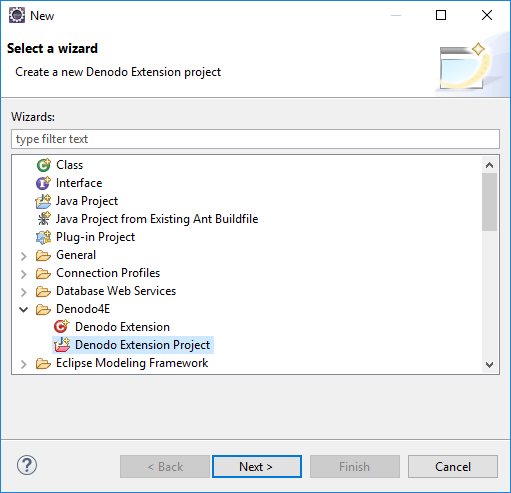
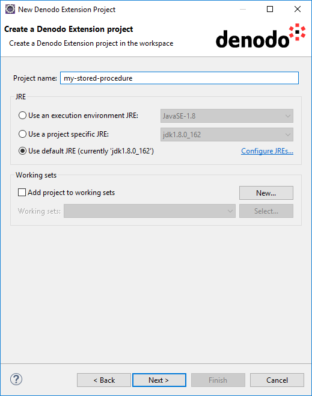
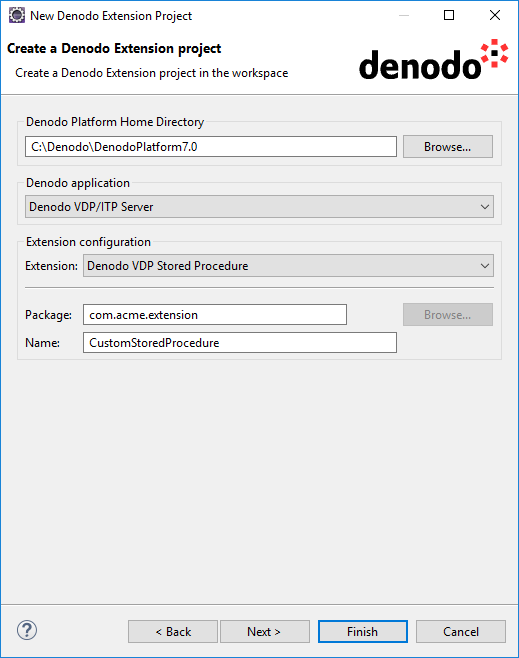
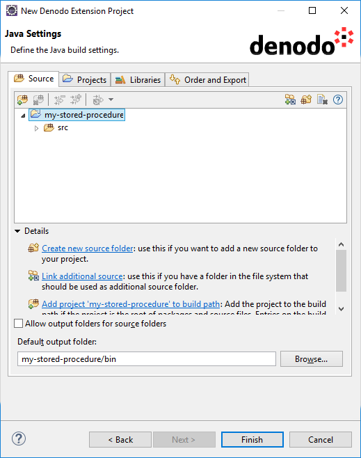
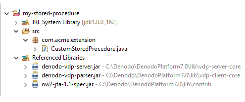

==========================================================
The Denodo Extension Project Wizard
==========================================================

Denodo4E provides a wizard for creating Denodo applications' extensions. 
To open the Denodo Extension Project wizard, click the menu **File** > **New** > **Project...**. The wizard is under the Denodo4E category.

   New Project wizard 

The wizard is divided in three pages where you have to enter different parameters to create a Denodo extension project.

The First Page
===============

In the first page, enter the following parameters: 

-  **Project name**
-  **JRE**: select a JRE of the same version than the one used to run the selected Denodo application (if you are using the JRE distributed with the Denodo Platform, it will be 1.8).
-  **Working sets**

After setting the required parameters in the second page, click **Finish** to create the new project if no further configuration is needed. 
In other case, press **Next** to navigate to the third page. 

 
The Second Page
================

The following parameters must be configured in the second page:

-  **Denodo Platform Home Directory**: enter the Denodo Platform's installation directory. The **Browse...** button can be used for convenience, but the directory can also be typed manually. The installation directory will be used to add to the new project's classpath the required libraries (the required libraries depend on the selected extension type). These libraries may not be available in all Denodo Platform installations (see :ref:`Supported extension types` for more details).
-  **Denodo application**: one of **Denodo VDP/ITP Server**, **Denodo Aracne/Scheduler Server** or **Denodo Wrapper Generation Tool**.
-  **Extension configuration**

   -  **Extension**: this parameter allows specifying the type of Denodo extension that will be created in the project. Different types are available according to the selected Denodo application (see :ref:`Supported extension types` for more details). Depending on the selected extension type, different templates of java and meta-information files will be generated and put into the new project.
   -  **Package**: this parameter is necessary to configure the java and meta-information files which will be generated.
   -  **Name**: this will be the name of the generated extension template class and will also be used to configure generated meta-information files.
 

 
 
The Third Page
===============

The third page is the same as the Java Build Path page in the Java Project wizard (see `New Java Project Wizard <https://help.eclipse.org/neon/index.jsp?topic=%2Forg.eclipse.jdt.doc.user%2Freference%2Fref-wizard-java-project.htm>`_ for more information).

 
Once all the configuration work is done, a new Denodo Extension project will be created and showed in the Package Explorer.

 
   Package Explorer

You can use the Denodo Extension wizard to add new extensions to an existing Denodo Extension project.
