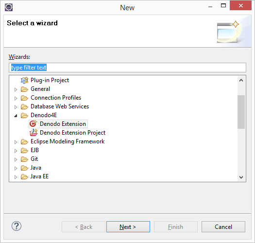
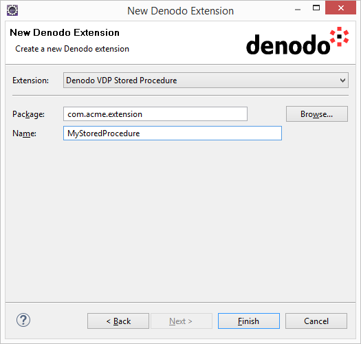

========================================
The Denodo Extension Wizard
========================================

Denodo4E provides a wizard for adding new extensions to existing Denodo Extension projects. To open this wizard, click the menu **File** > **New** > **Other....**.
You will find the wizard under the Denodo4E category.

   New Project wizard 2
 
Supported Project Types
=======================

New extensions can only be added to Denodo Extension projects containing extensions for the VDP/ITP Server or the Wrapper Generation Tool, as only one extension per project is allowed in the case of Aracne/Scheduler.

Wizard Configuration
====================

The Denodo Extension wizard consists of one page, where the following parameters must be configured:

-  **Extension**: this parameter allows specifying the type of Denodo extension that will be added to the selected project. Different types will be available depending on whether the selected project contains extensions for the VDP/ITP Server or the Wrapper Generation Tool (see :ref:`Supported extension types` for more details).
-  **Package**: the package where the new extension will be added. Click **Browse...** to select any of the packages contained in the selected project, or you can manually type a package name.
-  **Name**: name of the generated extension template class.

   New Denodo Extension Wizard
   
Once all the configuration work is done, click **Finish** and a new extension will be added to the selected project. Note that new dependencies will be automatically 
added to the project's classpath if necessary (required libraries will be taken from the Denodo Platform home directory configured for the selected project). 
For example, if you add a new Stored Procedure to a project which only contained VDP Custom Functions, new libraries will be added to the project's classpath.
