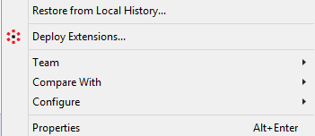
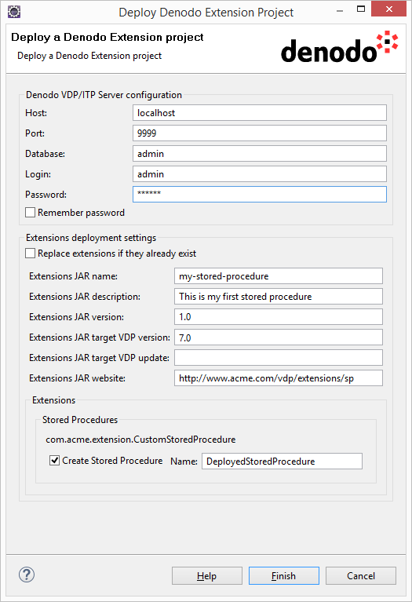
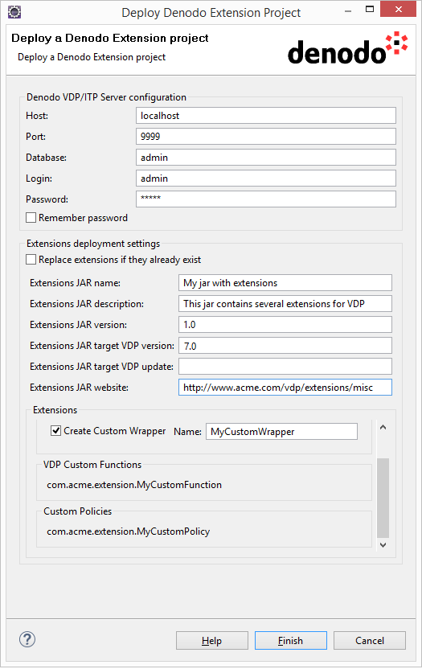
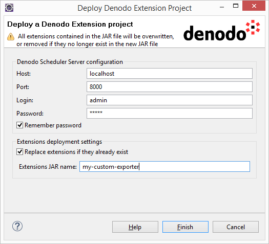

====================================================
The Deploy Wizard
====================================================

Denodo4E provides a wizard for deploying Denodo Extension projects into the corresponding servers or the Wrapper Generation Tool
(see :ref:`The Denodo Extension Project wizard` for more information about Denodo Extension projects). 

To start the Deploy wizard, open the contextual menu over a Denodo Extension project and click **Deploy Extensions...** 
(note that this option will only appear in the menu when a Denodo Extension project is selected). 

  
  Deploy Extensions Option
  
Deploying Extensions into the VDP/ITP Server
=============================================

Some configuration must be passed to the wizard before deploying a Denodo Extension project. 
In the case of a project containing extensions for the VDP/ITP Server, the following parameters must be configured:

-  **Denodo VDP/ITP Server configuration**

   -  **Host**: the host where the server is running (*localhost* by default).
   -  **Port**: the port where the server is running (*9999* by default).
   -  **Database**: the server's database where the extensions are going to be deployed (*admin* by default).
   -  **Login**: the login used to access the server (*admin* by default).
   -  **Password**: the password for the provided login.

-  **Extensions deployment settings**

   -  **Replace extensions if they already exist**: check if you wish to overwrite existing extensions if necessary.
   
      The following properties will be included in the generated JAR's manifest and can be used for extensions management purposes. Only the name is mandatory:
    
        -  **Extensions JAR name**: a name for the JAR file which will be generated containing the extensions. Note that this jar will be available while connected to any database in the VDP server, so it can be used to create Stored Procedures, Custom Wrappers or views that use Custom Functions in any database.
        -  **Extensions JAR description**: an optional description for the extensions contained in the project.
        -  **Extensions JAR version**: an optional version for the extensions jar.
        -  **Extensions JAR target VDP version**: an optional minimum required VDP version for the extensions jar. VDP will check the required version and the deployment will not be performed if the server's version is older than required.
        -  **Extensions JAR target VDP update**: an optional minimum required VDP update for the extensions jar. VDP will check the required update number and the deployment will not be performed if the server's latest update is older than required.
        -  **Extensions JAR website**: an optional website with additional information about the extensions included in the project.

    -  **Extensions**: this is a list of the extensions contained in the project to be deployed. In the case of the Stored Procedures and the Custom Wrappers, 
       it is possible to create them and give them a name (this is the default choice). If you choose not to create some of the Stored Procedures and Custom Wrappers, 
       they still can be manually created later using, for example, the VDP Administration Tool: the necessary classes will be available in the deployed JAR. 
       The VDP and ITP Custom Functions     will be available just by deploying the generated JAR file, so it is not necessary more configuration.
           
In the following screenshot you can see the Deploy wizard for a Denodo Extension project containing a Stored Procedure:

   
   Deploy Denodo Extension Wizard 

It is possible for a Denodo Extension project to contain several extensions for the VDP/ITP Server 
(Stored Procedures, Custom Wrappers, Custom Policies, Custom Input Filters and VDP and ITP Custom Functions), or for the Wrapper Generation Tool 
(several ITP Custom Functions can be packed in the same JAR). (See :ref:`The Denodo Extension wizard` for information about adding extensions to a Denodo Extension project). 
The next screenshot shows the Deploy wizard for a Denodo Extension project containing several extensions for the VDP/ITP Server: 

|

  
  Deploy Denodo Extension Wizard

Deploying Extensions into the Scheduler Server
==============================================

Now we will see what configuration is needed to deploy a Denodo Extension project into the Scheduler Server (in this case, the projects can only contain one extension):

-  **Denodo Scheduler Server configuration**
  
   -  **Host**: the host where the server is running (*localhost* by default).
   -  **Port**: the port where the server is running (*8000* by default).
   -  **Login**: the login used to access the server (*admin* by default).
   -  **Password**: the password for the provided login.

-  **Extensions deployment settings**

   -  **Replace extensions if they already exist**: check if you wish to overwrite existing extensions if necessary.
   -  **Extensions JAR file name**: a name for the JAR file which will be generated containing the extension.

      

  
   Deploy Denodo Extension Wizard   
  
Deploying Extensions into the Wrapper Generation Tool
=====================================================

These are the configuration parameters required for deploying a JAR with ITPilot Custom Functions into the Wrapper Generation Tool:

-  **Denodo Platform Home Directory**: here it must be specified the Denodo Platform's installation directory. 
   The **Browse...** button can be used for convenience, but the directory can also be typed manually.
   
-  **Extensions deployment settings** 
 
   -  **Replace extensions if they already exist**: check if you wish to overwrite an existing JAR file if necessary.
   -  **Extensions JAR file name**: a name for the JAR file which will be generated containing the ITPilot Custom Functions.
   -  **Extensions**: this is a list of the ITPilot Custom Functions contained in the project to be deployed.

  
.. figure:: deploywizard_6.png
   :align: center
   :alt: Deploy Denodo Extension Wizard
  
   Deploy Denodo Extension Wizard  

Final Steps
============

After you are finished configuring the Deploy wizard, click **Finish** to deploy the selected project into the corresponding 
server (which must be running) or the Wrapper Generation Tool. In the latter case, new extensions will not be detected until the tool is restarted 
(if it was already running). 

.. note::

   If the deployed project has more dependencies than the automatically added by the Denodo Extension Project wizard
   when the project was created, copy them to the folder :file:`{<DENODO_HOME>}/extensions/thirdparty/lib`. In the case of dependencies with other Eclipse projects, 
   these must be exported as JAR files before copying them to :file:`{<DENODO_HOME>}/extensions/thirdparty/lib`. 
