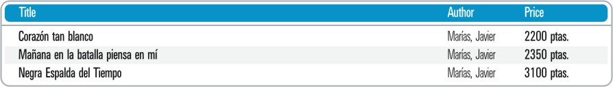

=========================================================
Ambiguity of Patterns and Demarcation of the Search Space
=========================================================

Given that DEXTL searches for occurrences of a specific pattern
throughout the entire document, the possibility of the defined pattern
being ambiguous is a potential problem. What this means is that portions
of the document that are not really tuples of the relation could match
the pattern.

In most cases this situation can be avoided by extending the pattern
specification to recognize parts that - although they are not to be
extracted - prevent ambiguity. However, on other occasions, this is not
so simple. A typical example is shown below.

**Example**: The figure below shows the graphic format
used by a bookshop on the Internet to display data on its products.

   Tabulated Results of a Bookshop

As can be seen, the data on the products is tabulated. The head of the
table may be difficult to distinguish from the actual results, if only
the *format tags* that are most intuitive in this case have been
defined: TD:= "<TD"[^\\>]\*">" and ENDTD:="</TD"[^\\>]\*">".

In fact, a program like the following is erroneous, as it would return
the heading as though it were a valid tuple of the relation ‘Book ’:

.. code-block:: none
   :name: Ambiguous Pattern
   :caption: Ambiguous Pattern

   {NAME="BOOK"
    :TITLE ENDTD TD :AUTHOR ENDTD TD :PRICE ENDTD
   }

Although in almost all cases, and in this one in particular, careful
definition of *format tags* or use of the series of functions for
processing subrelations (see section :ref:`Relations and subrelations`)
enables the definition of a correct pattern, it would evidently be
simpler and faster to define it in a more intuitive fashion without
using additional format tags.

To solve problems such as the one showcased in the previous example the
system offers the option of demarcating the part of a document where the
patterns are going to be applied. Within a specific element of the DEXTL
program this can be done with the FROM and TO clauses of an element.
These clauses are specified by using the constructions "FROM-ENDFROM"
(for the FROM clause) and "< >" (for the TO clause).

The FROM clause is used to demarcate *the point of the document where
the search for data has to be started*. The format of this construction
is shown below:

.. code-block:: none
   :name: Use of FROM and END\_FROM
   :caption: Use of FROM and END\_FROM

   {
    ...
    FROM
     TAGSET="ALL4_5"
     From pattern
    END_FROM
    Main Pattern of the Level
    ...
   }

Where *From pattern* is a DEXTL pattern constructed in the same way
as normal patterns. This pattern is only searched once; when found, the
search for the main pattern of the level starts. If no occurrence of the
*From pattern* is found, the group of tuples extracted for the
element will be empty.

As can be seen, the construction ‘FROM-END\_FROM’ must be used within an
element specification, before defining the patterns and/or subelements.

The FROM clause does not automatically inherit the tagset used by the
parent element, so if the FROM has to use a tagset different than the
default one, it has to be explicitly specified by using the TAGSET
clause after the FROM element (see section :ref:`Tagsets` for more info about
the tagsets).

As regards the TO pattern, its function is symmetric, but demarcating
*below* the concordance search zone. The TO pattern should be
inserted between the symbols ‘<’ and ‘>’ immediately before the end tag
of the subpattern ‘‘}’. If a TO pattern is not included, it is
implicitly assumed that this is the end of the current document. Another
very important use of the TO pattern will be explained in the context of
subrelation processing (see section :ref:`Relations and
subrelations`).

In this way, for the above example the following specification would
solve the problem without the need to define additional *format tags*.
The FROM clause specifies a pattern that matches the header of the
table, and the main level pattern extracts the information of the table
rows below the header.

.. code-block:: none
   :name: Solving the problem of the table header
   :caption: Solving the problem of the table header
   
   {
   FROM
   "Title" ENDTD TD "Author" ENDTD TD "Price" ENDTD
   END_FROM
   :TITLE ENDTD TD :AUTHOR ENDTD TD :PRICE ENDTD
   }

**Example**: The following DEXTL program searches for occurrences of the
pattern *Pattern* in the two zones of the document demarcated in the
following manner:

-  The first zone includes the first occurrence in the document of
   *PatternFrom1* to the first occurrence in the document of
   *PatternTo1* after *PatternFrom1*.
-  The second zone includes the first occurrence in the document of
   *PatternFrom2* after the first occurrence of *PatternTo1* to the
   first occurrence in the document of *PatternTo2* after
   *PatternFrom2*.

.. code-block:: none
   :name: Applying different patterns to Two Zones
   :caption: Applying different patterns to Two Zones
   
   {
   ...
   FROM PatternFrom1 END_FROM
   Pattern1
   <PatternTo1>
   }
   {
   ...
   FROM PatternFrom2 END_FROM
   Pattern2
   <PatternTo2>
   }

With this specification the DEXTL program starts to search for the
pattern *PatternFrom1*. No other pattern is searched for until this one
is found (if it arrives at the end of the document, the *extraction*
process ends).

If the pattern *PatternFrom1* is found, the patterns *Pattern1* and
*PatternTo1* are then searched for. Until *PatternTo1* is found the
results of all the occurrences of *Pattern1* are given.

When *PatternTo1* is found, the current element is abandoned (in this
case the first { ... }). The search for *Pattern1* ends and it moves on to
the second { ... }, where the same process is repeated.

It is important to bear in mind that the results that match the
demarcating patterns (in this case, *PatternTo1* and *PatternTo2)* are
not communicated or stored, as they are patterns that only serve to
demarcate the search area. That data piece is not returned as a tuple of
the relation, but is not discarded when it matches a TO pattern. This
means that when some data piece from the document matches one of the TO
patterns, the current element search is stopped and the search for the
following element begins over the same data that triggered the TO match.

Another function of the FROM patterns, which can be useful, is that they
can include attributes corresponding to the element in which they are
included. The values that are assigned to these attributes during the
process of searching for occurrences of the pattern are added to all the
tuples of the relation as additional attributes.

As an example, imagine that we are searching for data in an electronic
bookshop that shows the name of the AUTHOR at the beginning of the page,
followed by a list of all the books and prices. Using a FROM pattern we
can obtain the name of the AUTHOR and the rest of the data in the
element pattern:

.. code-block:: none
   :name: Using the FROM pattern to obtain additional data
   :caption: Using the FROM pattern to obtain additional data
   
   {
   ...
   FROM
   ...
   :AUTHOR
   ...
   END_FROM
   ANCHOR :TITLE ENDANCHOR ENDTD TD :PRICE BR
   ...
   }

The attributes obtained in the FROM pattern - in this case the attribute
AUTHOR with the corresponding value - are added at each occurrence of
the pattern of the element with an attribute TITLE and another attribute
PRICE.
