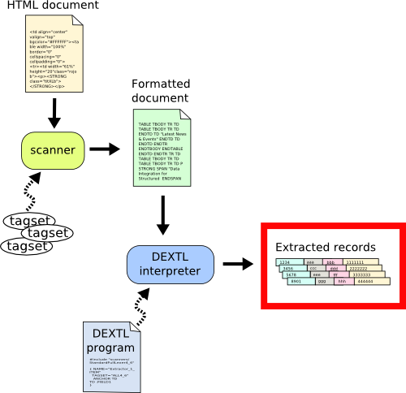

============
Introduction
============

Most information obtained from WWW (Worldwide Web) sources is presented
using the HTML tag language, centered on the visualization of data by
human beings. However, the constant growth of the Web makes it
impossible to access the data unless this is done mechanically. Many of
the Web sources also generate their data registers automatically - with
data repositories that are accessed through HTML front-ends.

This document introduces the DEXTL language (Data Extraction Language),
which provides the user with a structured view of the data contained in
HTML pages obtained beforehand (possibly using NSEQL). This language
will be used to extract structured information (as record sets) from
HTML pages.

Usually is not necessary to create DEXTL programs manually. The ITPilot
:doc:`/itpilot/generation_environment/index` graphic generation environment allows the DEXTL
programs to be created graphically using examples. Nevertheless, this
manual provides an exhaustive description of the language for advanced
users.

The general procedure for the extraction of data from HTML is displayed
in `Overview of the extraction process`_:

#. The HTML document is used as the input of the scanner (see section :ref:`Scanners`). The scanner uses tagsets (see section :ref:`Tagsets`) to
   format the HTML document into a new document that contains *format
   tags* instead of HTML tags.
#. The formatted document that the scanner outputs is used as the input
   of the DEXTL interpreter that applies a DEXTL program to the
   document. The DEXTL program specifies the format tags structure to be
   extracted from the document; all the matches found by the interpreter
   will be returned as data records at the end of the extraction
   process.

The following chapters explain each of the elements present in `Overview
of the extraction process`_: scanners, tagsets, format tags and DEXTL
programs.

   Overview of the extraction process
