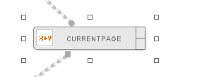
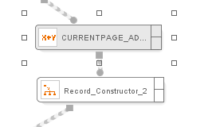
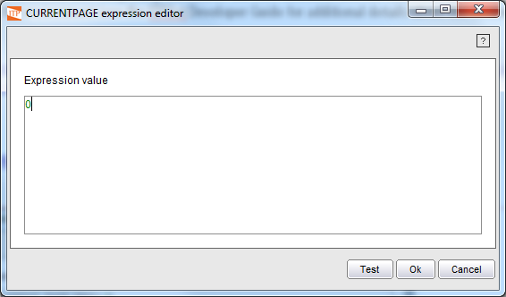
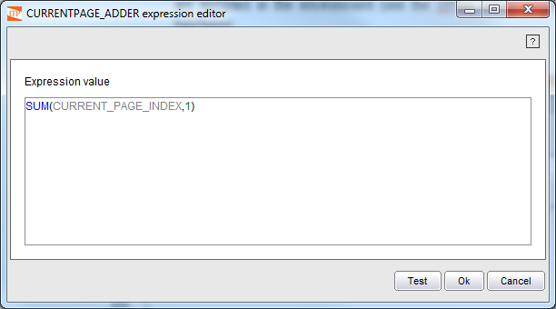

==========
Expression
==========

.. rubric:: Description

The Expression component allows defining an expression in function of
its inputs. The result of evaluating the expression will be returned as
output. The expression can also use constants and functions provided
byITPilot.

.. rubric:: Input Parameters

This component accepts zero or more values, zero or more pages, zero or
more records, and zero or more record lists.

.. rubric:: Output Values

This component returns the result of evaluating the expression.

.. note:: If any “Hidden” field on the inputs is used to build the
   expression, the wizard will prompt to ask whether the resulting
   expression must be hidden too or not.
   
.. rubric:: Example

`Variable initialization Expression component`_ shows part of a process
that uses the expression component to initialize a variable (e.g.
CURRENTPAGE) to 1. `Creation of a constant value in the Expressions
Editor`_ shows that the initialization is as simple as assigning an
integer constant to the expression value.

   Variable initialization Expression component

Following this initialization, another Expression component can be used
within a loop (either a Loop, a Repeat, or an Iterator component) to act
as a counter, in this case a pages counter (see `Use of an Expression
component as a pages counter`_):

   Use of an Expression component as a pages counter

Below is explained how to use the Expression editor to define the
expression (see `Using a function in the Expressions Editor`_).

Using the Expressions Editor
============================

The expressions editor is shown in `Using a function in the Expressions
Editor`_. The expression is built by manually typing in the “Expression
Value” box. This editing box provides some features to assist when the
expression is being typed: syntax highlighting and text completing.

-  Syntax highlighting: the errors in the expression are highlighted in
   red, and by hovering the mouse over the erroneous elements a
   description of the error will be provided as a tooltip. Also,
   different colors are used to highlight constants, functions and
   variables.
-  Text completing: a popup menu for text completing can be invoked by
   typing Ctrl+Space; it also appears after the expression is changed.
   This menu shows a list of elements that can be inserted in the
   current position, as input variables or functions (both built-in and
   custom). The items can be selected by clicking with the mouse or
   navigating the list with the up and down arrows and pressing Enter.
   
   The list of elements will only show the items that match the current prefix.
   For example, after writing a “c” character and opening the text completing menu,
   only the functions whose names start with “c” will be suggested. 
   
   Also, the expected types are taken into account, depending on the place where the
   menu is open. If the menu is open inside a function, the list will only show the
   items with a type compatible with the type of the function parameter where the cursor
   is placed. For example, when completing parameters of the function concat, only variables
   of type string will appear, and only functions whose return type is string. 
   
   The functions that are in the text completing list include the core functions and the
   custom functions that are installed in the environment.

   `Creation of a constant value in the Expressions Editor`_ shows an
   example in which a constant value is created and `Using a function in
   the Expressions Editor`_ shows an example in which an expression is used
   as a counter.

   Creation of a constant value in the Expressions Editor

   Using a function in the Expressions Editor

