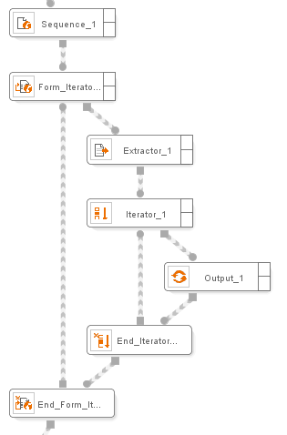

=============
Form Iterator
=============

.. rubric:: Description

This component allows iterating on the different options provided by a
specific web form, executing a different query on each iteration.

.. rubric:: Input Parameters

The Form Iterator requires the following elements as input parameters:

-  The input page, where the form on which to iterate is located.
-  Zero or more lists of records, zero or more values, zero or more
   records that can be used to parameterize the search and run sequences
   of the specific form.

.. rubric:: Output Values

As a return value, this component returns the page obtained after each
iteration.

.. rubric:: Example

Information is required on vacations in the US through a source of real
estate offers. This source offers a search form where a group of search
terms can be entered in a text box. There is also a combo box, where the
type of house required for the summer season can be chosen (apartment,
summerhouse, sublet, sale, etc.). With ITPilot, it would be possible to
create a process that accepts the type of house to be searched as the
input argument. However, if the search is to be made on several house
types, an input list provided by the user must be created. The Form
Iterator component allows doing this in a simpler form by allowing to
iterate on the options provided by the form. In each iteration, the
component will assign one of the possible combinations of form input
arguments and will run it.

`Use of the Form Iterator component`_ shows part of the described
process. A Sequence component navigates to the page containing the form.
A Form Iterator component is then added. In each iteration, it returns a
page used by an Extractor to obtain the required data.

To configure the Form Iterator component follow these steps:

#. The component receives as an input the output page of the Sequence
   component. It may also receive lists, records or values that may be
   used as input values on the required form.

   Use of the Form Iterator component

2. The component wizard is divided into five tabs:

   a. “Values”: This allows specifying the desired form fields and values on
      which to iterate. To do so, you must first specify the target form. For
      this, the following steps are taken:

      i.  Open a browser from the Browser->New Browser menu option and
          navigate to the form page.
      ii. Highlight the required form on the page. To do so, simply select
          part of the text or elements associated with that form (see
          the figure below).
 
          .. figure:: DenodoITPilot.GenerationEnvironment-194.png
             :align: center
             :alt: Highlighting part of the form to select it
             :name: Highlighting part of the form to select it
          
             Highlighting part of the form to select it

      iii. Click on the “Import Selected Form” button. The wizard editor will
           display information on each of the form fields and their values (see
           the figure below).

           .. figure:: DenodoITPilot.GenerationEnvironment-195.png
              :align: center
              :alt: Importing information from the form
              :name: Importing information from the form
           
              Importing information from the form

     iv. It is now possible to choose the different values to be used in the
         iterations for each field with an enumerated list of possible values
         (selection lists, check boxes, etc.). For text fields, constant values
         (between quotes) can be typed or attribute values can be drag&dropped
         (see the figure below). Through these steps,
         ITPilot is informed of the values to be used in the different
         iterations. The number of iterations is equal to the total
         combinations of these data (e.g. if two possible values are entered
         in a drop-down and two values in a text field, the component will
         iterate four times).

        .. figure:: DenodoITPilot.GenerationEnvironment-196.png
           :align: center
           :alt: Selecting values in the form fields (1)
           :name: Selecting values in the form fields (1)
        
           Selecting values in the form fields (1)

  b. On the next tab (“Navigation”) the searching and submitting sequences
     for the selected form are configured (this is usually already defined
     after importing the form). The sequence can be loaded from files or
     imported from the browser, as explained in section :ref:`Web browsing
     automation`, or ITPilot can automatically generate the sequence
     using the “Suggest submit sequence” button (see the figure below).

     .. figure:: DenodoITPilot.GenerationEnvironment-197.png
        :align: center
        :alt: Selecting values in the form fields (2)
        :name: Selecting values in the form fields (2)
     
        Selecting values in the form fields (2)

  c. The “Configuration” tab is used for configuring the total number of
     iterations, whether to run parallel iterations or not, the maximum
     number of parallel iterations that can be run and whether to reuse
     the current connection (so that the same browser is used for each
     iteration (which, as explained in section :ref:`Access to the Details
     Page: using Extractor Sequence`, may be inadequate for parallel
     iterations) or not. The order in which the attributes are used may
     also be configured, affecting the order of the combinations. On this
     tab it is also possible to configure the number of retries that can
     be run when an error is detected in the navigation sequence.
     
  d. The tabs ‘Advanced’ and ‘Denodo Browser’ contain the advanced
     configuration for the navigation sequence. For more information
     please see section :ref:`Advanced configuration of the Sequence and Next
     Interval Iterator components`.

     .. figure:: DenodoITPilot.GenerationEnvironment-198.png
        :align: center
        :alt: Configuration tab for the Form Iterator component
        :name: Configuration tab for the Form Iterator component
     
        Configuration tab for the Form Iterator component

3. Now the component is configured and it can be independently tested
   using the “Test” button (in this case a browser must be located in
   the imported form page. See section :ref:`Individual Test of Extractor
   Sequence, Next Interval Iterator and Form Iterator Components`).

