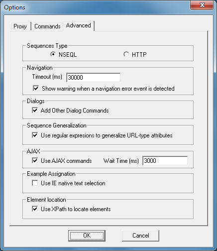

================
Advanced Options
================

Currently, the ‘Advanced’ tab allows configuring a set of global
parameters, using the “Advanced” tab. Please see `Advanced Options
Window`_.

   Advanced Options Window

-  *Sequences Type*: the toolbar enables the navigation sequence to be
   recorded as a set of NSEQL or http commands. The latter option can be
   used for very simple accesses, where only http access is required in
   GET or POST mode.
-  *Timeout*: specifies the maximum waiting time for a browser to run a
   sequence. This parameter is used when the user needs to run the
   navigation sequence from the toolbar.
-  *Show warning when a navigation error is detected*: specifies if a
   warning dialog should be shown when a navigation error is detected
   when accessing to a resource contained in the page (frame, image,
   etc.) and a :ref:`IgnoreNavigationError <nseql_guide_ignore_navigation_errors>` command is added to the sequence.
-  *Add Other Dialog Commands*: this option tells ITPilot to include
   dialog box completion commands (as well as proxy dialog box
   completion, which is configured in the “Proxy” tab) in the sequence.
   This option only applies to Microsoft Internet Explorer browsers.
-  *Use Regular Expressions to Generalize URL-type Attributes*: with
   this option selected, the toolbar will try to generalize URL
   attributes that appear in the sequence by means of regular
   expressions so as to ignore the URL parameters that have session
   values.
-  *Use AJAX Commands*: informs the system whether the use of AJAX
   commands is permitted or not. If it is known that the page to be
   viewed does not use AJAX, it may be advisable to deactivate this
   option so as to avoid generating unnecessary commands and parameter
   values in the sequence.
-  *Wait Time*: in navigation sequences involving complexities such as
   JavaScript and AJAX, the commands generated by the toolbar try to
   automatically detect when the effects in the page caused by a
   particular action (e.g. a click) have finished. Nevertheless, in
   certain cases the end of the effects may be not detected. This
   parameter specifies the maximum time ITPilot will wait for the end of
   the effects caused by an action to be detected before continuing the
   sequence anyway.
-  *Use IE native text selection*: if checked, the toolbar will use the
   native algorithm of Internet Explorer to select texts on web pages
   when assigning examples. If it is not checked, an ITPilot internal
   algorithm will be used. Using ITPilot text selection method, all HTML
   events fired because of mouse movements or mouse clicks when the user
   is selecting some text are blocked in order to prevent the page to
   react to these events and change its current content. Another
   advantage of the ITPilot text selection method is that it allows
   selecting a piece of text starting the selection inside a hyperlink
   without the need of start the selection before or after the
   hyperlink.
-  *Allow XPath to locate elements*: if checked, the toolbar will use
   *FindElementByXPath* commands to identify elements in the generated
   NSEQL. If it is not checked, the toolbar will generate other commands
   of the *FindElementByXXX* and *FindChildElementByXXX* families but
   it will not use *FindElementByXPath*.
