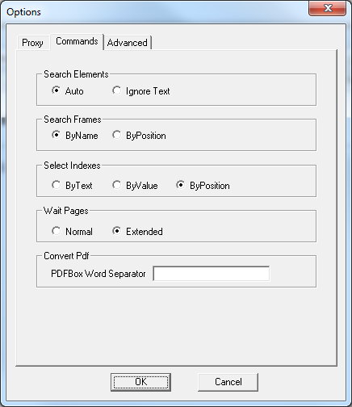

=====================================
Criteria for Selecting NSEQL Commands
=====================================

The :doc:`/itpilot/nseql/index` provides various alternatives for
performing certain actions. For example, selecting a link on which a
click event will be executed can be achieved with different commands.
Every command has a different way of identifying an element:

-  FindElementByAttribute: identifies an element according to the value
   of its attributes.
-  FindElementByText: identifies an element according to text contained
   in it.
-  FindElementByPosition: identifies an element according to the
   relative position of the element on the page.
-  FindElementByXPath: identifies an element according to an XPath
   expression that may involve several elements, attributes and text.

The toolbar will automatically try to select the more adequate command
for each case, but in certain situations you may prefer to modify the
automatic choice. For example, criteria based on text can be inadequate
when the text dynamically varies each time the web is accessed (e.g.
consider the case of a link that provides access to the list of new
messages in a webmail system, where the text indicates the number of new
messages and, thus, it can differ each time the service is accessed).

On the other hand, the least suitable criterion is usually the relative
position of the element on the page, as it is more vulnerable to
possible changes in the structure of the Web site. However, sometimes it
can be a good option when the other alternatives have been proven to be
inadequate.

This panel allows the criteria to be changed using the family of
commands related to the identification of elements, frames and options
in selectable fields. The options for each family are:

-  *Elements*: auto (the toolbar will choose the most suitable command),
   and “Ignore texts” (the toolbar will not use texts to identify the
   element).
-  *Frames*: value of the *name* attribute, or relative position on the
   page.
-  *Options (“Indexes”)*: text, value of the *value* attribute and
   relative position in the list of options.

If a value that does not exist for a specific element (e.g. a frame
without a value for the *name* attribute), the system will try to select
by itself another criterion that is more suited to this specific
element.

Another important aspect to take into consideration is that the criteria
set for frames are *global to the entire page*. This means that within a
specific page of the navigation sequence the same selection criteria
should be used for all the events on frames contained in it. If during
the generation of the navigation sequence different criteria are
specified for elements of the same type within the same page, the system
will always take the last criterion set.

This tab also allows selecting the type of NSEQL default wait command
the tool will use for page downloads. “Normal” indicates that the
“WaitPages” command will be used. In this case, at recording time the
system will count the number of pages that are downloaded after a
certain navigation action (e.g. a click on a link). At execution time,
the system will wait for that number of pages to download before
executing the remaining commands of the NSEQL program. Notice that on
the presence of redirections and/or multi-frame pages, the number of
pages downloaded after a navigation command can be different from 1. The
main drawback of this option is that in some cases, the number of pages
downloaded after a navigation action may be variable

The “Extended” option indicates the use of “extendedWaitPages” command.
This command does not record the number of pages downloaded after a
navigation action. Instead, at execution time, after executing a
navigation action, ITPilot will wait a certain time to check how many
navigations are launched by the browser and will wait for all of them to
complete before continuing executing commands. Therefore, this option
does not have the drawback mentioned for the “Normal” option but, in
turn, can be slightly less efficient in some cases.

Finally, this tab allows specifying the PDFBox Word Separator. By
default, the PDFBox text extraction algorithm will output a space
character if there is enough space between two words. The PDFBox Word
Separator option allows to change this behavior by specifying a
different character to use.

`NSEQL Options Window`_ shows a view of this configuration window.

   NSEQL Options Window

