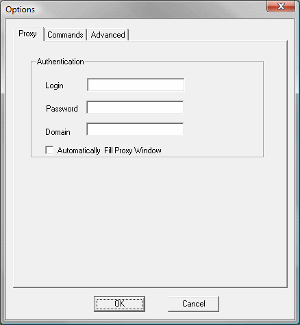

=================================================
Generating Sequences Using an Authenticated Proxy
=================================================

If the Internet is going to be accessed through a proxy with
authentication, it may be necessary to provide a value for the following
parameters:

-  Login: user in the proxy.
-  Password: user password in the proxy.
-  Domain (Windows 2000): Windows domain.

`Proxy Options Window`_ shows this window.

   Proxy Options Window

This window also lets the user configure whether the Proxy
authentication window must be automatically filled with the provided
data if it appears.

.. note:: When the proxy configuration has been set and a proxy dialog
   is open, after successfully filling it the state is saved in the
   toolbar. From now on, all the sequences that are recorded will add at
   the start of the sequence a *SetProxyAuthInfo* command that fills that
   data. If the proxy configuration is changed in the Proxy Options Windows
   (`Proxy Options Window`_), it will not have effect until another proxy
   authentication dialog appears and it is filled with the new configured
   values, thus changing the state of the toolbar.

