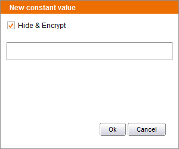

==================================
Recording Sequences with Passwords
==================================

When recording a Set Text action over a <INPUT type=”password”> element
like the password field in the login page of the webmail example, the
Sequence Generator toolbar will never include the password in the
resulting NSEQL program. There are two cases:

-  The user enters the password and a variable name: the NSEQL program
   will include the variable name instead of the password.
-  The user enters only the password: in this case, the toolbar will
   encrypt the password and the NSEQL program will include a parameter
   like “encrypted:2LdrCaNizETkfGNlET0G1A==” in the appropriate SetValue
   command instead of the clear password. When executing the sequence,
   the encrypted password will be automatically decrypted so the real
   password will be set on the html password field. After importing the
   sequence in the Wrapper Generator Tool, the encrypted value can be
   edited in the NSEQL editor. To do this, we can put the mouse over an
   encrypted parameter and do Ctrl + Click or we can put the cursor on
   the parameter, press Ctrl + Space and click on the option “New
   Constant Value”; in both cases the dialog shown in `Edit encrypted values`_ appears
   and allows entering a new value that will be automatically encrypted
   again. Note that this feature is only available for the parameter of
   SetValue commands and the password parameter of the SetProxyAuthInfo
   command.

   Edit encrypted values
