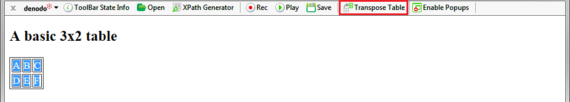
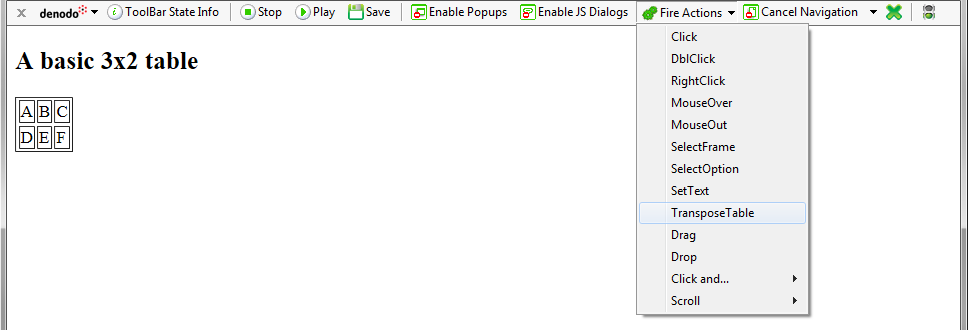
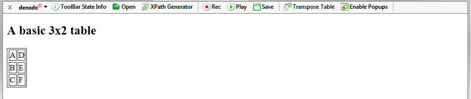
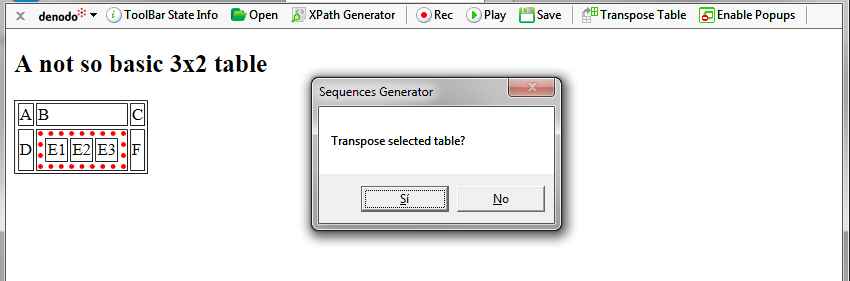
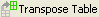

=====================================
The Transpose Table Button and Action
=====================================

The process for extracting data from HTML tables followed by ITPilot
assumes that the desired records are disposed as table rows. However, in
some cases the desired records may actually be disposed as columns in
the table (e.g. in tables with columns providing information on
different time sections and where information is to be obtained per
period of time). Although a possible solution involves extracting the
information row by row to subsequently restructure it in the process
flow, the NSEQL sequence generation tool provides an option known as
“Transpose Table”, which transposes any table highlighted by the mouse
on the page.

The transpose process flips the table over, transforming row vectors
into column vectors. Here is an example shown in `Using the “Transpose
Table” Button`_ and `Using the “Transpose Table” Action`_. There is a
table with two rows and three columns ({A, B, C}, {D, E, F}) and you
want to obtain its results as three registers with two values each ({A,
D}, {B, E}, {C, F}). If the toolbar is not in record mode, select the
table (all its elements) and click on the Denodo toolbar button |image0|
(see `Using the “Transpose Table” Button`_). If the toolbar is not in
record, select the action “Transpose Table” and then click on the table
(see `Using the “Transpose Table” Action`_). The result will be as shown
in `Result of the “TransposeTable” Command Execution`_. Any subsequent
data extraction process will use the modified table.

   Using the “Transpose Table” Button

   Using the “Transpose Table” Action

   Result of the “TransposeTable” Command Execution

If the selected table is located inside another one, the selected table
will be marked and a dialog will be displayed asking the user if that is
the table that needs to be transposed.

If the user clicks *No*, the table that the selected table belongs to,
will be marked and the same dialog will be displayed.

   Transposing a table located inside another table

