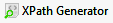

=======================
XPath Generator Utility
=======================

Sequences Generator Toolbar includes a utility that simplify the task of
generating a XPath expression to locate an element on a page. The tool
generates the smallest XPath expression (i.e. the one referencing the
minimum number of nodes an attributes) required to uniquely identify the
element in the page. The obtained expression can be used with the
ITPilot functions XPATH and XPATHLIST (see section :ref:`Functions for page
handling`) or with the NSEQL command *FindElementByXPath*.

Open the tool clicking the |image0| button.

   Screenshot of the XPath Generator utility

To generate an XPath expression:

-  Start typing the URL of the page in the top of the wizard and press
   ENTER to load the page. If the target element is not on the page then
   perform the required actions on the embedded browser to make the
   target element appear on the page.
-  Click the button “Start XPath generation”. This will make the tool to
   enter in a “generation mode” where mouse actions on the browser
   control have no effect on the HTML page. If you need to make browsing
   actions again, click “Stop XPath generation” to return to the
   “browsing mode”.
-  Click the target element. It will be highlighted with a red
   rectangle. The component below the browser control will display the
   DOM route to the target element in a tree and the generated
   expression is shown at the bottom of the wizard. Click on any of the
   nodes of the tree to see its XPATH expression.

The “Execute JavaScript” check box allows reloading the page with
JavaScript enabled or disabled.

The “Copy to clipboard” button copies the generated expression to the
clipboard.

