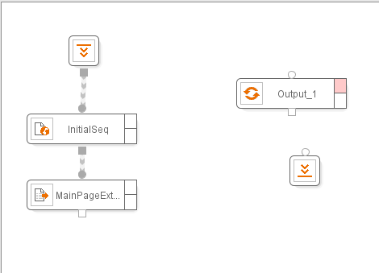
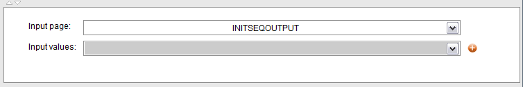

========================================
Configuration of the Extractor Component
========================================

.. toctree::
   :hidden:

   defining_the_structure_of_the_data_and_assigning_examples.rst
   generating_a_dextl_specification_from_the_examples.rst
   testing_the_generated_specification.rst
   locale_configuration_of_the_extractor_component.rst
   error_processing_on_the_extractor_component.rst

In this section we explain how to configure one of the main ITPilot
components alongside with the Sequence component: the Extractor
component. To illustrate the explanation, we continue using the example
introduced in section :ref:`Presentation of the example`.

In our example, after having successfully created a navigation sequence
to reach the page containing the list of user e-mails (:ref:`Content of a message`), the
next objective is obtaining the summary information about each mail that
is shown in the list.

To do so, we will use the Extractor component, |image0|. This component
executes a data extraction specification written in the DEXTL :doc:`/itpilot/dextl/index` language
to extract desired information from an HTML page. The user does not have
to manually write the DEXTL program; as in the case of the Sequence
component, the specification can be entirely generated by merely
providing the tool with some examples of the information to extract.

To add the Extractor component, drag it to the workspace and connect it
to the Sequence component. Alternatively, right-click on the Sequence
component and use the ‘Insert after’ option in the contextual menu.
Rename the component as “MainPageExtractor” using the “Rename component
name/ output name” option in the contextual menu and rename the output
as “EXTRACTIONOUTPUT”. The expected result is shown in `Using an
Extractor Component`_.

   Using an Extractor Component

The first step in the component configuration process is the selection
of the input page from where the component is going to extract
structured data. This page is the output of the Sequence component (i.e.
its output value INITSEQOUTPUT). Select it from the selection list (see
`Input page of the Extractor component`_). It is possible to extract
information from a local variable’s contents too. For doing this, a
String-type variable containing HTML code can be cast to a Page-type
variable using the Cast function and then used as the input page for the
Extractor. See section :doc:`../../appendix_b_itpilot_functions/type_conversion_functions/type_conversion_functions` for details.

The next step is generating the data extraction specification for this
page using the Extractor component wizard.

The Extractor wizard is composed of several panes that can be
independently maximized, minimized and resized, so you can dispose them
in the screen in the way that best suit your needs at any given time.
The panes are:

-  Structure Pane. In this pane, you can define and examine the
   structure of the records to extract. As we will see, the structure
   can be also created in the browser.
-  Generation Pane. In this pane, there are several options to customize
   the process of automatic generation of the DEXTL specification from
   examples marked in the browser. You can also manually edit the
   current DEXTL specification or even write it from scratch.
-  Extractor Sequences Pane. In this pane, you can examine and define
   navigation sequences which are contextual to the extracted records
   (“Extractor Sequences”). See section :ref:`Access to Details Pages` for
   detail.
-  Test Specification Pane. In this pane, you can test the generated
   specification and extractor sequences.
-  Token Viewer Pane. While the DEXTL specifications can be
   automatically generated, advanced users may wish to edit them
   manually. This pane provides a utility to ease this process.

The typical steps for configuring the Extractor Wizard are:

1. Use the browser to define the structure and provide examples of the
   target data (this is explained in detail in the next section).

#. If required, use the browser to record “Extractor Sequences” (see
   section :ref:`Access to Details Pages`).

#. Click on the “Import data from browser button” in the Extractor
   component wizard. The DEXTL specification is automatically generated and
   shown in the Generation pane and, if Extractor sequences have been
   defined, they are shown in the Extractor Sequences pane. The defined
   structure is shown in the Structure Pane.

#. Use the Specification Test pane to test the specification and the
   extractor sequences (see section :ref:`Testing the generated
   specification`).
   

#. If the test is not totally successful:

   a. If some results are not extracted, you may need to go back to the
      browser to add more examples and import them again.
   b. If some of the extracted results are incorrect, you can use the
      options of the Generation pane to make the generated specification
      less ambiguous (see section :ref:`Generating a DEXTL specification from
      the examples`).

#. Alternatively, if you are an advanced user, you can manually refine the
   DEXTL specification (or even write it from scratch) using the Generation
   Pane and the Token Viewer pane (see section :ref:`Generating the Data
   Extraction Specifications Manually`).

#. If you need to review or change the examples marked in the browser at a
   later session, use the “Export data to browser” button and then use the
   “Review Examples” button in the Denodo Navigation Sequence toolbar in
   the browser (see section :ref:`Reviewing the data`).

   Input page of the Extractor component

