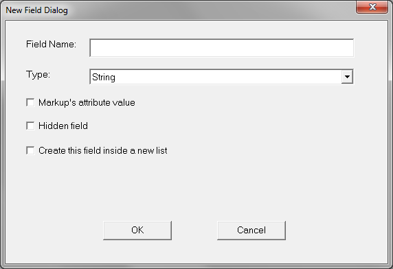
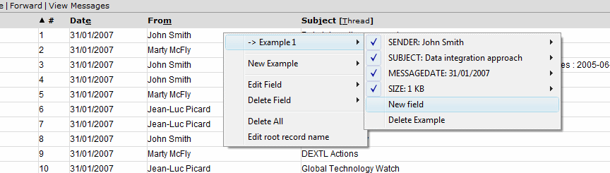
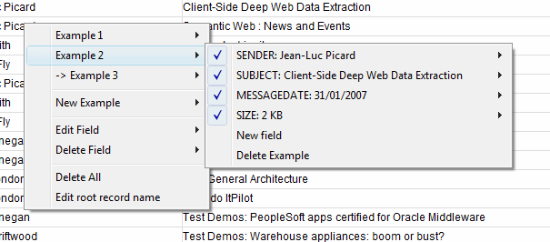
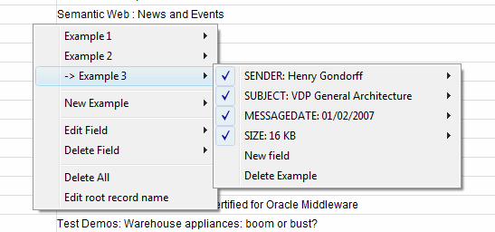
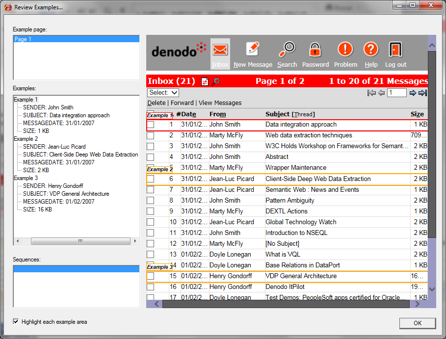
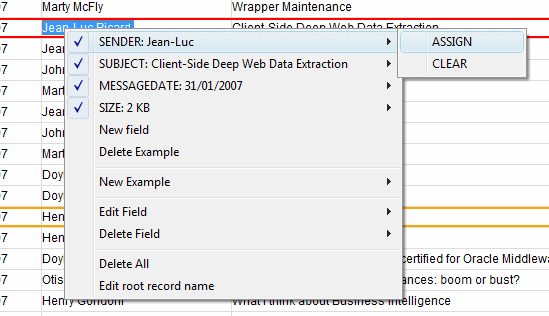
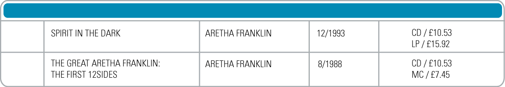
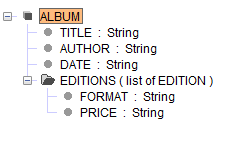

=========================================================
Defining the Structure of the Data and Assigning Examples
=========================================================

The first step when extracting data from a web page is assigning the
examples of the data we want to extract. After the examples are created,
ITPilot will use them to generate a new DEXTL specification that
extracts the desired data from the web page.

Assigning the First Example
=================================================================================

With the browser open in the e-mail list page (as shown in :ref:`First
message screen <my-reference-label_figure4>`), click the “Assign Examples” button of the toolbar.
The browser will change to the examples assignment mode, and new fields
can be added.

In the case of the webmail application, we want to extract four fields
for each e-mail:

-  SENDER: the person who sent the e-mail
-  SUBJECT: title of the message
-  MESSAGEDATE: e-mail reception date
-  SIZE: size of the message in KB

The steps to add the first e-mail example are the following:

#. Select in the browser the text “John Smith” of the first e-mail.
#. Right-click it so the examples popup menu appears.
#. Select the option “New example > New field” (the “New field” option
   of the “New Example” submenu). A dialog will appear to specify the
   data for the new field. Set
   “SENDER” as the field name, and String as its type. As this field is
   going to extract visible text (as opposed to extracting the value of
   an HTML attribute), the “Markup’s attribute value” check box must be
   deselected. The “Create this field inside a new list” and “Hidden
   field” check boxes must be deselected too, because the SENDER
   attribute is a simple field and it will not be set to sensitive
   values we want to hide.

   Dialog for creating a new field

4. Add the SUBJECT field to the created example, by highlighting the
   text “Data integration approach” and selecting the option “Example 1
   > New field”. Type the field name and accept the default String type
   and the rest of options, as in the SENDER field.
#. Repeat step 4 for the fields MESSAGEDATE (using the text
   “31/01/2007”) and SIZE (selecting the text “1 KB”). Choose Date for
   the type of the field MESSAGEDATE (specifying the pattern
   “dd/MM/yyyy”). The syntax for specifying date patterns is explained
   in section :doc:`../../generation_envirtonment_tools_-_part_ii/wrapper_advanced_options_specific_browser_pool_and_locale/locale`.

After these steps are completed, when opening the popup menu and
displaying the submenu “Example 1”, the data of the added example is
displayed, as seen in the figure :ref:`First of the page examples <my-reference-label_figure4>`.

   First of the page examples

Adding More Examples
=================================================================================

After the first example is created, as described in the previous
section, you can add more examples. ITPilot can infer a valid DEXTL
specification for some simple pages using just one example (as it is the
case for this simple webmail example), but for some other pages more
examples will be needed. In those cases, add new examples that are
structurally different of each other: examples that add new fields that
are not present in other cases, for instance. In this case we will add
more examples for illustrative purposes.

The process for adding new examples is the same as the one in section :ref:`Assigning the first example`. Add the following examples, using steps
1-5:

-  “Jean-Luc Picard” / “Client-Side Deep Web Data Extraction” /
   “31/01/2007” / “2 KB” (`Second example`_)

   Second example

-  “Henry Gondorff” / “VDP General Architecture” / “01/02/2007” / “ 16
   KB” (`Third example`_)

   Third example

Reviewing the Data
=================================================================================

With all the examples created, click the “Review Examples” button to
open the dialog shown in `Review examples dialog`_. The dialog displays
all the three added examples, in the left tree labeled as “Examples”.
For each of the examples, all the values of the fields are displayed.

In the center part of the dialog the web page is shown, with the already
assigned examples highlighted in orange. When selecting an example from
the list in the left, it will be highlighted in red on the page.

The “Example page” list shows the list of all pages where examples have
been selected, as they do not have to be highlighted from the same page.
For example, to create a specification that extracts the contents of an
e-mail, two different examples would be created in different pages. In
that case, the “Example page” list would show two pages, and selecting
each one of them would show the examples defined in each of the pages.

The “Sequences” list shows the recorded detail sequences. See Part II of
the example for more information about recording and executing detail
sequences.

   Review examples dialog

Editing the Structure and Examples
=================================================================================

Once the examples are created, the can be edited both in the page and
the Review Examples dialog. For example, suppose that when reviewing
examples, we notice that the second example contains the SENDER value
“Jean-Luc” instead of “Jean-Luc Picard”. To correct this error, select
“Example 2” in the “Examples” list, highlight the correct text and open
the contextual menu, selecting the option “SENDER: Jean-Luc > ASSIGN”
(`Editing the value of an example`_). The field will get assigned the
correct value.

   Editing the value of an example

Other modifications that can be carried on the data are:

-  Clearing the value of one field (option “FIELD\_NAME > CLEAR”.
-  Adding a field to an example (option “New Field”).
-  Deleting a whole example (option “Delete example”).
-  Editing a field, using the same dialog that was used when creating
   the field (option “Edit field > FIELD\_NAME”).
-  Deleting a field of the structure (removing it from all the
   examples), by using the option “Delete Field > FIELD\_NAME”).
-  Deleting all the examples (option “Delete All”).
-  Editing the name of the output record (option “Edit root record
   name”).

Nested Levels in the Component Structure
=================================================================================

There may be nested levels in the schema of the data to be extracted.
`Music bookstore`_ shows an example of an on-line music shop, the data
of which can be modeled in line with the schema ALBUM={TITLE, AUTHOR,
DATE, EDITION:{FORMAT, PRICE}}, where EDITION is a complex element.
According to this definition, an EDITION value will be composed of a
list of records, where each one has two fields known as FORMAT and
PRICE.

The created structure would be displayed in the Structure pane as shown
in `Structure of Music store`_.

   Music bookstore

   Structure of Music store

To this end, a “level flattening” option is provided. Click with the
right-hand button of the mouse on a compound element to view the
“Flatten level” option. In cases like this one, you may want data to be
“flattened” to belong to the same level. The selection only affects the
output structure of the data. For further information, please consult
:doc:`/itpilot/dextl/index`.

Each level of the structure may use its own tagset (please see section :ref:`Tagsets and Scanners` for more information about tagsets).

