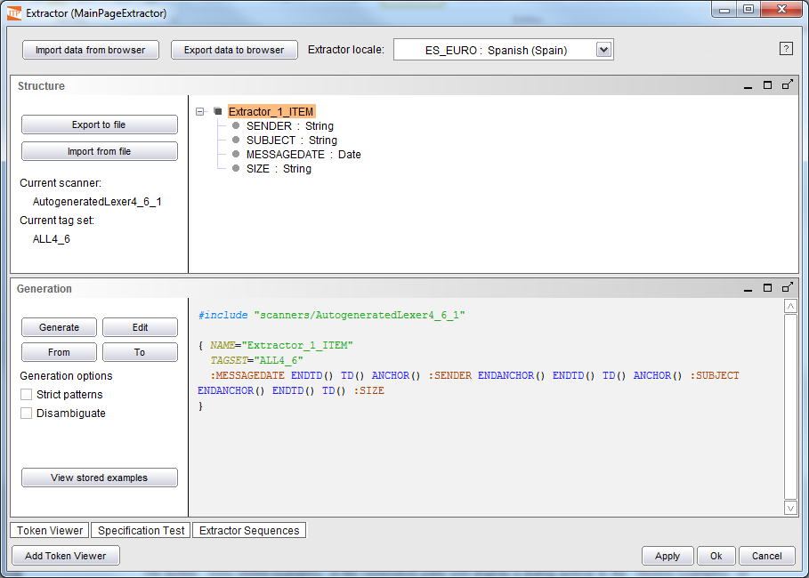
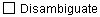
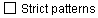

==================================================
Generating a DEXTL Specification from the Examples
==================================================

After all the examples are assigned in the browser, it is time to
generate a DEXTL specification from them. Open the Extractor wizard and
click the button “Import data from browser”. The examples are
automatically imported, and the following events take place:

-  In the Structure pane, the structure created in the browser is
   imported. You can see the SENDER, SUBJECT, MESSAGEDATE and SIZE
   fields, with their data types.
-  The Generation pane starts creating the DEXTL specification. The
   message “Generating patterns” is displayed, and after a while the
   panel displays the DEXTL program.

The results of importing the examples are shown in `Data imported from
the browser, and generated DEXTL`_.

   Data imported from the browser, and generated DEXTL

The button “View stored examples” in the Generation pane will display a
dialog similar to the “Review Examples” of the browser, where the
examples can be examined but not edited. They can be deleted by clicking
the “X” button next to each of the examples, or the “Delete All” button.

The generation process offers the following options:

-  **Elimination of ambiguities** (clicking on the check box: |image0|): when the user
   selects this option, the analyzer modifies the patterns of the DEXTL program generated
   by adding elements at the beginning and end of each in order to recognize only those elements
   that most accurately correspond to the selected examples –that is, the patterns are generated
   with more restrictions in order to avoid incorrect extraction of data that do not match the
   provided examples-. When should this option be used? When the generated specification has been
   checked and is seen to be getting more results than required. Other alternatives are the use of
   the following option (“Strict Patterns”), and to manually introduce the elements FROM and TO, 
   which delimit the beginning and end of the extraction area (for more information on these elements, see section :ref:`Tagsets and scanners included in the distribution`).
   
-  **Strict Patterns** (clicking on the check box: |image1|): if this option is selected, the system
   tries to generate the most restrictive patterns possible. Specifically, the patterns will contain the
   bigger possible number of text separators, instead of replacing them with elements of the type IRRELEVANT
   (that match with any text). If the user does not select it, the system maximizes the number of IRRELEVANT
   elements and minimizes the use of text separators. See :doc:`/itpilot/dextl/index` for more information. When should this
   option be used? In similar circumstances than in the “Disambiguate” option: when more results than expected are being received.

