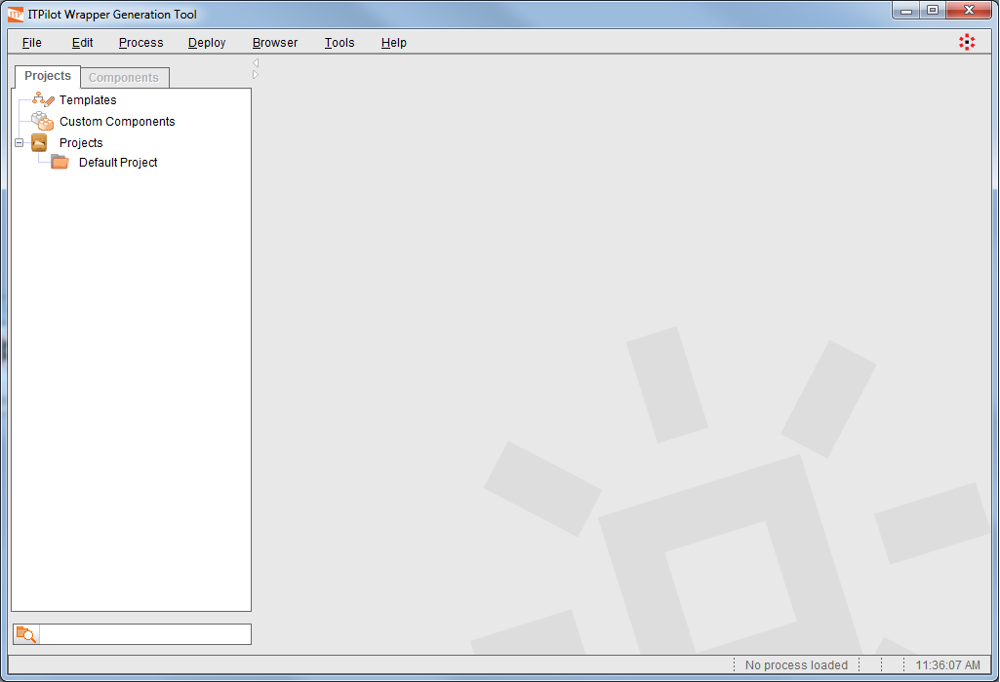
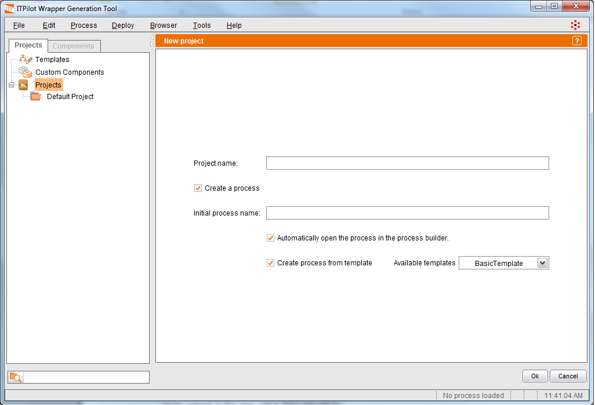
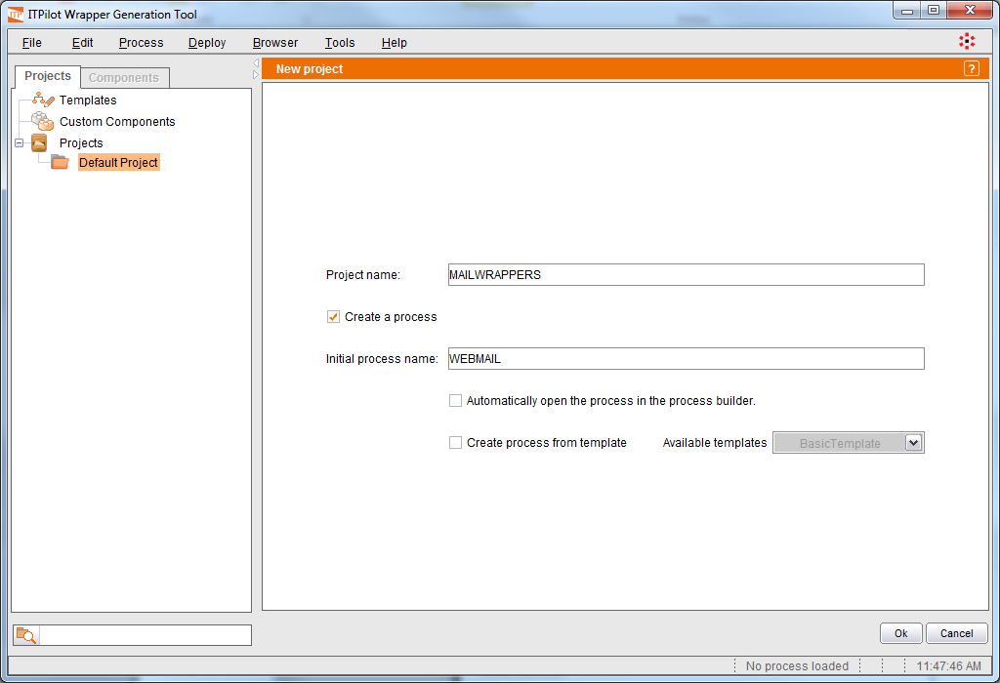
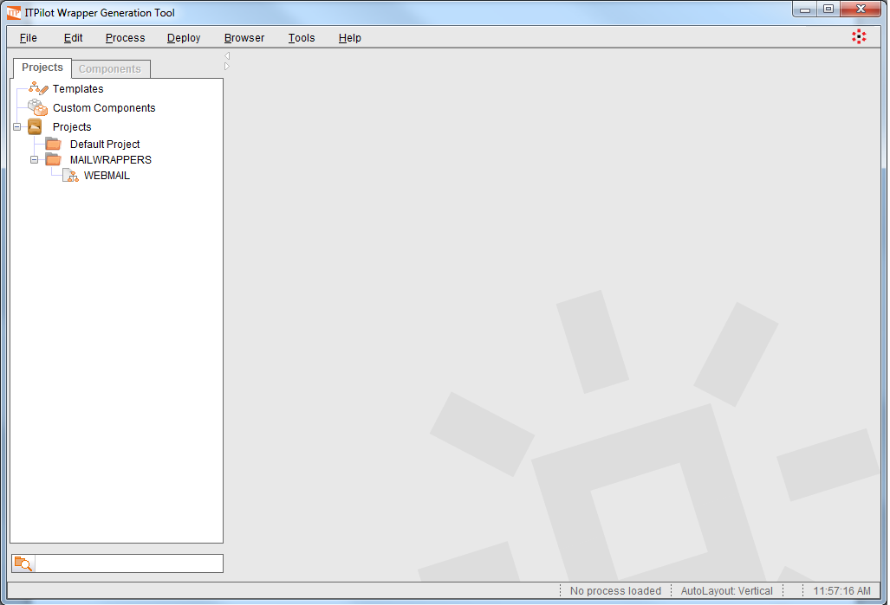

==============================
Creating Projects and Wrappers
==============================

Wrapper programs must be created within a project. In this case, we will
create a project called “MAILWRAPPERS” and a wrapper called “WEBMAIL”.
The projects are displayed in the Projects tab of the Browsing Area (see
`Empty projects list`_). Note that there exist three pre-configured
projects that are not editable:

-  “Default Project” is a regular project where wrappers can be added.
-  “Templates” is a special project which is explained below.
-  “Custom Components” is another special project which is explained in
   section :ref:`Saving a Flow as a Custom Component`.

   
   Empty projects list

   Project and process creation screen

To create a new project, right-click **Projects** and then, click **New** > **Project** on the contextual menu. The workspace will display several
configuration parameters (see `Project and process creation screen`_),
including a text field, where the project name can be entered. In this
case, call it “MAILWRAPPERS”.

When creating a new project, it is possible to create a process at the
same time by checking the “Create a process” option (note that). A name
for the new process must be entered. In this case, the name will be
“WEBMAIL”.

Denodo ITPilot provides three templates, useful so the wrappers do not
need to be created from scratch:

-  *BasicTemplate*: a template of a wrapper that extracts data from a
   single web page.
-  *StandardTemplate*: a template that queries a web form extracts the
   data from the results page and iterates over the possible pagination
   intervals.
-  *StandardDetailTemplate*: a template that queries a web form,
   extracts the data from the results page and the “detail” page of
   every record and iterates over the possible pagination intervals.

These templates fit our example perfectly but we will not use them so
that we can explain how components are placed and interconnected in the
workspace. Therefore, we will de-select the “Create Process from
Template” option.

.. note:: You can create your own templates by creating wrappers inside
   the project “Templates”. If you want to save an existing wrapper as a
   template, you can copy it to the “Templates” project or use the option
   ‘File -> Save as template…” (both actions have the same effect).

Now leave the “Automatically open the process in the process builder”
option unchecked and press the Ok button to create both project and
process (see `Creating a new project and process`_). Now the project is
displayed in the Browsing Area (see `New project and process`_). You can
delete a project by selecting it and pressing the *DEL* key or using the
“Drop” option from the project’s contextual menu. Deleting a project
involves eliminating all of its associated wrappers and, therefore, you
must be careful with your selection. On deleting a project the tool
allows you to specify whether the wrappers eliminated are deleted from
the display tool only or also from the hard drive. If they are only
deleted from the tool, they will disappear from the project view but
they can be retrieved again by selecting the Refresh option from the
project’s contextual menu (by clicking with the right-hand button of the
mouse on the specific project) or by selecting the Add Processes option
and then choosing the specific process to be retrieved.

The processes can be copied and moved from one project to another using
the “Copy to Project” or “Move to Project” options from the contextual
menu of each process. You can also move processes by dragging them from
the source project and dropping them on the target project.

The projects / processes can be migrated between different installations
of the Wrapper Generation Tool using the “Export” and “Import” options
from the “File” menu (see section :ref:`Migrating wrappers between generation
environments: import and export`).

Finally, you can create new processes using the option New -> Process
from the project’s contextual menu.

   Creating a new project and process

   
 

  
   New project and process
