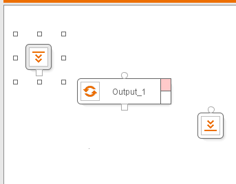
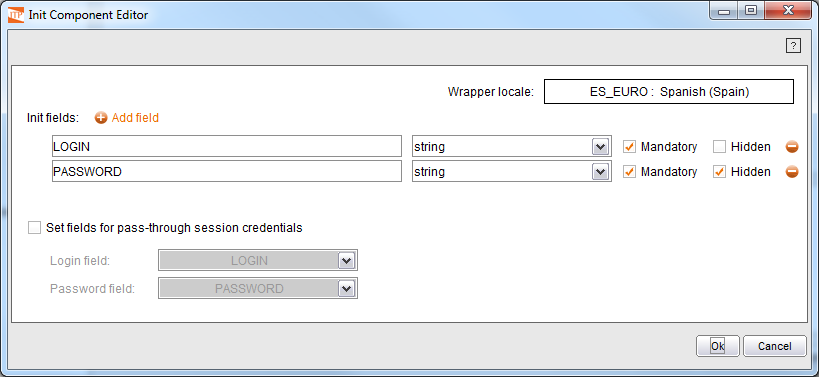

======================
Process Initialization
======================

.. toctree::
   :hidden:

   use_of_the_catalog_explorer.rst

The initialization component is responsible for storing the structure of
the input data, which is the data that the wrapper will receive from the
calling application. For example, in this case, certain information is
required by the e-mail application to access the messages - more
specifically, the user name and password of the user.

The following steps are required to define the input parameters: First,
select the initialization component using the left button of the mouse.

   Selection of the Initialization Component

A contextual menu for the component is available by right-clicking the
mouse. This allows assigning a name for the component and its output
variable. In our example we will use the name INITCOMPONENT as component
name and we will rename the output to MAILPARAMS.

Now, double-click on the component to access the Init component wizard
that will allow you to create an input record (see `Initialization
Editor`_). In this editor we can see the component locale (by default,
it will have the configuration selected at installation time or the
wrapper’s default locale, as it is described in section :doc:`../../generation_envirtonment_tools_-_part_ii/wrapper_advanced_options_specific_browser_pool_and_locale/locale`). To
create the register elements, click on the |image1| button and specify
its name and data type. Tick the “Mandatory” check box to indicate that
the parameter is mandatory. You can also tick the “Hidden” check box to
indicate that the parameter will contain information you want to avoid
displaying in the GUI or logging in the platform log files. Fields can
be of any of these types: string, integer, date, double, long, float,
url, page, browser, boolean, record and list. If the element is of date
type, then you can also indicate the format in which the dates will be
received using the |image2| button.

If a field is configured to be a record or a list, the “Hidden” check box
will be disabled and a label button |image3| will appear next to the
type selector. This button can be used to add new fields to the record
or list. These sub-fields can be configured as any other field, except
for one detail: the “Mandatory” check box will be disabled, as only
top-level fields can be mandatory.

In our example, we will create two elements:

-  LOGIN, string-type and mandatory.
-  PASSWORD, string-type, mandatory and hidden.

The result of the action can be seen in `Initialization Editor`_.

   Initialization Editor

It is possible to use pass-through session credentials with ITPilot
wrappers. When a user queries an ITPilot wrapper with pass-through
session credentials enabled, the Virtual DataPort server will use the
credentials of the user as input values for two fields defined in the
wrapper input schema. To define the fields that will receive the login
and password values select the check box “Set fields for pass-through
session credentials”. After doing this, use the selectors that are below
the check box to specify what fields will receive the user login and the
user password. Note that the field specified as password will always be
automatically marked as “Hidden”.

If the fields for pass-through session credentials are set in the Init
component wizard, at deployment time the tool will provide the option to
enable the use of pass-through session credentials with that wrapper
(see section :ref:`Deploying Wrappers to the Wrapper Server`).

.. note:: If pass-through session credentials is enabled, the fields
   that have been specified in the Init component to use as login and
   password will not be included in the schema of the base views created
   from the wrapper.

.. note:: Once a wrapper has been deployed, the use of pass-through
   session credentials can be enabled or disabled from the Virtual DataPort
   Administration Tool. See the section :ref:`Web Sources (WWW)` of the Virtual
   DataPort Administration Guide for details.

Now click on “OK” to return to the main window.

