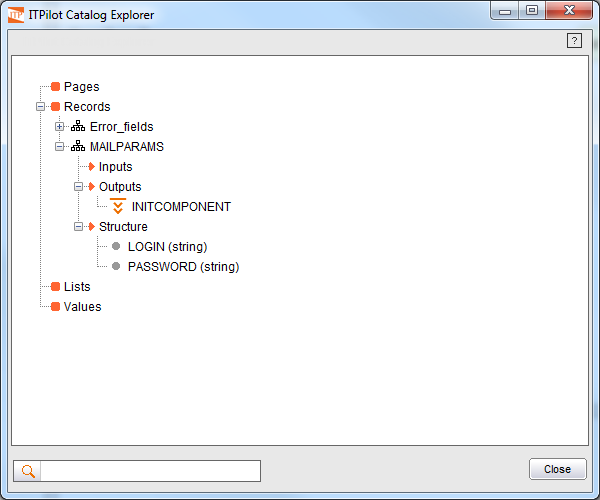

===========================
Use of the Catalog Explorer
===========================

Before continuing with process generation, this is a good time to
introduce a very useful tool to examine information about the variables
used by the process.

Clicking on the “Catalog explorer” button of the button area (or
selecting the “Process-Catalog Explorer” menu option) will start the
Catalog Explorer. A window similar to the one shown in `Catalog
Explorer`_ will appear indicating that, at that particular time, the
MAILPARAMS record is not used as input of any component, is the output
for INITCOMPONENT and showing its specific structure.

   Catalog Explorer

The following information is available for each type of catalog element
(Pages, Records, Lists of Records and Values):

-  *Inputs*: list of components with this element as input.
-  *Outputs*: list of components with this element as output.
-  *Structure*: Used in Register and List elements, it shows the
   register fields (or the fields of the inner register in the case of
   the list).

