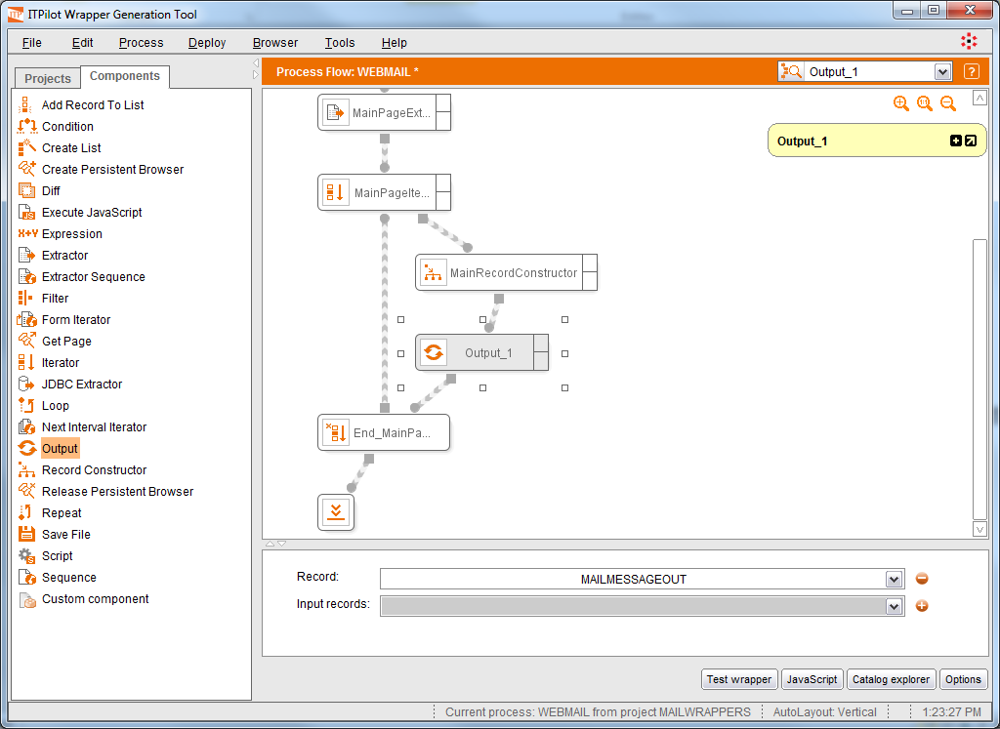
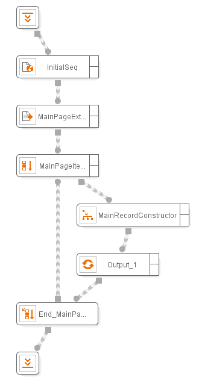

===================================
Returning Results: Output Component
===================================

The “Output” component returns a record as output of the wrapper. This
record can contain fields of any type, simple or complex (records, lists
and pages). To use it, add it to the workspace (|image0| icon), connect
it at the desired place in the workflow and specify the input record in
the “Record” parameter in the component input configuration area.
Alternatively, a list of records can be specified in the “Input records”
parameter. Wrapper results are returned to the calling application as
soon as they are obtained, without waiting for the wrapper execution to
finish.

To finish the first stage of our example, just insert a new “Output”
component after the “Record Constructor” component configured in the
previous section and specify as its input the record returned by the
RecordConstructor component (MAILMESSAGEOUT). Notice that, if no
transformation were necessary, we could also choose the record returned
by the Iterator component, or we could drop the Iterator component and
specify the Extractor component’s output as the value for the Output
component’s “Input records” parameter. As the Output component is also
inside of the Iterator execution loop, then for each iteration it will
return the record created by the Record Constructor component, and the
final result of the wrapper will be a list with all the processed
records.

`Use of the Output component`_ shows the use and configuration of the
component.

   Use of the Output component

`Complete process of the first part of the example`_ shows the complete
process for the first part of the example. A similar wrapper structure
is generated when a wrapper is created using the template
“StandardTemplate” in the wrapper creation dialog. Use this template to
save time when building a wrapper that browses to a results page and
extracts a list of records.

   Complete process of the first part of the example

