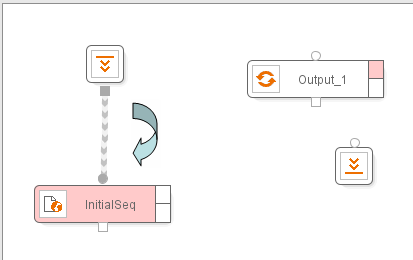

=======================
Web Browsing Automation
=======================

.. toctree::
   :hidden:

   component_configuration.rst
   comparison_between_msie_and_denodo_browser.rst
   advanced_configuration_of_the_sequence_and_next_interval_iterator_components.rst
   error_processing_on_the_web_browsing_automation.rst

Once the input parameters have been defined, the next step in our
example is to configure the process so that the wrapper knows how to
browse to the list of the user e-mails. To do so, the system must know
how to access the main page of the e-mail application, enter the user
login and password values and any other type of additional browsing
until the first page of results is accessed.

In ITPilot, the browsing tasks are primarily carried out by the Sequence
component. This component is intrinsically related to the Navigation
Sequence Generation Tool, which will be described in depth in section :ref:`Generating Navigation Sequences`. This tool enables users to generate
the sequence graphically, without having to know the specific details
about how to use the internal language NSEQL (described on the :doc:`/itpilot/nseql/index`).

To add the Sequence component to the workspace you can drag the Sequence
component, |image0|, from the “Components” tab in the browsing area or
use the “New component” option from the work area contextual menu. The
Sequence component is displayed in the workspace. The default name and
the component output variable can be modified in the component’s
contextual menu. The output of a Sequence component is a page. In our
example, we choose the name InitialSeq for the component name and
INITSEQOUTPUT for the output variable.

Now link the initial component to the sequence component to start
creating the process flow. To do so, as indicated in `Connecting
components`_, click with the left-hand button of the mouse on the
initialization component square connector and, without releasing the
mouse button, drag it to the sequence component input port (round in
shape). Release the mouse to see the connection between both components.

A faster way to insert and connect components in the workspace is
available by using component contextual menus. For instance, you can
also create and connect the new Sequence component by using the ‘Insert
After’ option in the contextual menu of the Initialization component.

   Connecting components

