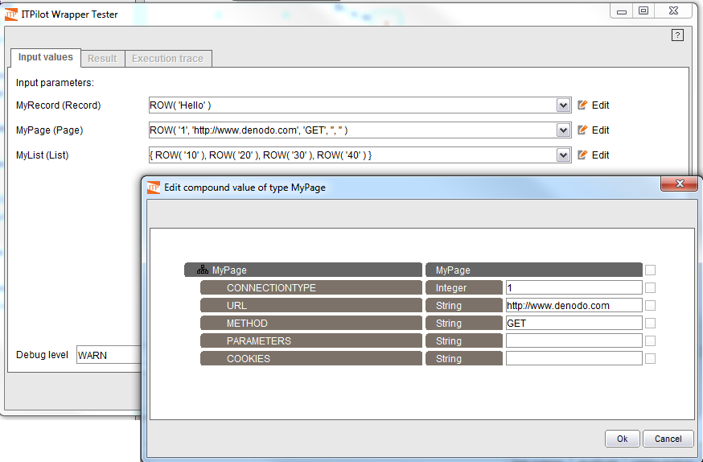
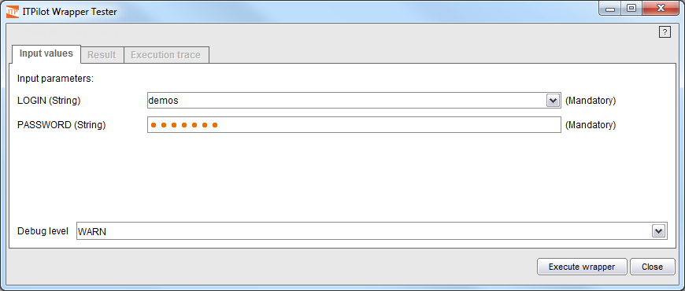
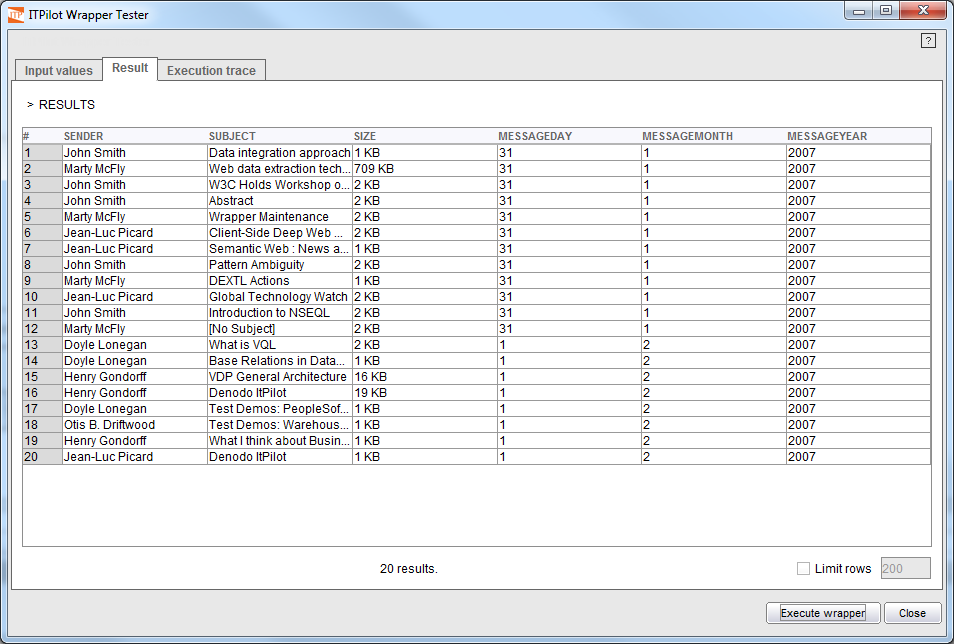

=================
Wrapper Execution
=================

To test a wrapper click on the “Test Wrapper” button in the button area.
A window like the one shown in `Wrapper testing tool`_ will be
displayed. This test tool consists of three tabs. The first one, “Input
Values”, enables users to enter values for each of the wrapper input
parameters (as defined in the initialization component in section :ref:`Process initialization`). Note that a password text field is used for
the PASSWORD because we had checked the “Hidden” check box in the
initialization component. Even though it will not be necessary in our
example, the test tool allows defining values for parameters of record,
list and page types. In any of these cases, the |image0| button will
appear next to the input parameter’s value. By clicking on it, an editor
where values for the parameter’s sub-fields can be entered will appear
(see `Editing a page-type input parameter in the Wrapper testing
tool`_). Sub-fields can also be marked as NULL by selecting the check box
which is associated with each one. Note that in the case of a page-type
parameter, the list of sub-fields will always be the same:

-  CONNECTIONTYPE (Integer): 0 for default browser, 1 for MSIE browser,
   3 for Denodo browser.
-  URL (String): any valid URL, according to the connection type
   specified in the first parameter.
-  METHOD (String): either GET or POST.
-  PARAMETERS (String): a list of semicolon -separated
   ``PARAMETER=VALUE`` elements.
-  COOKIES (String): a list of semicolon-separated ``NAME=VALUE``
   elements.

The value for a record, list or page can also be manually typed in the
input parameter’s value box. The syntax is as follows:

-  RECORD/PAGE: ROW(’<value>’[,’<value>’]\*).
-  LIST: [ {} \| {<record>[,<record>]\*} ].

   Editing a page-type input parameter in the Wrapper testing tool

   Wrapper testing tool

The test tool also allows selecting the trace level of the wrapper to
execute. You can choose from among FATAL, ERROR, WARN, INFO, DEBUG and
TRACE (FATAL showing the most important messages, and TRACE showing all
the messages). The use of the DEBUG level is recommended when testing
the wrapper for the first time.

By clicking on the |image3| button, the editor displays the “Results”
tab and the wrapper begins execution. The Wrapper Generation Tool will
launch the browser/s, required to execute the wrapper according to the
configuration of the tool and the Sequence components used in the
wrapper. As the wrapper returns results, they are shown in a table in
the “Results” tab. During the execution, the button is transformed
to |image4|, thus allowing the running to be stopped at any moment.

If some error occurs during execution you can examine the messages shown
in the “Execution Trace” tab to find more information about the error.
The “Limit Results” option in this tab allows limiting the number of
rows that are shown in the table, and the “Export” button can be used to
save the information contained in the table to a file. Also, when an
error occurs, an error code is returned, from the following:

-  ANY\_ERROR = 1: Unknown error.
-  STOP\_ERROR = 2: If the wrapper execution was stopped by any reason.
-  RUNTIME\_ERROR = 3: A runtime error, for example, a division by zero
   in an Expression component.
-  STORE\_ERROR = 4: When an exception is found in a save file
   operation.
-  CONNECTION\_ERROR = 5: When a network connection cannot be
   established.
-  SEQUENCE\_ERROR = 6: An error in the execution of a Sequence
   component.
-  HTTP\_ERROR = 7: An HTTP error in the execution of a Sequence
   component.
-  TIMEOUT\_ERROR = 8: A timeout error.
-  INVALID\_RECORD\_ERROR = 9: An invalid record error, for example,
   when a component receives as input a record which has a structure
   different from the expected one.
-  INVALID\_SCRIPT\_ERROR = 10: The JavaScript code that should be
   interpreted by the wrapper is not correct.
-  INVALID\_QUERY\_ERROR = 11: The query received by the wrapper is not
   correct (invalid parameters).
-  FILENAME\_EXISTS\_ERROR = 13: Error saving a file with the Save File
   component if the file already exists and the component has been
   configured to not overwrite the file.

.. note:: Currently, the error code “12” is not used.

`Results returned by the wrapper`_ shows the results obtained by
executing the wrapper created for our example.

   Results returned by the wrapper

Before continuing, save the process (File->Save) to avoid the loss of
valuable information and to be able to modify or add functions in the
future.

