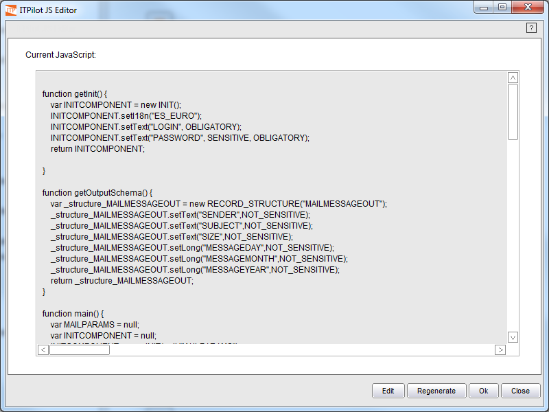

==================
Wrapper Generation
==================

Once the graphic creation of the process is complete, it can be tested.
To do so, the wrapper must be converted to JavaScript. ITPilot
automatically compiles the workflows defining the wrappers to programs
expressed in JavaScript language. The JavaScript code is generated by
clicking on the “JavaScript” button on the button area (or by directly
executing the process by pressing the ”Test wrapper” button, even though
this option does not allow the visualization of the JavaScript code). If
the code cannot be generated, check the error message that is displayed
in the JavaScript editor and that all components in the workflow are
correctly configured (remember that incorrectly configured components
appear in red).

If the code is successfully generated, a window will be displayed
containing the code, as shown in `JavaScript code of the generated
wrapper`_. The code can be edited from this window, should any
modification have to be made, or it can be regenerated. If you decide to
regenerate the JavaScript associated to the flow, any changes made to
the code will be lost. However, bear in mind that the changes made to
the JavaScript code will have no effect on the component flow, and
subsequent changes made to the workflow will not have effect in the
modified JavaScript. As the JavaScript code is the one executed by the
ITPilot runtime, after making changes to the workflow the JavaScript
code must be regenerated and modified again, to include the changes in
the workflow. If changes in the graphical flow editor are frequent, the
use of the Script component (see section :ref:`Script`) is recommended to
apply the necessary changes to the JavaScript code of the wrapper,
instead of editing the code manually after each change to the wrapper.
Besides, you can read :doc:`/itpilot/developer/index` for further information on the code
generated by ITPilot.

   JavaScript code of the generated wrapper

