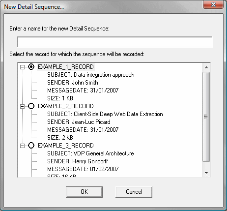
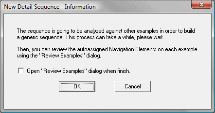
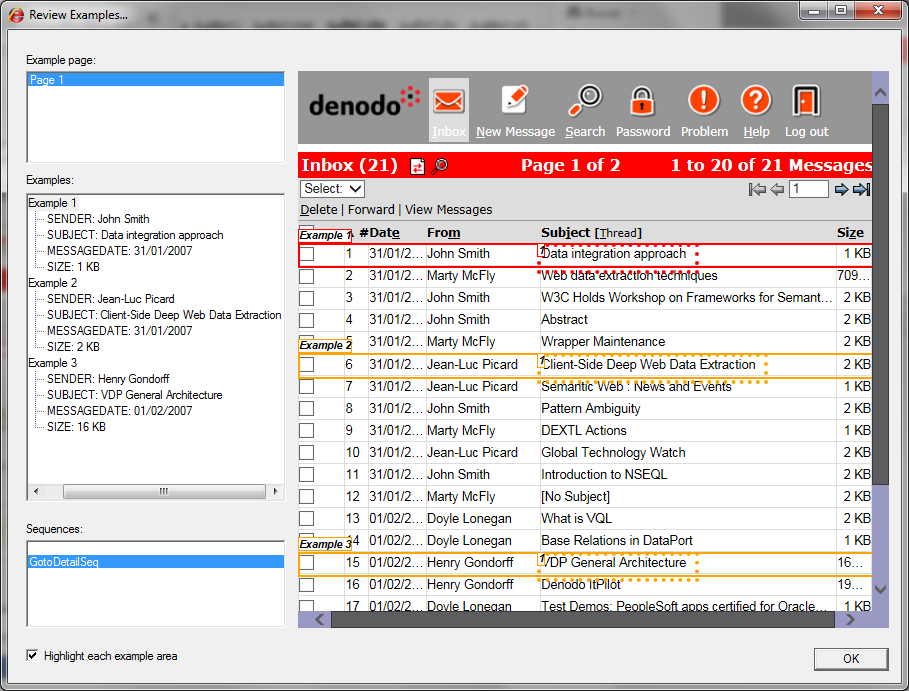
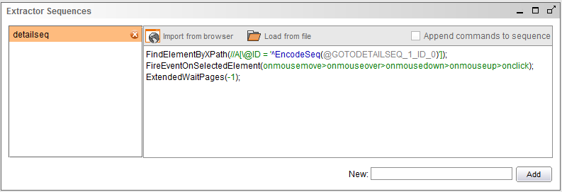
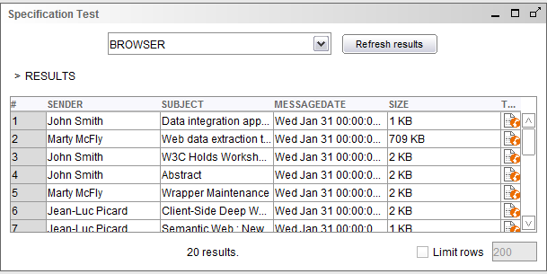
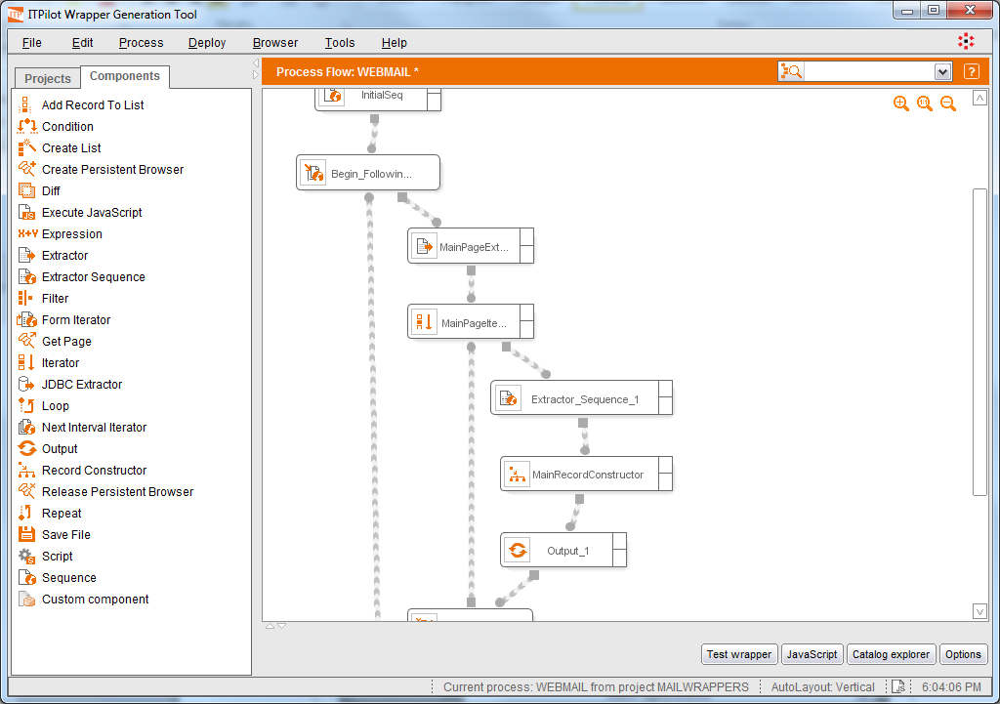
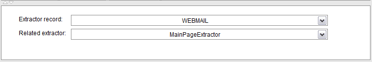
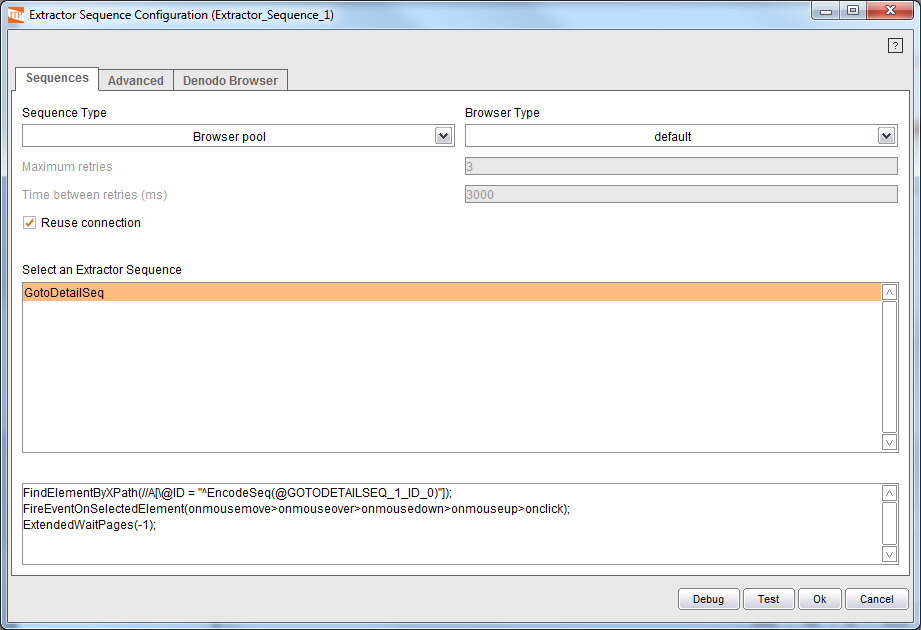
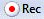

====================================================
Access to the Details Page: Using Extractor Sequence
====================================================

The aim now is to build the browsing relation between the main page of
results and the details page for each message. Once the Sequence
component has obtained the page of results, it is sent to the Extractor
component to generate a list of records, each one of which represents
one of the e-mail messages on that page.

With this list of e-mails available, it is needed a navigation sequence
that accesses the detail page for each of the messages. Instead of
defining one different sequence for each e-mail, a parameterized
sequence will be generated in the toolbar, and then that sequence will
be applied to each of the extracted records.

Recording a Navigation Sequence
=================================================================================

The automation features of ITPilot make the recording of the
parameterized sequence as easy as recording a regular sequence. While in
the “Assign Examples” mode, follow these steps:

#. Click the button |image0|, as when recording a regular sequence. The difference when the examples assignment mode is selected is that the dialog that appears is the one shown in
   `Detail sequence dialog`_.

   Detail sequence dialog

2. The detail sequence dialog is used to give the sequence a name and
   select which one of the created examples is going to be used to
   record the sequence. Type “GotoDetailSeq” for the sequence name, and
   select the first of the examples (the e-mail sent by John Smith) and
   click ok.
#. After accepting the dialog, we are now recording the detail sequence.
   As the example selected in step 2 was the first one that we added,
   the detail sequence will access the message with subject “Data
   integration approach”. Right-click on that subject and select the
   option “Click”.
#. When the message page is loaded, all the sequence steps are completed
   so click the |image0| button. The dialog `Confirmation dialog`_ will open, notifying
   about the process that is going to be executed: as the recorded sequence is
   specific to the first e-mail, ITPilot is going to try to generalize and parameterize
   it so it can be used to access all the contents of the e-mails that the Extractor
   obtained from the page. To achieve this, the toolbar will try to assign to each example
   the correct “Navigation Elements” (each one of the steps of the navigation sequence).

#. Select the “Open Review Examples dialog when finish” (so the results
   of the process can be examined) and click “Ok”.

   Confirmation dialog

Reviewing the Generated Sequence
=================================================================================

After the sequence is recorded and the toolbar analyzes and
parameterizes it, the “Review Examples” dialog will be shown in `Review
examples dialog showing the detail sequence`_.

   Review examples dialog showing the detail sequence

In this dialog, the “Sequences” area now shows the created sequence
“GotoDetailSeq”. If the sequence is selected, the page will display the
navigation elements assigned to each of the examples, with their
respective numbers. In the figure you can see that the navigation step
number 1 is assigned to the links “Data integration approach” (for the
first example), “Client-Side Deep Web Data Extraction” (second example)
and “VDP General Architecture” (in the third example). Please notice
that only the navigation elements of the first example were explicitly
specified (when recording the sequence); the navigation elements for the
rest of examples were automatically inferred.

In the event of the inferred elements being incorrect, they can be
manually edited using the popup menu. The following options are
available:

-  Reassign sequence elements: select this option to change one of the
   steps of an example detail navigation. The new element will be the
   one under the cursor when the page was right-clicked to open the
   menu.
-  Clear all the navigation elements of the sequence.
-  Recalculate the navigation elements of the sequence automatically.

Importing the Sequence into the Extractor Component
=================================================================================

As in Part I of this example, when finished with the toolbar operations,
just click the “Import Data from browser” button in the Extractor
wizard, and the examples and detail sequences will be imported.

The imported sequences can be reviewed, edited and deleted from the
“Extractor Sequences” pane inside the Extractor wizard (`Extractor
Sequences pane after importing the browser data`_).

   Extractor Sequences pane after importing the browser data

The Extractor Sequences pane provides the following functions:

-  Inspecting the sequences recorded in the toolbar and imported into
   the component. By clicking in any of the sequences of the list, it
   will be displayed in the editing area.
-  Adding new NSEQL sequences: type the name of the new sequence in the
   text field marked as New:, located in the lower right corner of the
   pane. After the name is typed, click the Add button and the new
   sequence will be added to the list of sequences, in the left part of
   the pane, and an empty sequence editor will be shown in the central
   part. The editor is similar in capabilities to the one in the
   Sequence editor, so a sequence can be imported from the browser,
   loaded from a file or manually typed (using the manual editing aids).
   After the sequence is complete, click the Save button to accept the
   changes.
-  Modifying the existing sequences: select the sequence to be edited,
   and then modify it by typing in the sequence. When a sequence is
   modified a \* character appears next to its name. Once the editing is
   finished, click the Save button to accept the changes or the Cancel
   button to discard them (both buttons located in the lower right
   corner of the pane, only visible when a sequence is modified). As
   mentioned in the previous item, the sequence editing area offers the
   same editing capabilities as the one found in the Sequence editor.
-  Deleting navigation sequences: select the NSEQL sequence on the list,
   and click the X button next to its name; a dialog will appear asking
   for confirmation.

Testing the Detail Sequence
=================================================================================

If in the Specification Test pane the extraction is tested again (as
seen in section :ref:`Configuration of the Extractor Component`), the
results pane now displays an extra column called “Test” (`Testing a
DEXTL specification with a detail sequence specified`_). This column
contains buttons with the Extractor Sequence icon, and each of them
tests the detail sequence of that particular record. Click one or
several of them to check how the different messages are accessed by the
browser.

   Testing a DEXTL specification with a detail sequence specified

When you have finished reviewing and testing the imported sequence,
click the “Ok” button to accept the changes in the Extractor component.

Using the Extractor Sequence Component
=================================================================================

Once the extractor sequences have been created as explained in the
previous section, the Extractor Sequence component allows executing
them.

The Extractor Sequence component must define as input parameters both
the Extractor component that extracted the record whose detail sequence
is going to be executed and the record itself.

In our webmail example we have defined one extractor sequence that
clicks on the link associated to each e-mail to access the body message.
The component inputs will be the Iterator output record, WEBMAIL (it
must be specified as value for the input parameter “Extractor Record”),
and the Extractor component that created the record, MainPageExtractor
(it must be specified as value for the input parameter “Related
Extractor”).

Note that, the Extractor Sequence component needs to execute the
sequence to access the “details” page starting from the page which
contains the record which receives as input (in our example the WEBMAIL
record). As the Extractor component used to extract the record is
provided as input, then the Extractor input page is implicitly used by
the Extractor Sequence component as the start page to execute de
sequence (in our example INITSEQOUTPUT).

The created component, represented by the |image5| icon, is displayed in
the workspace of `Use of the Extractor Sequence component`_, and the
inputs configuration in `Inputs configuration for the Extractor Sequence
component`_.

   Use of the Extractor Sequence component

   Inputs configuration for the Extractor Sequence component

Double-click on the component to access its wizard tab. The wizard is
divided into three tabs: Sequences, Advanced and Denodo Browser Each of
them is described in the following paragraphs.

The Sequences tab of the extractor sequence editor allows selecting the
extractor sequence to execute. The *Select an Extractor Sequence*
selection list of the wizard shows the names of the extractor sequences
that have been generated in the Extractor component provided as input.
When one of the sequences is selected, the NSEQL navigation sequence
appears in the lower part of the screen (as shown in `“Sequences” Tab in
the Extractor Sequence Component`_). The other options available in the
Sequences tab of the wizard are the same as in the Sequence component
(see section :ref:`Component Configuration`).

   “Sequences” Tab in the Extractor Sequence Component

Like the rest of components that execute navigation sequences, the
“Advanced” tab allows to configure an ad hoc sequence to load the start
page from which the detail sequence is executed (i.e. the input page of
the Extractor component specified as the “Related extractor” input
parameter) and the “Denodo Browser” tab allows to configure browser
optimization if the Denodo Browser was chosen as navigation tool. Please
see section :ref:`Advanced configuration of the Sequence and Next Interval
Iterator components` for more information.

Nevertheless, there is a little difference in the configuration of the
“Advanced” tab in the Extractor Sequence component: if the “Use Custom
Sequence for Restoring Input Page” check box is checked, besides the
option for providing any type of sequence, it is also possible to check
the “Default Sequence” option. If this is checked, the input page will
be obtained by simply executing the “Back” command (equivalent to
pressing the “Back” button in the browser). In the case of the Extractor
Sequence component, this is enough in many cases, because after pressing
“back”, the browser will usually access the page containing the result
list. Its main advantage is its high efficiency since no additional
navigation is required.

Lastly, the wizard’s “Test” button allows testing the sequence generated
for the component. The Section :ref:`Individual Test of Extractor Sequence, Next
Interval Iterator and Form Iterator Components` describes how to do it.

After configuring the Extractor Sequence component, the user just has to
go to the contextual menu and rename the output variable name (the
result page) to DETAILPAGE.

The contextual menu can also be used to open the component error
configuration, in a similar way as it was explained in the section :ref:`Error Processing on the Web Browsing Automation`. In addition to the error types explained in that section,
the Extractor Sequence component adds the *Invalid record* *error*. This
error occurs when the sequence of the Extractor Sequence component needs
variables which are not provided by the extracted input record. This can
happen if the sequence depends on optional fields which may not be
always extracted. This kind of error can be handled by *raising* it
(wrapper execution stops), *ignoring* it (wrapper execution continues)
or *continuing* with the next iteration (note that, the Extractor
Sequence component is executed inside a loop which iterates over the
records extracted from a page, and using this handler the current
iteration is stopped and the execution continues with the next one).
Besides, the actions *Trace record* and *Output record* (see section :ref:`Error Processing on the Web Browsing Automation`) can be executed with this type of error.

