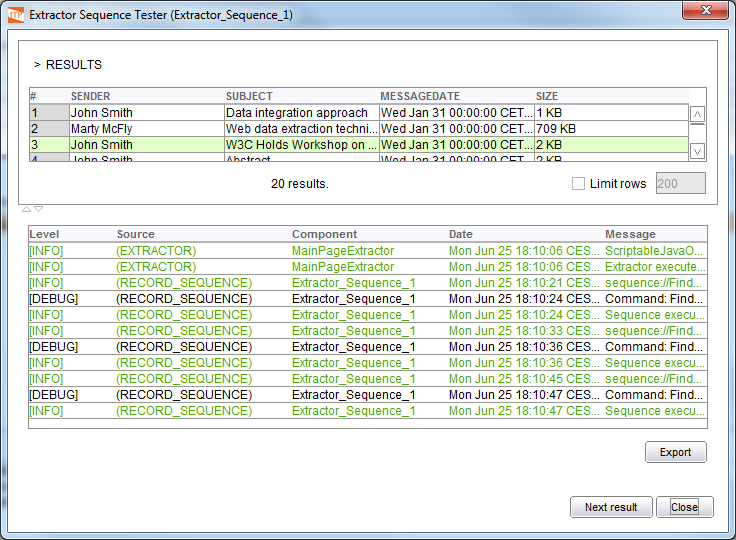

==========================================================================================
Individual Test of Extractor Sequence, Next Interval Iterator and Form Iterator Components
==========================================================================================

The components Extractor Sequence (see section :ref:`Extractor Sequence`), Next Interval
Iterator (section :ref:`Next Interval Iterator`) and Form Iterator (section :ref:`Form Iterator`) can be tested with no need for complete wrapper
compilation and test. In this section it is described how to do it. To
illustrate the process, the Extractor Sequence component created in our
example will be used.

`Test window of the Extractor Sequence component`_ shows the results of
the sequence configuration of the Extractor Sequence component in our
example. The following steps are required to test the component:

#. Open a browser with the Browser->New Browser option in the main page
   menu of the Wrapper Generation Tool.

#. Browse to the page where the sequence to test starts:

   -  If the user is testing an Extractor Sequence component, he/she must
      navigate to a page that contains a list of records of the type the
      sequence will be executed against. In our example, he/she should
      authenticate against the email application, and access the email list
      of a user.
   -  If the user is testing the Next Interval Iterator component he/she
      must execute a query of the type used by the wrapper in the target
      source, and leave the browser in the first result interval.
   -  If the user is testing the Form Iterator, he/she must place the
      browser in the page in which the form to iterate is.

#. In the configuration window of the Extractor Sequence component, click
   on the |image0| button. ITPilot will transfer the session data from the
   Internet Explorer browser to an ITPilot browser, loading the same page.
   It will also launch a component test window like the one shown in 
   `Test window of the Extractor Sequence component`_. 
   This window shows the execution trace
   just as it is done in the complete wrapper execution test window, shown
   in section :doc:`Wrapper Execution <../../generation_environment_tools_-_part_i/wrapper_generation_tests_and_exporting/wrapper_execution>`. In this window, and by clicking the
   |image1| button, the ITPilot browser executes the sequence against the
   page currently loaded in the browser. If the sequence has been
   adequately configured, the expected behavior is the following:

   -  If the Extractor Sequence component is being tested, the table on the
      top of the Test dialog will initially display all the records
      obtained by the Extractor component; and each time the ‘Next Result’
      button is clicked, the detail page of the following record will be
      accessed. In our example, the detail page of each email will be
      accessed.
   -  If the Next Interval Iterator component is being tested, the next
      result interval will be accessed each time the ‘Next Result’ button
      is pressed.
   -  If the Form Iterator component is being tested, a new query against
      the form will be executed each time the ‘Next Result’ button is
      pressed.

   Test window of the Extractor Sequence component

