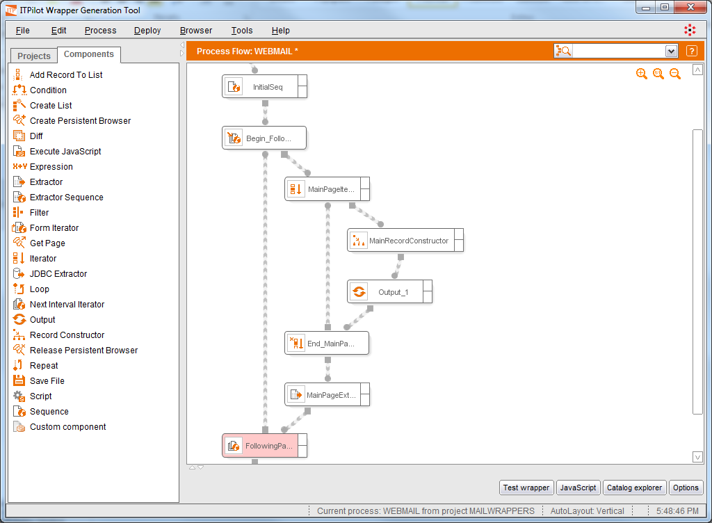
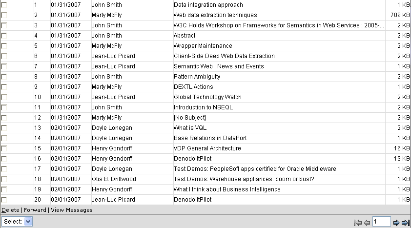
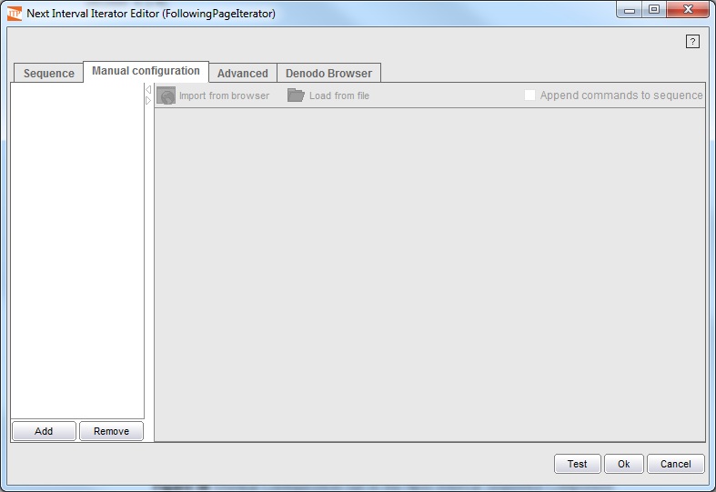

==============================
Extracting Multipaginated Data
==============================

.. toctree::
   :hidden:

   pagination_using_single_block_or_multiple_block_schemes.rst

Many Web sources present large lists of results in various consecutive
pages and provide browsing elements (e.g. ‘Next’ / ‘Previous’ links) to
allow users to navigate through result pages.

To ease dealing with these situations, the ITPilot Wrapper Generation
Tool provides a browsing component called “Next Interval Iterator” that
iterates on the result pages. This section explains how to use this
component.

When placed in the workspace, the ‘Next interval Iterator’ component is
represented using one begin box and one end box. The portion of the
workflow between the two boxes will be executed in each iteration. The
component takes as input a page value representing the first page of
results (typically this page value will be the output of a “Sequence”
component) and at the end of each iteration, a navigation sequence will
be executed to access the next pagination interval; this new page will
be the input for the next iteration. The process ends when there are no
more intervals. The user can also set a maximum number of iterations.

To illustrate the use of the component, we will extend our example
Webmail wrapper to extract data about all the e-mails in the Inbox
folder (currently, it only extracts data about the e-mails shown in the
first page of the list).

Add the Next Interval Iterator |image0| component to the workspace and
connect it to the previously created process in the way shown in `Use of
the Next Interval Iterator component to browse more pages of results`_.
Rename the component as “FollowingPageIterator”, and its output to
“NEXTSEQOUTPUT”.

The component can now be configured. In the input configuration area of
the component set the input page parameter to the variable outputted by
the “InitialSeq” component. Although it is not needed in the example,
input records can also be specified. These records are used when the
navigation sequence has variables. In that case, at execution time
ITPilot will substitute the variable for the value of the record field
with name matching the name of the variable.

   Use of the Next Interval Iterator component to browse more pages of results

Double-click on either of the two boxes of the component to access its
wizard. This editor is similar to the sequence editor described in
section :ref:`Component Configuration`, although with certain distinguishing
features described below.

To illustrate the component configuration, we will proceed with our
example. First, we will generate a navigation sequence to access the
next results page. `Webmail result page`_ shows the first page of
results. At the bottom right, you can see a series of links that enable
you to browse to the following pages of results.

To record the sequence, open a browser using the “Browsers - New
Browser” menu option (if you have not already done so) and place it in
the first page of the e-mails list. Click on the button |image2| and
when the dialog in which the initial URL has to be written appears,
leave the URL blank and click OK. We are now recording on the current
page.

First, if the whole page doesn’t fit in the browser window, scroll down
to the lower part of the page using the browser scroll bar. Now, place
the cursor on the |image3| button (“Next Page”) in the navigation panel
(|image4|), right-click and then left-click on the “Click” option from
the contextual menu. The browser will then go to the next page of
results. We then stop the recording process with |image5|.

   Webmail result page

Now, we can go back to the Next Interval Iterator wizard and load the
new sequence by pressing |image7|, or the |image8| button if you have
saved the recorded sequence in a file. Now, click ‘OK’ to exit the
wizard.

The effect of these last actions can now be seen by testing the wrapper
again, as explained in section :ref:`Wrapper generation, tests and
exporting`.

Now you can either skip to section :ref:`Access to Details Pages` to proceed
with the example, or keep reading to learn about how to deal with more
complex cases.

The component wizard has the following additional configuration options:

-  *Sequence Type, Browser Type*: They have the same functions as in the
   “Sequence” component (see section :ref:`Component
   Configuration`).

-  *Pagination Type*: this option allows specifying the type of pagination
   used by the website. There are three options:

   -  *Constant Scheme*: this scheme must be used when the next intervals
      can be always accessed by executing the same navigation sequence
      (e.g. clicking on a “Next” link). In this case, only one navigation
      sequence needs to be defined. Our webmail example uses this type of
      pagination.
   -  *Single Block Scheme*: This second scheme assumes that the sequence
      for accessing the next interval is always the same, except for a
      variable that is incremented by a constant value in each iteration. A
      typical example are the cases where access to the next intervals is
      achieved by clicking on links labeled “2”, “3”, “4”, etc. The section
      :ref:`Pagination using Single Block or Multiple Block Schemes` explains
      this option in more detail.
   -  *Multiple Block Scheme*: The *Multiple Block Scheme* is used when
      the results intervals are shown in blocks of pages, so that the pages
      in the same block can be accessed in the same way as in the *Single
      Block scheme* but a different navigation sequence is needed to access
      the next block of pages. For example, some pages show results in
      blocks of five or ten pages; to move between intervals in the same
      block the same method as in the Single Block Scheme is used, but the
      user must click on “Next” to access the next block of pages (e.g.
      links 1, 2, 3, 4, and 5 allow accessing the corresponding interval,
      and a “Next” link allows to access the following block of pages 6, 7,
      8, 9, and 10). The section
      :ref:`Pagination using Single Block or Multiple
      Block Schemes` explains this option in more detail.

-  *Iterate until navigation fails*: if selected, ITPilot will access all
   the possible pagination intervals, until the navigation to the next
   interval is not possible.

-  *Maximum Sequence Repetitions*: this parameter is only enabled if the
   “Iterate until navigation fails” option has not been selected. It
   determines the number of iterations (i.e. the number of pages of
   results to be covered as of the main page). For example, if “2” is
   entered, ITPilot will try to click twice (and the wrapper would
   extract data from three pages of results in total).
   
   If it is set to “0”, the result is the same as marking the “Iterate
   until navigation fails” check box.

-  *Reuse connection, Maximum retries, Time Between retries*: They have the
   same functions as in the “Sequence” component (see section :ref:`Component
   Configuration`).

-  *Manual Configuration*. This tab allows specifying a list of navigation
   sequences. If this option is used, the “Pagination type” option is
   ignored and the component will execute one sequence from the list (from
   first to last) in each iteration until the end of the list is reached.
   Users may add new navigation sequences by clicking the |image9| button, as in the `Manual Configuration tab in the Next
   Interval Sequence Component`_. By clicking the “<New Sequence>” message,
   users can write, load from a file, or import a sequence from the browser
   toolbar. As many navigation sequences as necessary can be added.

-  *Advanced* and *Denodo Browser* tabs have the same functions as in the
   “Sequence” component (see section :ref:`Advanced configuration of the
   Sequence and Next Interval Iterator components`).

   Manual Configuration tab in the Next Interval Sequence Component

