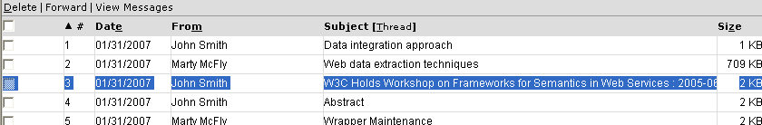
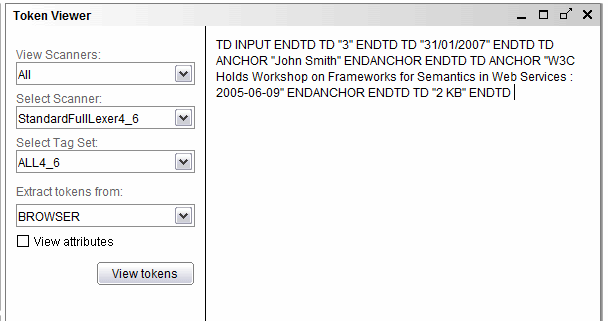

===========================================
Obtaining the Tokens of the Data to Extract
===========================================

Once the structure is defined, the following step is to check the tokens
that are present in the web page to extract, using the Token Viewer
pane. Open a browser, navigate to the inbox page and highlight one of
the messages (as seen in `Selecting one of the examples`_).

   Selecting one of the examples

Go back to the Extractor wizard, open the Token Viewer pane and click
the “View Tokens” button (making sure the “Extract tokens from:” option
has the value “BROWSER”). The pane will import the data of the selected
area and display the tokens of that part of the web page (`Tokens of the
third message`_).

   Tokens of the third message

The tokens of the example are:

-  TD INPUT ENDTD: corresponding to the check box at the beginning of the
   message.
-  TD “3” ENDTD: the index of the e-mail.
-  TD “31/01/2007” ENDTD: the date of the e-mail that we want to
   extract.
-  TD ANCHOR “John Smith” ENDANCHOR ENDTD: link for the message body,
   that contains the sender of the message as text.
-  TD ANCHOR “W3C Holds Workshop on Frameworks for Semantics in Web
   Services: 2005-06-09” ENDANCHOR ENDTD : link for the message body,
   that contains the subject of the message as text.
-  TD “2 KB” ENDTD: size of the message.

The next step will involve defining the specification that extracts data
that follows this pattern.

The options of the token viewer include selecting what scanner and
tagset is going to be used to analyze the page and extract the tokens.
This is useful to try different combinations and check which one
recognizes the tokens that are useful to extract the data that is
wanted. Also, apart from analyzing the text highlighted in the browser,
other sources can be used: a Denodo Browser, a browser from the pool, a
local file or an FTP resource (these last three are available in the
dialog opened when the “ADVANCED” option is selected in the “Extract
tokens from:” combo box).

