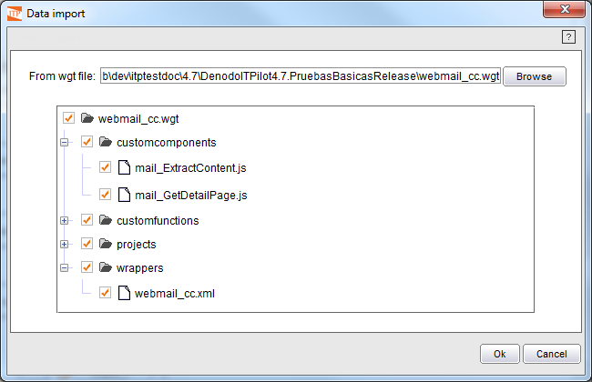

==================
Importing Wrappers
==================

To import a previously exported set of wrappers select the “File” menu
and then the option “Import … “. The “Data import” dialog will appear.
On this dialog click Browse, use the file chooser to select the WGT file
to be imported and click on the Open button. Alternatively, you can drag
and drop the WGT file into the workspace area. The “Data import” dialog
will show a tree with the contents of the file. Use the check boxes to
select the individual contents to import (`Data import dialog`_). Click Ok and the
selected data will automatically be imported into the generation
environment. If any of the contents being imported already exists in the
generation environment, an overwrite alert will prompt for a replacement
confirmation.

If the option “config” is available when importing the file and it is
checked, then the configuration of the Wrapper Generation Tool will be
imported. All the configuration parameters will be automatically
overwritten except the file paths: confirmation dialogs will be shown
asking for permission to override the existing paths. If confirmation is
given, the new paths will only be set in case the specified files exist
in the file system.

   Data import dialog
