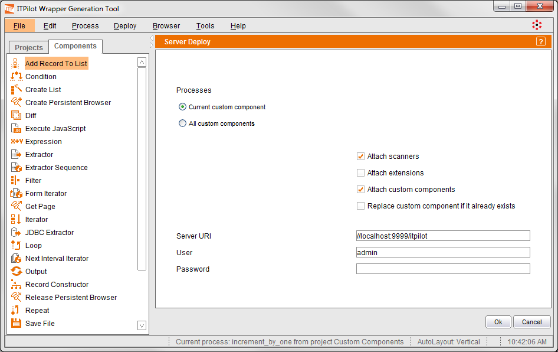

==================================================
Deploying a Custom Component to the Wrapper Server
==================================================

Like regular wrappers, custom components can be deployed into the
Wrapper Server from the Wrapper Generation Tool. The custom component
can also be exported as a VQL file, so you can load it in the server at
some later moment.

|

To deploy a custom component to the wrapper server, open the component in the ITPilot Wrapper Generation Tool. Then
click on the “Deploy” menu of the menu bar. This shows two submenu
options: “VQL Generator …” and “Server deploy …”. Click on the second
option and the screen shown in `Custom component deployment in an
ITPilot Wrapper Server`_ will appear.

The deploy dialog allows deploying only the custom component that is
being currently edited, or all the custom components in the Custom
Component project.

To deploy the custom component, enter the server URL
(//localhost:9999/itpilot by default), login (‘admin’ by default) and
password. The deployment options are a subset of the options available
for regular wrappers. See section :ref:`Deploying Wrappers to the Wrapper Server` for further
details.

Click OK and, assuming the Wrapper Server is started, the custom
component will be deployed. For further information on the ITPilot
Wrapper Server, read the :doc:`/itpilot/user_guide/index`.

   Custom component deployment in an ITPilot Wrapper Server

VQL Generation
=================================================================================

This option is useful when the Wrapper Server is not started or it is
not accessible from the network where the Wrapper Generation Tool is
being used.

From the main window of the ITPilot wrapper generation environment, open
a custom component and then click on the “Deploy” menu of the menu bar.
This shows two submenu options: “VQL Generator …” and “Server deploy …”.
Click on the first option and the export dialog will be shown.

The available options are the same as the ones explained above. Pressing OK, ITPilot will store the
file at the selected location in the local file system.

Once the VQL file has been generated, it can be loaded into the ITPilot
Wrapper Server using the ‘Load VQL File’ option in the ITPilot Web
administration tool.

