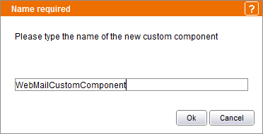
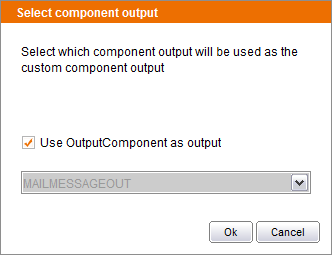
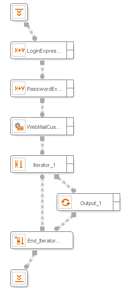

===================================
Saving a Flow as a Custom Component
===================================

.. toctree::
   :hidden:

   deploying_a_custom_component.rst

Denodo ITPilot enables users to create custom components which can be
reused as components of a more complex process. These components are
created and managed as regular wrappers in the Custom Components
project. We will illustrate the process using again the Webmail example
introduced in section :ref:`Presentation of the example`.

A custom component can be created in several ways:

-  To save the current loaded wrapper as a custom component, select the
   “File->Save as custom component” menu option (or use the combination
   of keys Ctrl+Alt+S) and assign a name to the custom component (see
   `Selecting the output type of the custom component`_). A new wrapper,
   with the specified name, will be created in the Custom Components
   project. In our example, load the webmail wrapper created in section :ref:`Presentation of the example`, and save it as a custom component
   specifying the name “WebMailCustomComponent”.

   Assigning a name to the custom component

-  To create a custom component from an existing wrapper, it can also be
   copied or moved directly to the Custom Components project.
-  A new wrapper can also be created from scratch inside the Custom
   Components project.

When any wrapper is saved as a custom component, or copied or moved to
the Custom Components project, or a wrapper contained in the Custom
Components project is edited and saved, a dialog will ask which output
will be used as the custom component output (see REF \_Ref156721696 \\r
\\h \\\* MERGEFORMAT ¡Error! No `Selecting the output type of the custom
component`_). In this case, we will check the “Use OutputComponent as
output” option. Alternatively, the output of one of the process’
components could also be chosen as the custom component output.

   Selecting the output type of the custom component

Once these steps are complete, a new component will appear under the
“Custom component” entry of the Components tab in the tool’s browsing
area. To test it, a small test process can be created that uses this
component. `Using a custom component in a new process`_ shows this small
example. It can be seen how, as a list, the customized component output
is processed by an Iterator component. To create the input data we use
two Expression components (see section :ref:`Expression` for detailed
information about this component). These are needed because the
initialization component returns a record as its output whereas the
custom component requires two atomic values as inputs. The remaining
process is similar to that shown previously in this guide.

The wrappers in the Custom Components project and the components under
the “Custom component” entry of the Components tab in the tool’s
browsing area are permanently linked:

-  When a wrapper in the Custom Components project is deleted, its
   associated custom component is also deleted and vice versa.
-  When a wrapper in the Custom Components project is saved and it is
   not complete or it has components configured incorrectly, the
   associated custom component will not be generated and the wrapper
   will be labeled with the word “Draft” in the projects menu. When the
   wrapper is fixed and saved, the “Draft” label disappears and the
   custom component appears in the Components tab.

When editing a wrapper saved in the Custom Components project, the
component that was chosen as the custom component output is highlighted
with a darker border and shows the label “output” over the component
node. If the wrapper is modified and saved again, this output component
will be selected by default in the dialog that asks for the custom
component output.

The execution of a custom component can produce only one type of error,
a *runtime error*, which is raised when any error occurs during the
execution of the component. This error can be *raised* (wrapper
execution stops), or *ignored* (execution continues), and the actions
*Trace record* and *Output record* can be executed.

It is important to note that custom components are used by reference, so
if a custom component wrapper is modified, the changes will affect all
the wrappers of the Wrapper Generation Tool using that custom component.
The same applies when an existing custom component is re-deployed in the
Wrapper Server (see section :ref:`Deploying Wrappers to the Wrapper Server`): all the wrappers
running in the server, and using that custom component, will use the new
version.

.. note:: JavaScript edition for Custom Component wrappers is not
   supported. The user should edit the wrapper’s flow instead.

   Using a custom component in a new process

