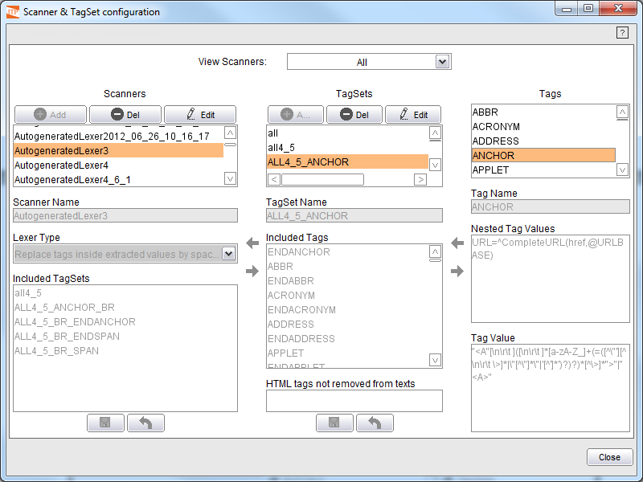
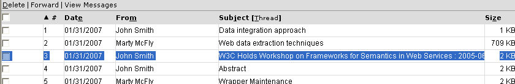

=================================
Graphical Creation of New Tagsets
=================================

From the main window of the ITPilot Wrapper Generation Tool, click on
the “Tools” menu of the menu bar, and then click on the “Scanner &
TagSet configuration” submenu option. A new window will be open, such as
the one shown in `Scanner and Tag Set Generation Tool`_.

   Scanner and Tag Set Generation Tool

This tool is divided into three vertical areas, where each one contains
information on the scanners, tagsets and specific tags that currently
exist in the ITPilot installation you are working with.

In the upper part of the window, the user may specify if the complete
set of scanners and tagsets are shown, if only those generated manually
will be shown, or if only the ones automatically generated in the web
extraction process will be shown (see section :ref:`Configuration of the
Extractor Component`). In case of selecting the automatically
generated, a “Remove Unused Scanners” button will be available: this
button will remove all the scanners that are not being used in a
wrapper.

By selecting a scanner with the mouse you will be able to see their
internal characteristics: “lexer” type (see section :doc:`Lexer Types <./lexer_types>`) and,
most importantly, the tagsets included. The central area shows all the
existing tagsets and the tags in each one. Lastly, the right-hand area
indicates the available tags. There is a tag defined for every HTML tag.

To illustrate the creation of new tagsets, we will create a new set used
to extract data from table cells which values are text fragments, which
may contain new lines in the middle (by using the   or the 

tags) and links. These values cannot be extracted with the default
tagset all4\_6, since it assumes that  , 
 and <A> tags act as
data separators. The new tagset will only contain the HTML tags used to
define tables: <TABLE>, </TABLE>, <TR>, </TR>, <TD> abd </TD>.

Therefore, create a new tagset called “myTextTagSet”, by clicking the
|image1| button in the central “TagSets” area. Once is created, edit it
by selecting it in the list of tagsets and click the |image2| button.
The arrows between the “TagSets” and “Tags” areas will became enabled;
you can then select any tags to be included in the tagset and click the
|image3|. For this example, the required tags are TABLE, ENDTABLE, TR,
ENDTR, TD and ENDTD.

The “TagSets” area provides also the option “HTML tags not removed from
texts” which is used to describe which HTML elements from the ones that
do not match the elements used in the set will not be deleted from the
processed text; this is useful when it is required that certain HTML
structure is kept on the extracted data (for instance, in order to show
them directly in some kind of web application or portlet). In order to
use this option, a regular expression must be written. This expression
must be an *OR* (“\|”) of the expressions which define each of the
desired tags (they can be consulted in “Tag Value” text area). Note
that, if the tags used in the regular expression are included in the
tagset they will not be returned as tags. For example, if you want to
return the P and ENDP tags as text, then the regular expression should
be the following one:
*“<P”[\\n\\r\\t][^\\>]\*“>”\|“
”\|“</P”[\\n\\r\\t][^\\>]\*“>”]\|“
”*,
and then P and ENDP will not be returned as tags although they are
included in the tagset.

In our example we will not use this option.

To complete the stage, save the tagset by clicking on |image4|. If you
want to cancel the changes made to the tagset and return to the last
saved version, simply click on the |image5| “Revert to Saved” button.
Note that it is also possible to create a new tagset by copying an
existing one. To do this click the |image1| button in the central
“TagSets” area, check the “Copy existing TagSet” option in the “New
TagSet” dialog and then select the desired tagset before clicking Ok.

Lastly, create a new scanner and link it to the recently created tagset.
The operation is similar to the step indicated above, clicking on
|image1| in the left-hand part of the scanner generation window and
creating a new scanner, “myLexer”. Then, with the recently created
scanner marked, add the “myTextTagSet” tagset to the scanner by clicking
on the |image2| button of the scanner, selecting the tagset and then
clicking on the arrow |image3| between both areas to include it in the
scanner. The scanner generation window will be similar in appearance to
that in `Creating a new scanner`_, where the “Included TagSets” field of
the scanner area displays the “myTextTagSet” tagset.

   Creating a new scanner

The last step of this process involves saving the scanner so that it can
be used by any ITPilot application. To do so, simply click on |image4|
in the scanner area. Besides, it will be necessary to install the
scanner in the Wrapper Server when a wrapper using it is deployed (use
the appropriate option in the deploy wrapper dialog). Please see section :ref:`Deploying Wrappers to the Wrapper Server` for more information about how to do it.

