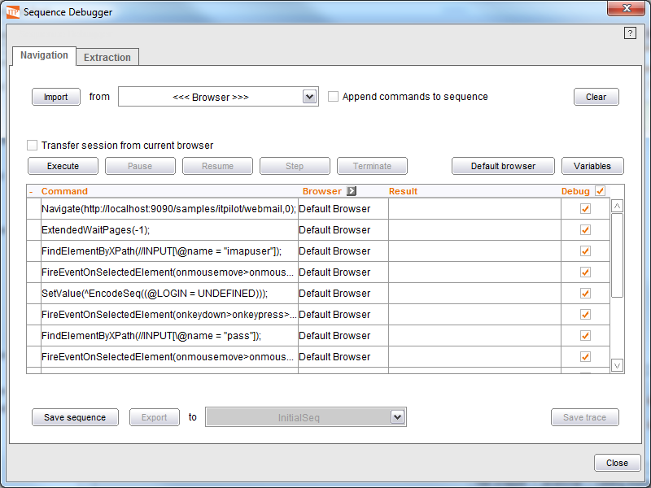
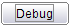
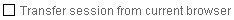
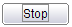
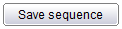
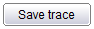

===========================
Using the Sequence Debugger
===========================

.. toctree::
   :hidden:

   breakpoint_management.rst

Denodo ITPilot offers the user the possibility of debugging a specific
Sequence component by using the sequence debugging tool. This tool,
accessible in the menu Tools -> Sequence Debugger… or by pressing the
button |image0| in the Sequence component wizard, lets the user execute
a navigation sequence step-by-step. `Sequence Debugger`_ shows the tool.

   Sequence Debugger

Navigation sequences can be loaded in the debugger using the |image2|
button. The selection list beside the button allows choosing the
sequence to load. The available options are:

-  One option for every “Sequence” or “Extractor Sequence” component in
   the current process. If the option corresponding to a component is
   chosen, the sequence configured in it will be loaded in the debugger.
-  Browser. The last navigation sequence recorded in the browser toolbar
   will be loaded in the debugger. Recall that the browser should have
   been launched using the “Browser-> New Browser” menu option.
-  File. Allows loading a sequence stored in a file.

If the “Append commands to sequence” check box is ticked the NSEQL
commands of the imported sequence will be appended to the current list
of commands instead of replacing them.

To execute the wrapper, there exists the option of transferring the
currently active browser session, by selecting |image3|. This lets
users test commands starting from a specific state (e.g. in order to
test next interval page accesses).

The use of the debugger is very simple:

-  Start the process by pressing the |image4|  button starts this process.
   It can be stopped by pressing the   button, and it can be resumed also ( |image5| button). To restart, press |image6|. 
-  The |image7| button performs a complete execution of the commands the current list without stopping.
-  In order to execute step-by-step commands, the |image8| button must be pressed. 
-  In case any of the commands use variables, the user must provide the
   execution values, by pressing the |image9| button. If this is not done before starting the execution, the system will request
   the values as the sequence is being executed. Values for the variables are given using an editor similar to the one
   shown in Figure :ref:`Sequence editor with loaded sequence<figure-21-label>`. If the sequence being debugged was imported from a Sequence component, the check boxes for the
   variables that match a hidden field in the input records of the Sequence component will be checked by default.
-  If necessary, new commands may be added to the sequence by double
   clicking the last row of the commands table, labeled as “Double click
   here to add commands”. A new dialog will appear with a sequence
   editor similar to the one found in the Sequence wizard. Type one or
   more commands in the dialog and click “Save”; they will be added to
   the debugger.

The debugger window also offers the following options to perform export
actions on the sequence:

-  The |image10| button allows saving the navigation sequence to file, in NSEQL format. This action is useful when the original sequence has been given new commands, or updated ones. 
-  The |image11| button lets users export the updated sequence to a Sequence component of the wrapper. 
-  |image12| lets users export the navigation sequence execution trace to a text file. 

