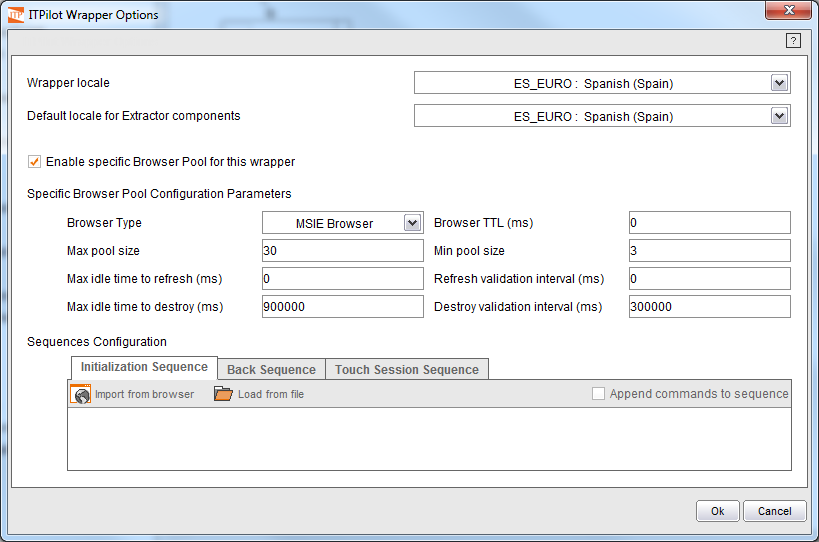

==========================================================
Wrapper Advanced Options: Specific Browser Pool and Locale
==========================================================

.. toctree::
   :hidden:

   specific_browser_pool.rst
   locale.rst

Before finishing the wrapper creation process, some added capacities can
be configured. Specifically, ITPilot allows configuring the use of a
specific browser pool by the wrapper; besides, the default locale
information of the wrapper can also be configured.

To do so, we use the “Options” button of the button area (alternatively,
we can use the menu option “Process” > “Wrapper options…”). A new window
will appear such as the one at `Wrapper options dialog`_.

.. _wrapper-options-label:

   Wrapper options dialog

