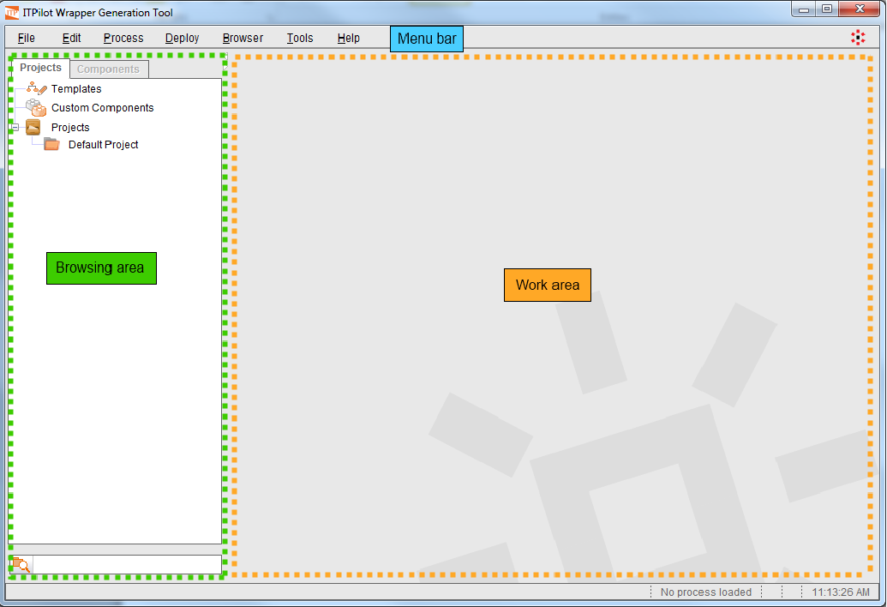

=========================
Introduction to the Tools
=========================

This section describes the basic characteristics of the “Wrapper
Generator Tool” (see `Main areas of the Wrapper Generation Tool`_) and
the “Sequence Generator” (see `Sequence Generation toolbar`_), although
they will be explained in detail in their respective sections (sections
:ref:`Generation Environment Tools - Part I` , :ref:`Generation Environment Tools
- Part II` and :ref:`Generating Navigation Sequences` of this manual).

To launch the “Wrapper Generator Tool”, you can either use the button of
the same name in the “ITPilot” pane of the Denodo Platform Control
Center or execute the script :file:`{<DENODO_HOME>}/bin/itpadmintool_start`.

The main screen of the Wrapper Generation Tool is shown in :ref:`Main areas
of the Wrapper Generation Tool` and is divided into three main areas:

*Menu bar*: contains the following menus

-  The “File” menu allows:

   i. Creating a new project or wrapper.
   #. Reloading the current wrapper from disk.
   #. Saving wrappers in disk.
   #. Saving wrappers as templates. Templates are useful when several
      wrappers follow similar structure, so they do not need to be created
      from scratch.
   #. Saving the current wrapper as a new custom component (see section
      :ref:`Saving a Flow as a Custom Component`).
   #. Saving the current wrapper as a new extension (see section :ref:`Exporting
      a flow as an extension`).
   #. Importing and exporting wrappers (see section :ref:`Migrating wrappers
      between generation environments: import and export`).
   #. Adding extensions to the Generation Environment (see section
      :ref:`Managing extensions`).
   #. Loading a wrapper from the list of recent wrappers.

-  The “Edit” menu allows copying and pasting the components that
   participate in a wrapper. Additionally, the “Paste and rename variables
   option” allows you to paste components avoiding name conflicts between
   the variables used by the components.

-  “Process” contains options specific to the current wrapper:

   i. Generate the JavaScript of the wrapper
   #. Test its execution (see section :ref:`Wrapper generation, tests and
      exporting`)
   #. Open information and configuration dialogs of the wrapper: catalog
      explorer (see section :ref:`Use of the Catalog Explorer`) and wrapper
      options (see section :ref:`Wrapper Advanced Options: specific browser pool
      and Locale`).

-  “Deploy” allows generating the VQL code of the wrapper (‘VQL Generator
   …’) or deploying the wrapper into the Wrapper Server (‘Server deploy
   …’). See section :ref:`Deploying Wrappers to the Wrapper Server` for more information.

-  The “Browser” menu allows launching and closing browsers. The browsers
   are used during the wrapper creation process to create navigation
   sequences (see section :ref:`Web browsing automation`) and to mark examples
   of information you want to extract from a web page (see section
   :ref:`Configuration of the Extractor Component`).

-  The “Tools” menu allows to open the NSEQL Sequences debugger (see
   section :ref:`Using the Sequence Debugger`), the Scanners and Tagsets
   configuration tool (:ref:`Tagsets and Scanners`), the extension management
   Tool (see section :ref:`Managing extensions`) and the dialog for configuring
   tool preferences (see section :ref:`Generation Tool Global Preferences`).

-  The “Help” menu allows accessing the Denodo Platform documentation.

*Browsing Area*: this area is divided in two tabs

-  The Projects tab, displays the projects along with the wrappers for
   each project.
-  The Components tab displays the list of components ready to be used
   in the wrappers, including those provided by the tool (see :ref:`Appendix
   C: Catalog of Components`) and any custom components created after
   the installation (see section :ref:`Saving a Flow as a Custom Component` for
   further information). This tab is disabled when no wrapper is being
   edited.

*Work area*: This is the main area of the tool and is where the wrapper
is graphically created by adding, configuring and combining the
graphical components into a web automation process.

 

   Main areas of the Wrapper Generation Tool

As it has been already mentioned, the process of wrapper generation is
aided by a toolbar installed in the MSIE browser. This toolbar can be
seen in `Sequence Generation toolbar`_.
The function of each of the buttons and options will be explained in
detail in section :ref:`Generating Navigation Sequences`.

 

   Sequence Generation toolbar

