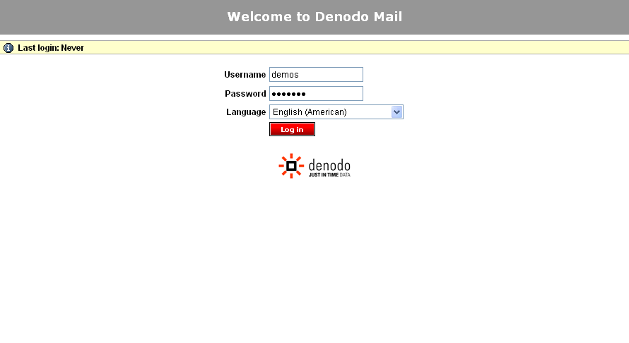
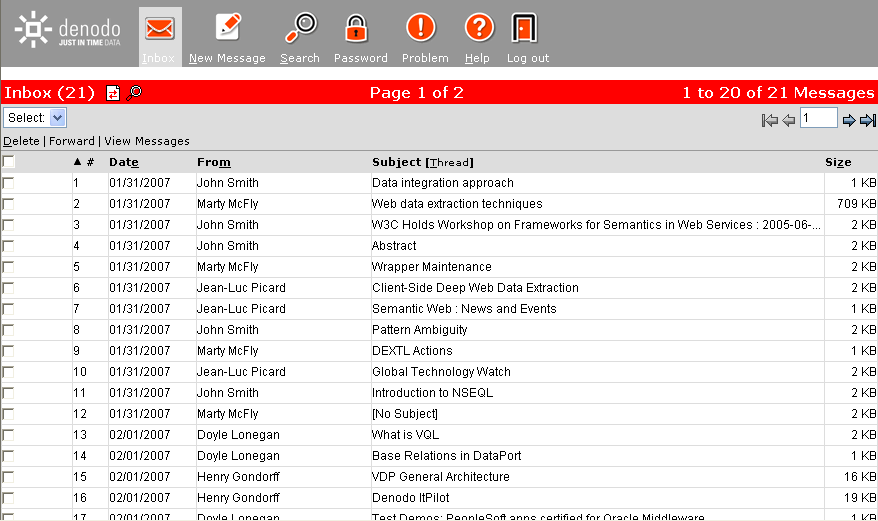

=======
Example
=======

`Example Web mail source: Authentication`_ shows the authentication page
of a web application distributed with the Denodo Platform which we will
use for our test examples. Said Web page simulates the behavior of a
classical Web mail system. To access the example application, follow
these steps:

-  Execute the *webmailsample\_startup.bat* script in the
   *DENODO\_HOME/samples/itpilot/webmail* path. The script starts the
   application in the web container embedded in the Denodo Platform.
-  Access the application in the *samples/itpilot/webmail* path of the
   web container embedded in the Denodo Platform. If the container runs
   in the local host and the default port is used, then the URL will be
   http://localhost:9090/samples/itpilot/webmail.

The figure below shows the page of said service
that displays the messages of the user *demos*.

   Example Web mail source: Authentication
 

   Example Web mail source: Message list

`NSEQL program for accessing the Web mail system`_ shows an NSEQL
program which automatically connects to the service, authenticates by
entering a user login and password and, once the inbox folder content
has been accessed, it sorts the messages by date by clicking on the link
“Date”.

To fully understand the example it is a good idea to consult the command
reference in section :ref:`List of NSEQL Commands`. In any case, the
explanations provided below will be sufficient for an intuitive
understanding of how NSEQL programs are generated.

.. code-block:: none
   :name: NSEQL program for accessing the Web mail system
   :caption: NSEQL program for accessing the Web mail system
   
   Navigate(http://localhost:9090/samples/itpilot/webmail/,0);
   ExtendedWaitPages(-1);
   FindElementByXPath(//INPUT[\@name = 'imapuser']);
   SetValue(demos);
   FireEventOnSelectedElement(onkeydown>onkeypress>onkeyup>onchange,true);
   FindElementByXPath(//INPUT[\@name = 'pass']);
   SetValue(DeMo.04);
   FireEventOnSelectedElement(onkeydown>onkeypress>onkeyup>onchange,true);
   FindElementByXPath(//INPUT[\@name = 'loginButton']);
   FireEventOnSelectedElement(onmousemove>onmouseover>onmousedown>onmouseup>onclick);
   ExtendedWaitPages(-1);
   FindElementByXPath(//A[matches\\(.\\,'\\\\s*Date\\\\s*'\\)]);
   FireEventOnSelectedElement(onmousemove>onmouseover>onmousedown>onmouseup>onclick);
   ExtendedWaitPages(-1);

The *Navigate* command ensures the browser browses to the specified URL.
The *WaitPages(1)* command can be used to force the system to wait for
the page to be downloaded before continuing (with certain redirection
types, it may be necessary to wait until more than one page has been
downloaded). The same effect is possible using
*Navigate(http://mail.demos.denodo.com,1)* as an initial command, since
the second parameter of the *Navigate* command also allows for a number
of pages to wait for downloading before continuing to be specified.
Furthermore, the *ExtendedWaitPages*\ (-1) command can be used so that
the system itself infers the number of pages to wait for before
continuing to browse.

The *FindElementByXPath* command selects the login text field of the
login form shown in `Example Web mail source: Authentication`_ (an
element of type ‘INPUT’ which has an attribute *name* with value
*imapuser*). After that, the *SetValue* command completes the login text
field with the value *demos* and the *FireEventOnSelectedElement*
command fires the specified set of events in order to execute the
JavaScript handlers associated with those events. The last parameter of
this command indicates to the system that it must wait until all those
handlers finish their execution.

The following three commands (*FindElementByXPath, SetValue*, and
*FireEventOnSelectedElement*) perform the same actions described in the
previous paragraph to complete the password text field with the value
*DeMo.04*.

With the following command, *FindElementByXPath,* the INPUT element with
name *loginButton* is selected and the *FireEventOnSelectedElement*
command fires the events to simulate a click over the button. In
practice, this produces a form *submit*. The following
*ExtendedWaitPages* command, again, makes the browser wait for the page
to download before continuing.

Finally, the *FindElementByXPath* selects the first link of the page
which associated text match the regular expression specified as the
second parameter of the XPath function *matches*. In this case,
the system will find the first link with a text that matches “Date”
ignoring spaces. The next command, *FireEventOnSelectedElement*, fires
the events corresponding to a click on the selected link, causing
the messages to be sorted by date (see `Example Web mail source: Message
list`_). Finally, the *ExtendedWaitPages* command, again, makes the
browser wait for the page to download.

Our example is made a little more complicated below. Imagine that during
the login process we want to select the language “English (American)”.
Let us also imagine that after that, we want to access the following
result page, by clicking on the next page image (a pointed arrow facing
rightwards) besides the page number at the right of the page. The new
program is shown in `NSEQL program for accessing the Web mail system
(modified)`_. The new commands have been marked in red.

The first highlighted command selects the first *select* which has an
attribute *name* with value *new\_lang*. The *SelectOptionByText*
command selects the option which text matches with “English (American)”
in the select element selected by the previous command. After that, the
command *FireEventOnSelectedElement* fires an *onChange* event over the
select.

With the **FindElementByXPath** of the last two highlighted commands,
the system searches a form with name *pagenav1* and then selects, from
the form descendents, the first image with attribute *src* that matches
the value
\http://localhost:9090/samples/itpilot/webmail/mailbox.php\_files/right.png.
Then, the *FireEventOnSelectedElement* fires the events to do a click
over the image.

.. code-block:: none
   :name: NSEQL program for accessing the Web mail system (modified)
   :caption: NSEQL program for accessing the Web mail system (modified)
   :emphasize-lines: 9,10,11,15,16,17

   Navigate(http://localhost:9090/samples/itpilot/webmail/,0);
   ExtendedWaitPages(-1);
   FindElementByXPath(//INPUT[\@name = 'imapuser']);
   SetValue(demos);
   FireEventOnSelectedElement(onkeydown>onkeypress>onkeyup>onchange,true);
   FindElementByXPath(//INPUT[\@name = 'pass']);
   SetValue(DeMo.04);
   FireEventOnSelectedElement(onkeydown>onkeypress>onkeyup>onchange,true);
   FindElementByXPath(//SELECT[\@name = 'new_lang']);
   SelectOptionByText(regex:\\\\s*English\\\\s*\\\\\\(American\\\\\\)\\\\s*,0,true);
   FireEventOnSelectedElement(onchange,true);
   FindElementByXPath(//INPUT[\@name = 'loginButton']);
   FireEventOnSelectedElement(onmousemove>onmouseover>onmousedown>onmouseup>onclick);
   ExtendedWaitPages(-1);
   FindElementByXPath(//FORM[\@name = 'pagenav1']//IMG[\@src =
        'http://localhost:9090/samples/itpilot/webmail/mailbox.php_files/right.png']);
   FireEventOnSelectedElement(onmousemove>onmouseover>onmousedown>onmouseup>onclick);
   ExtendedWaitPages(-1);
