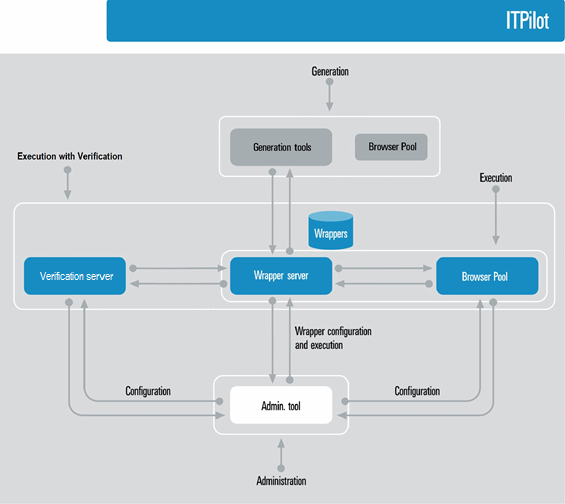

===========================
Denodo ITPilot Environments
===========================

.. toctree::
   :hidden:
   
   administration_tool.rst
   generation_environment.rst
   execution_environment.rst
   verification_environment.rst  

Denodo ITPilot facilitates wrapper generation, execution and
verification in Web sources in a simple and dynamic way. Three
Environments exist, each of which facilitates one of the aforementioned
actions and all are managed through the Administration Tool. Each
environment contains a series of Components described below. The figure below
shows the relationships between
Environments and their Components.

   ITPilot Environments and Components

