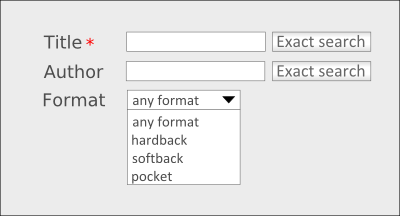

============
Introduction
============

.. toctree::
   :hidden:
   
   denodo_itpilot_environments/denodo_itpilot_environments.rst

Most data available on the World Wide Web (hereinafter Web) can be
obtained only by means that are friendly for Web users, but not useful
for automatic and mechanical processing by software applications.
Nowadays, many Web sites offer *ad hoc* query interfaces with forms that
return the data required in lists comprising semi-structured responses
encoded in HTML documents. This part of the Web - accessed through
different types of forms and/or interfaces that return data
automatically obtained from internal databases - is normally called
“Hidden Web”).

This “Hidden Web” is by no means a small part of the whole WWW and
contains a huge amount of data which, in many cases, are of great
quality and interest to users. Web sites like e-shops (that provide
their catalogs in this way) and search engines for data of a scientific,
health, patenting or financial nature are good examples of this. It is
also often the case that these Web sites are private access (i.e. a
user/password is required to access them), have an advanced query
interface (allowing data searches in respect of different subject
matters) and/or return results in the form of lists of items encoded in
HTML with links to related pages that contain more data on each item
(e.g. generally e-shops return a list of results, but with the option
for the user to “click” on the title to access another page with
commentaries on the product, photos, related products, etc.).

Other common complications arise from the use of technologies such as
JavaScript, dynamic HTML or session maintenance systems that further
complicate automated access to data contained in these Web sites.

In addition to the problem of accessing these sources with “hidden”
data, applications that want to use these data are also frequently faced
with the problem of results being returned in HTML, which is a tag
language defined for visual display by users that never publishes
metadata of any type on the structure and/or semantics of the results
generated. Neither does it structurally differentiate navigation
elements (menus), graphic panels and data useful to the user. The
problem of extracting the relevant data contained in HTML pages thus
also arises.

Example: Look at this example of an Internet bookshop with a search form
as shown in the figure below. The form obliges users to specify a value
for the attribute "TITLE" and gives them the option of entering a value
for the attribute "AUTHOR" and for the attribute "FORMAT" (restricting a
group of values).

The bookshop returns a result list with data on TITLE, AUTHOR, FORMAT,
PUBLISHER and PRICE.

   Bookshop form

This case summarizes the difficulties an application faces when
attempting to extract structured data from Web environments: accessing
Web sources, navigating through transactional environments, option
selecting and, finally, extracting data from semi-structured data.

Denodo ITPilot is the Denodo Technologies solution for easy access to
and structuring of datasets on the Web; this process involves
constructing an abstraction from the specific Web source called wrapper
that isolates the client applications from the intrinsic characteristics
of this site (access protocol, native data structure, etc.). ITPilot
provides a distributed and scalable environment for generating,
executing and verifying wrappers.

This manual presents Denodo ITPilot and provides instructions for
correct installation, recommendations on the different types of
architecture it supports, as well as a guide to the execution and
verification environment:

-  The components of ITPilot are introduced in
   this same section
  
-  The next section will provide an overview of the
   recommended architectures.

-  The section :ref:`Installation and Initial
   Configuration` gives a detailed description of the installation process
   for each of the components

-  The section :doc:`/itpilot/user_guide/introduction/introduction` does the same job
   with the server startup procedure.

-  The section :ref:`Web Administration Tool`
   explains the ITPilot Web Administration Tool.

-  The section :ref:`Verification
   Server Graphical Configuration and Monitoring tool` deals with the
   ITPilot Verification Server Graphical Configuration and Monitoring Tool.
   
   .. important:: The ITPilot Verification Server has been deprecated and may be removed in the next version of the Denodo Platform.
   
-  The section :ref:`Wrapper Execution Trace Logs` gives instructions on
   how to set up logging for the trace events generated during wrapper
   execution.

