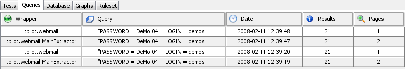

==========================================
Monitoring the Wrappers Under Verification
==========================================

The verification graphical tool lets users monitor the execution of the
wrappers that have been loaded into the Wrapper Server. This can be
achieved by using the following tabs:

-  Tests: this tab displays information about the tests that have been
   executed, and their results. The information available is the
   following:

   Tests Tab

..

   *  Wrapper: database and wrapper name
   *  Test: name of the test that has been executed
   *  Date: execution date
   *  Score: test result. This score indicates the percentage of agreement
      of the results with the test’s criterion, where 0 means complete
      agreement and 100 a complete disagreement.
   *  Passed: it reports whether the test was successful or not (if so, it
      does not participate in the rule activation).
   *  Message: provides additional information about the execution.
  

-  Queries: this tab displays information about the queries that have been
   executed against the wrappers.

   Queries Tab

..

   -  Wrapper: database, wrapper and, optionally, Extractor component name.
   -  Query: query that has been executed against the Wrapper Server.
   -  Date: execution date.
   -  Results: number of returned results
   -  Pages: if related to an Extractor component, number of pages used in
      execution; if related to a wrapper, the value is always 1.

-  Database: this tab displays all information stored in the verification
   database. It is divided in two additional tabs, which are shown with the
   symbol |image1|.

   Database Tab

..

   -  *Tab 1*: information about the wrappers that are stored in the
      verification database.

      -  *Wrapper*: database and wrapper name
      -  *Extractors*: name of the wrapper’s Extractor components
      -  *Valid Data*: number of queries and results not outdated stored in
         the verification database for that wrapper.
      -  *Outdated Data*: number of queries and results outdated stored in the
         verification database for that wrapper.
      -  *Tests*: number of tests stored in the verification database for that
         wrapper.

   -  *Tab 2*: information about the wrapper that is selected in the selection
      box.

.. figure:: DenodoITPilot.UserGuide-63.png
   :align: center
   :alt: Information about the selected wrapper
   :name: Information about the selected wrapper

   Information about the selected wrapper

..

      -  *Wrapper*: database, wrapper and Extractor component name
      -  *Query*: query used for executing the wrapper
      -  *Date*: execution date
      -  *Row*: number of results for this query execution
      -  *Status*: status of the execution (correct, incorrect, …)
      -  *ID*: execution identifier
      -  *View*: button to access detailed information. It will open a new tab
         showing internal information about this identifier.
  

-  Graphs: this tab shows different graphs from the wrappers and the tests
   that have been executed in a specific timeframe. The choice of which
   wrappers and tests are to be supervised must be done before the wrapper
   starts being executed.

   Graphs Tab

