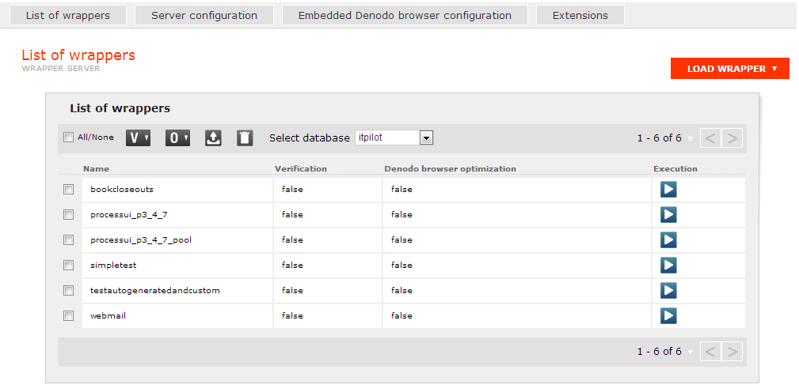
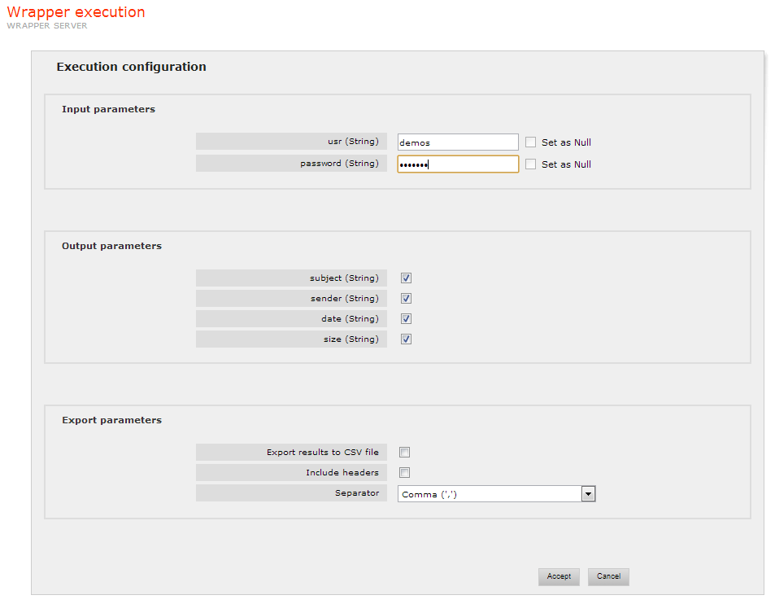

====================
List of Wrappers
====================

From this section, the user can deploy new wrappers in a Wrapper Server,
and also configure and execute those wrappers which are already
deployed. `List of Wrappers`_ shows an instance of the web
administration tool in which the user is connected to one of the
available Wrapper Servers, and the “List of wrappers” section can be
seen (see section :ref:`Web Administration Tool` for information about how
to connect to a server).

   List of Wrappers

Wrapper Servers can contain several databases, where each database has
its own independent list of wrappers. If only Denodo ITPilot has been
installed, and no Virtual DataPort, only one database will be available
(“itpilot”). If there is more than one database defined in the server,
the user can switch between them by using the “Select database”
drop-down list. The list of wrappers will update accordingly.

Loading, Exporting and Deleting Wrappers
=================================================================================

Usually, wrappers are deployed in the Wrapper Server directly from the
wrapper generation tool. However, VQL files
containing the definition of a wrapper can also be loaded manually from
the Virtual DataPort administration tool. To do so, click on the “Load wrapper” button,
then select the file to load by clicking the “Choose File” button and
graphically selecting the file. Once the path is ready, click on the
“Upload” button. The wrapper will be loaded into the currently selected
database, and the wrapper list for that database will be updated in the
administration tool.

Wrappers deployed in the Wrapper Server can be exported as VQL files. To
do so, the user must select the wrappers he wants to export by marking
the check boxes to the left of their respective entries in the wrapper
list, and then click on the button |image1|. He will then be presented
with a window, where he can choose to export some elements whose
presence in the generated VQL is optional: the scanners, extension jar
files, and custom components used by the wrapper or wrappers being
exported. If those dependencies are not exported along with the wrappers
themselves, any Wrapper Server which imports the generated VQL file must
already have them installed, in order for the wrappers to load
correctly.

To delete a wrapper deployed in the Wrapper Server, the user must mark
its associated check box in the wrapper list and then click on the button
|image2|. Multiple wrappers can be deleted simultaneously in this
manner.

Marking the topmost check box, the one with the label “All/None”, will
select all the wrappers currently visible in the list.

Wrapper Options
=================================================================================

Wrappers in a Wrapper Server can be put under automatic verification.
This means the Verification Server will monitor the execution of those
wrappers, and if it detects anomalies in the returned results, it will
send an e-mail to a configured address, warning that the source pages
may have changed and the wrapper may need to be modified accordingly.

Wrappers under automatic verification display “true” in the Verification
column, for the rest of wrappers “false” will be displayed. To enable or
disable automatic verification for one or more wrappers, the user have
to select the wrappers, marking the check boxes to the left of their
respective entries in the wrapper list, and then click on the button
|image3|. A popup menu will appear, showing the options “Enable
verification” and “Disable verification”.

Note that enabling automatic verification is not enough by itself; the
user should define rules in the Verification Server specifying what
counts as an “anomalous result” that triggers the notification (see
section :ref:`Configuring the Verification server`).

In order to increase the efficiency of the Denodo Browser, components
that execute sequences using this browser can be configured, at
generation time, to execute a test of the sequence to collect and store
optimization information. During the test execution the browser detects
what elements of the accessed pages are needed to execute the sequence
and stores information to identify them. Then, using that information,
subsequent executions of the sequence can only load those elements.

Wrappers using the Denodo Browser optimization information collected at
generation time display “true” in the Denodo browser optimization
column. To enable or the use of the optimization information for one or
more wrappers, the user have to select the wrappers, marking the
check boxes to the left of their respective entries in the wrapper list,
and then click on the button |image4|. A popup menu will appear,
showing the options “Enable optimization” and “Disable optimization”.

Note that enabling Denodo Browser optimization is not enough by itself;
the user should configure the sequence components to collect the
automatic optimization information during the generation of the wrapper.

The information collection process needs to be rerun when the sequence
is changed. In some cases, it can also need to be rerun when the pages
of the source changes although the navigation sequence is still valid.
If the collection process is not rerun in this scenario, the execution
of the sequence using the optimization information will fail. If you do
not want to regenerate the optimization information and redeploy the
wrapper, then you need to configure the wrapper to not use the Denodo
Browser optimization, as explained above.

Wrapper Execution
=================================================================================

The administration tool allows queries to be made against wrappers
deployed on a Wrapper Server.

Clicking on the Execution |image5| icon for a wrapper in the wrapper
list will lead to the wrapper execution page.

`Wrapper Execution Page`_ displays the execution page for a wrapper. The
check boxes under “Output parameters” allow selecting which output fields
of the wrapper are going to be displayed in the result table. Input
parameters for the wrapper are supplied using the text fields under
“Input parameters”. The “Set as Null” check box allows the user to not
provide any value for an optional input parameter (i.e. setting it as
null). This check box is disabled for mandatory input parameters. The
types of both the input parameters and output fields are shown between
parentheses.

   Wrapper Execution Page

After filling the input values and selecting the output fields, by
clicking the “Accept” button the administration tool will start the
execution of the query. To achieve this, it will call the Wrapper Server
to invoke the query on the selected wrapper, which will be in turn
communicated to the appropriate data source. The results, properly
structured, will be shown in the execution window result list in an
asynchronous way: the individual rows will appear in the results table
as soon as they are available.

Before pressing the “Accept” button, the results of the execution can be
configured to be stored in a CSV (Comma-Separated Value)-type file,
marking the check box “Export results to CSV file”. The “Include headers”
check box allows including the names of the output fields as headers in
the CSV file. The column separator is also configurable. When the export
check box is marked, clicking on the “Accept” button will show a standard
download dialog for choosing the desired target folder/file. The file
will be created as the execution starts, and new results will be written
as they arrive.

.. |image2| image:: DenodoITPilot.UserGuide-25.png

