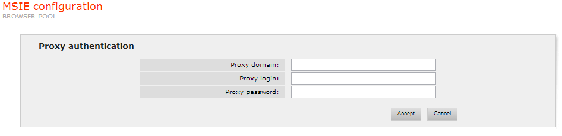

=========================================
MSIE and Denodo Browser Configuration
=========================================

The parameters of the following groups can be configured for the two
browser types (sections “MSIE configuration” and “Denodo browser
configuration”).

Browser Configuration
=================================================================================

-  Max Download: Indicates the maximum time a browser will wait to
   download a page (in milliseconds).
-  Object Timeout: Maximum time (in milliseconds) that a browser can be
   used outside the pool to deal with a wrapper request. When this time
   lapses, the browser is destroyed. If the value of this parameter is
   less than 0, the browser can remain outside the pool indefinitely.
-  Initial Port: Each browser of the pool listens to requests in a port.
   The value of this parameter determines the port number to be used as
   the first one to assign port numbers to the browsers. From this
   number, consecutive port numbers will be used in ascending order.
   This property is available only for Microsoft Internet Explorer.
-  Graphical Interface: Indicates whether or not the pool browsers will
   display a graphical interface. To optimize system efficiency,
   applications in production do not normally display browser graphical
   interfaces. However, it may be useful to turn the interface on for
   debugging purposes. This parameter can only be configured for the
   MSIE browser.
-  Silent: with this option activated, none of the dialogs that the
   browser normally opens is displayed (this includes JavaScript
   dialogs, certificate warnings, etc.). This parameter can only be
   configured for the MSIE browser.

`Browser configuration`_ shows the administration tool page where to configure these
parameters for the MSIE browser.

.. figure:: DenodoITPilot.UserGuide-18.png
   :align: center
   :alt: Browser configuration
   :name: Browser configuration

   Browser configuration

Download Controls
=================================================================================

This group of parameters allows the type of contents that should be
downloaded or executed by the pool browsers to be specified. The content
types whose download or execution can be configured are: images, videos,
background sounds, script programs, Java applets and ActiveX controls.
If Denodo Browser is used, only scripts programs can be configured.
`Download controls`_ shows the
administration tool page where to configure these parameters for the
MSIE browser.

   Download controls

Cache Controls
=================================================================================

This group of parameters is for specifying whether or not the pool
browsers should use the local cache and/or the proxy cache. Denodo
Browser do not allow the proxy cache option to be configured. Denodo
Browser can configure an additional parameter for the maximum number of
JavaScript files that can store in its JavaScript cache (“Maximum number
of cached JavaScript files”). Cached scripts will be executed faster
than the ones that have to be re-downloaded.
`Cache controls`_ shows the
administration tool page where to configure these parameters for the
MSIE browser.

   Cache controls

Proxy with Authentication
=================================================================================

If the Internet is accessed through a proxy with authentication, the
following parameters (for the two browser types) must be configured:

-  Proxy login: user login in the proxy. If Denodo browser is used, this
   parameter also configure the proxy host and port to be used, with the
   following syntax: ``user@host:port``
-  Proxy password: user password in the proxy.
-  Proxy domain (Windows 2000): Windows domain.

`Proxy with Authentication`_ shows the administration tool page where to
configure these parameters for the MSIE browser.

   Proxy with Authentication

.. note:: The proxy server settings (host and port) must be configured
   in the settings dialog of the Microsoft Internet Explorer (not from the
   Denodo options) if this browser is used. To access it, open the
   Connections tab of the Tools > Internet Options dialog of Microsoft
   Internet Explorer. You can configure the proxy using the LAN settings
   button. If the Internet Explorer browser is not correctly configured to
   browse through the proxy server, the ITPilot server will ignore these
   authentication parameters.

.. note:: See the documentation of the NSEQL command
   :ref:`nseql_guide_setproxyauthinfo` in the ITPilot NSEQL Guide for more information about
   configuring Internet access through a proxy in ITPilot.

Pool Size and Policy for Reusing Browsers
=================================================================================

-  Max pool size: maximum number of browsers in the pool.
-  Min pool size: minimum number of browsers. The system will not reuse
   browsers already existing in the pool unless the current number is
   equal to or greater than the value of this parameter.
-  Reusable Browsers: indicates if the pool browsers can be reused to
   deal with more than one request. Enabling browser reusability
   increases the efficiency of most applications; however, it may not be
   suitable in some cases, where dealing with a previous request changes
   the browser response to subsequent requests (for example, through the
   use of cookies).
-  Max browser TTL: Maximum Time to Live of a persistent browser. If a
   persistent browser is active more than the specified time, it will be
   removed and a new one will be created with the same page loaded as
   the former browser. This is useful because, due to known problems in
   some versions of Microsoft Internet Explorer, when using this type of
   browser, performance may degrade if the browser has been open for too
   long. This option only applies to persistent browsers, not regular
   ones.

`Pool size and reutilization policy`_ shows the administration tool page
where to configure these parameters for the MSIE browser.

   Pool size and reutilization policy
