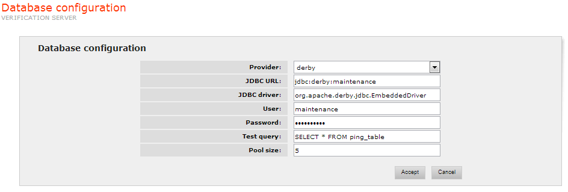

==========================
Database Configuration
==========================

The Verification Server needs to collect some information about the
wrappers it monitors, in order to be able to detect changes in the
underlying web sources. The data collected consist in examples of the
queries performed against such wrappers, along with the returned
results.

The database where this information is stored is configurable. The
configuration parameters are the following:

-  Provider: database provider (by default: ``derby``). The possible
   values are ``derby``, ``mysql`` and ``oracle``. When selecting a value, sensible default
   values will be assigned to the rest of database parameters, when
   applicable.
-  JDBC URL: URL access to the Database for the JDBC driver (by default:
   ``jdbc:derby:maintenance``).
-  User/Password: user and access password (by default:
   ``maintenance/maintenance``).
-  JDBC driver: JDBC driver to be used (by default:
   ``org.apache.derby.jdbc.EmbeddedDriver``). If the driver is not
   distributed in the Denodo Platform, it must be placed in the
   ``DENODO_HOME/extensions/thirdparty/lib`` directory or its path must
   be added to the ``DENODO_EXTERNAL_CLASSPATH`` environment variable so
   Denodo can find it.
-  Pool size: maximum number of simultaneous connections the pool will
   allow (by default 5).
-  Test query: test query executed on the DBMS. The connection pool,
   before assigning any of the free connections in the queue, will check
   to verify if the connection is valid or not (by default:
   ``SELECT * FROM ping_table``).

`Database Configuration Tab for the Verification Server`_ shows these
configurable parameters in the Database Configuration section.

   Database Configuration Tab for the Verification Server
