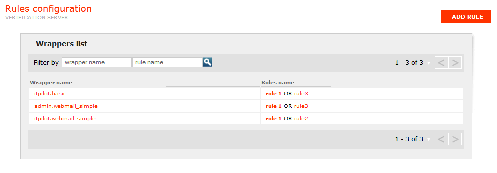
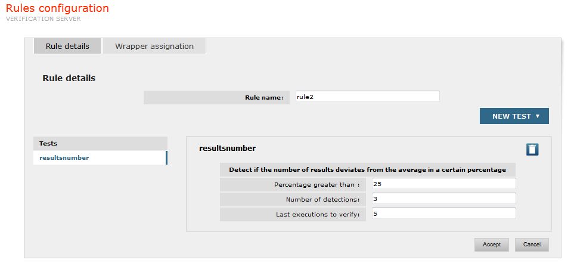
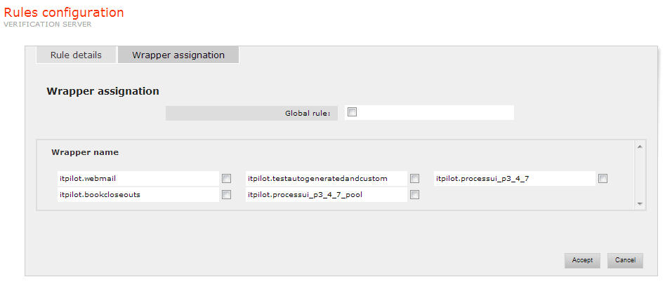
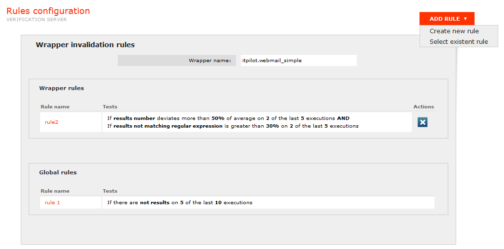

=======================
Rules Configuration
=======================

The Verification Server needs to be able to detect situations in which
one of the wrappers under its supervision ceases to give correct results
because of a change in the structure of the source pages. This will
trigger a notification.

The detection process is carried out by collecting and analyzing the
results returned by the wrapper in response to queries received during
normal operation of the Wrapper Server. A series of different tests can
be performed. These tests return a percentage value representing the
disagreement of the results with the test’s criterion, where 100% means
complete disagreement and 0% a complete agreement. If a test returns
values higher than 0, that may indicate a problem with the wrapper.

The available tests are the following:

-  *ZeroResults*: checks whether the source returns any result or not.
   The intuition behind this test is that if a significant number of
   queries do not return any results, a possible reason is a
   malfunctioning of the current wrapper. This test will return 100 if
   there are no results, and, on the contrary, 0.
-  *Compatibility*: checks the compatibility between the results and the
   query. E.g. if **title=java** is searched, then the returned
   results should contain the word “java” in the **title** field
   of the extracted tuples. The opposite would mean that the current
   wrapper might not be correctly extracting the data from that field.
   The percentage value is calculated proportionally to the number of
   tuples which do not verify the compatibility test with regard to the
   total ones.
-  *Consistency*: checks whether the results match the regular
   expressions defined in the wrapper metadata. The intuition behind this test is similar to the previous
   test: if the results do not verify the pointed out regular
   expressions, it is probable that the current wrapper is not correctly
   performing the extraction process. The percentage value is calculated
   proportionally to the number of tuples which do not verify the
   regular expressions with regard to the total ones.
-  *Invariability*: checks that a certain result percentage of the
   results of some query is maintained when that same query is executed
   some time later. The intuition behind this test is that, in some
   sources, very abrupt changes in the extracted results for a same
   query alongside time might indicate a malfunctioning of the current
   wrapper. The percentage value is calculated proportionally to the
   number of tuples which are not kept since last query executions with
   regard to the total ones.
-  *Pagination*: checks that in every intermediate result page returned
   by the wrapper (all but the last one), the number of returned tuples
   is the same. If any intermediate page does have fewer results than
   others, this could mean that the wrapper is omitting some relevant
   results (take into account that web sources usually paginate their
   results in intervals with a fixed number of results for each one).
   The returned percentage value is calculated as a function of the
   deviation of the obtained number of tuples with regard to the
   expected number of tuples. If there is no deviation the percentage
   returned will be 0; it will become higher as the deviation becomes
   larger. This expected number of tuples is calculated by supposing
   that each intermediate page returns the maximum number of results
   obtained for some of the pages.
-  *ResultsNumber*: checks that the number of tuples obtained in
   successive executions of a same query across time is similar. The
   intuition behind this test is that, in some sources, very abrupt
   changes in the number of extracted results for a same query could
   indicate a malfunction of the current wrapper. The percentage is
   calculated by checking the deviation of the number of tuples returned
   by the query with respect to the average of the last executions of
   that query. If there is no deviation, the percentage returned will be
   0. The percentage will become higher as the deviation (either because
   of and increase or a decrease in the number of results) becomes
   larger. In particular, if there is a drop in the number of results to
   0, the percentage returned will be 100.

Tests are grouped into “rules”. A wrapper can have a series of these
rules associated to it. A rule is composed of one or more tests, along
with alert conditions over their results: the percentage returned by a
test must lie above a certain threshold, for a given number of times, to
contribute towards the firing of the rule which contains the test. All
the tests in a rule must match their alert conditions for the rule to
fire.

If any rule associated to a wrapper fires, a notification is triggered
and an email is sent according to the Mail Configuration.

`Rules Configuration tab for the Verification Server`_ shows the Rules
Configuration section. Individual wrappers are displayed in a list,
their names prefixed with the name of the database to which they belong
in the Wrapper Server. The list also shows the name of the rules
associated to each particular wrapper. The list can be filtered by
wrapper name (only the wrappers whose names contain the filter string
are shown) and/or by rule name (only the rules whose names contain the
filter string, and the wrappers which have any of those rules assigned,
are shown).

   Rules Configuration tab for the Verification Server

To create a new rule, the user should click on the “Add Rule” button.
The form to create a rule will appear, containing two tabs:

-  **Rule details**: this tab, depicted in `Rule creation page: rule
   details`_, allows setting the rule name and configuring the tests that
   will compound the rule. To add a test to the rule click on the “New
   test” button and select the type of the test to be added from the popup
   menu which appears. Then configure the rule parameters:

   -  Results (only for test “zeroresults”): This parameter
      indicates if the wrapper should return results or not in order to
      consider the test as failed.
   -  Percentage greater than (all tests but “zeroresults”): This
      parameter indicates the percentage returned by the test to consider
      it as failed. The test will fail if its result is greater than the
      specified value (i.e. the disagreement of the results with the test’s
      criterion is greater than the percentage specified by the user).
   -  Last executions to check: number of past wrapper executions which are
      taken into account for this test. The value “1” indicates the last
      execution performed, “2” indicates the last two executions, and so
      on.
   -  Number of detections: number of times that the test must “fail”
      taking into account the executions configured in the parameter “Last
      executions to check”. For example, if “Number of detections” is 3 and
      “Last executions to check” is 5, then the test will contribute to
      fire the rule if it fails in at least three of the five last
      executions.
  

The tests added to the rule are shown in the left part, under the header
“Tests”. To modify or remove a test just click on it and it will be
shown in the right part. Then its parameter values can be changed, or it
can be deleted from the rule by clicking on the |image1| button.

   Rule creation page: rule details

-  **Wrapper assignation**: this tab allows assigning the rule being
   created to one or more wrappers. The user can select the “Global
   rule” check box (see `Rule creation page: assigning rules to
   wrappers`_) to assign the rule to all the wrappers in the Wrapper
   Server. To assign the rule to a specific set of wrappers, the user
   may select these wrappers using their respective check boxes.

   Rule creation page: assigning rules to wrappers

Once the rule details have been configured and the rule has been
assigned to the desired wrappers, click on the “Accept” button to store
the rule. The rule creation can be canceled at any moment by clicking on
the “Cancel” button.

Existent rules can be edited, just by clicking on the name of the rule.
A form similar to the one used to create a new rule will appear with the
current configuration of the rule being edited. The form will contain,
in addition, the button |image4| to remove the rule from the
Verification server.

To see in detail and manage the rules assigned to a wrapper, the user
may click on the wrapper name. A new page will appear (see `Example of
Verification Rules`_) showing all rules assigned to the wrapper, with a
textual description of each of them. The button “Add Rule” can be used
to add an existing rule to the wrapper or create a new one. Rules that
are no “global” can be unassigned by clicking on its associated |image5|
button.

   Example of Verification Rules

`Example of Verification Rules`_ shows the rules assigned to the wrapper
“webmail\_simple” (deployed in the database “itpilot”). The first rule
is composed of two tests, and the second rule is a global rule composed
by a single test. The tests mean the following:

-  The first test of the first rule uses the test type *ResultsNumber*,
   and it will contribute to fire the rule when the percentage value
   returned by this test is above the 50% in at least 2 of the last 5
   executions (i.e. when the number of results returned, in at least two
   of the last five executions, deviates more than the 50% with respect
   to the average of results returned by the same query in past
   executions).
-  The second test of the first rule uses the test type *Consistency*,
   and it will contribute to fire the rule when percentage value
   returned by this test is above the 30% in at least two of the last
   five executions (i.e. when the number of tuples which do not verify
   the regular expressions defined in the wrapper metadata, with regard
   to the total ones, is greater than the 30% in at least two of the
   last five executions).
-  The test of the second rule uses the test type *ZeroResults*, and it
   will contribute to fire the rule when five of the last ten executions
   do not return any result.

