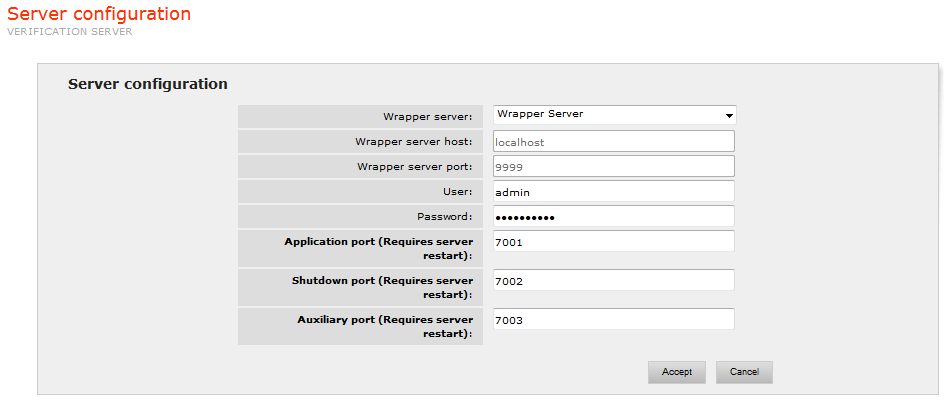

==========================================
Server Configuration (Verification Server)
==========================================

In this section, the port numbers used by the Verification Server can be
configured. It also allows the user to specify the Wrapper Server whose
wrappers will be verified.

-  Wrapper Server, Wrapper Server host and Wrapper Server port: the
   Verification Server needs to access the Wrapper Server, where the
   wrappers in execution are stored, so that it can detect changes
   automatically. In the “Wrapper Server” drop-down list,
   the user can select the required Wrapper Server from among the ones
   known to the web administration tool (see section :ref:`Adding, editing
   and deleting servers` for instructions on how to add new servers to
   the web administration tool). The user may also choose “none” in the
   drop-down list to enter custom host and port values.
-  User and Password: the user and password used by the Verification
   Server to authenticate in the Wrapper Server.
-  Application Port: port used by the Verification Server to communicate
   with the Wrapper Server.
-  Shutdown Port: port used by the server to wait for the Shutdown
   signal in order to finish its execution if received.
-  Auxiliary Port: communication port between the Verification Server
   and its clients.

`Setting the Verification Server ports and selecting the Wrapper
Server`_ shows these
configurable parameters in the Server Configuration section.

   Setting the Verification Server ports and selecting the Wrapper Server
   
.. important:: The ITPilot Verification Server has been deprecated and may be removed in the next version of the Denodo Platform.