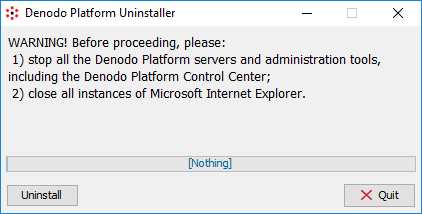

================================
Uninstalling the Denodo Platform
================================

The goal of the Denodo Platform uninstaller is to:

-  Remove the directory where the Denodo Platform is installed.
-  On Windows, if you installed ITPilot components, to unregister their DLL files registered during the installation.
-  Remove the shortcuts created on the Desktop.

The uninstaller removes all the components of the Denodo Platform; it is not possible to remove only some of them.

Follow these steps to start the uninstaller:

.. rubric:: On a Host with Graphical Support

1. Stop all the Denodo Platform servers and tools of this installation.
#. Close all the windows of Internet Explorer.
#. Launch <DENODO_HOME>/bin/denodo_platform 
#. Click **Uninstall** to launch the uninstaller. It will show another dialog. In this one, click **Uninstall**.

   

.. rubric:: On a Host without Graphical Support

1. Stop all the Denodo Platform servers and tools of this installation.
#. Execute this command:

.. code-block:: bash

   cd <DENODO_HOME>
   jre/bin/java -jar Uninstaller/denodo-uninstall-7.0.jar -c

.. rubric:: Troubleshooting the Uninstaller

If the uninstallation process fails, follow these steps to complete the uninstallation of the Denodo Platform:

1. Delete the folder where the Denodo Platform or the Solution Manager are installed.
#. Optionally, if you installed the Denodo Platform on Windows, remove the Windows services created during the installation.
#. Optionally, if you installed ITPilot, unregister the DLL files of the Denodo Platform.
#. Optionally, on a host with graphical support, remove the shortcuts created during the installation.
