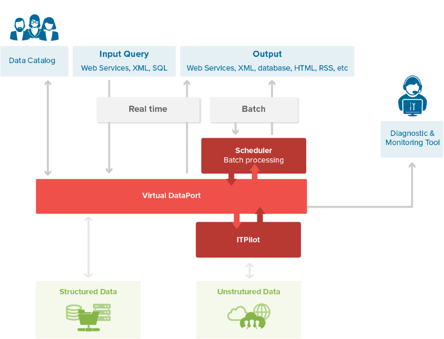

============
Introduction
============

Modern business processes must make use of a vast array of information
systems, developed over several decades.

These systems, in turn, make use of a vast array of data sources,
developed for the most part using completely disparate technologies
(relational databases, Web services, XML documents, spreadsheets, flat
files …) and very dissimilar data models. Some of these data sources are
“well-structured” for ease of querying from client applications; more
and more are less well structured and lack even rudimentary schema for
facilitating client interactions. Some, in fact, are pure text
documents, which make no pretense at adhering to a “structure” of any
kind.

Development of modern information systems and optimization of business
processes require access and utilization of the data stored in this vast
array of inherited data repositories.

Another important trend to consider is the expansion of Social Media and
Big Data, an obvious example of the widespread dissemination of needed
information and the heterogeneity of data formats. This data, typically
found through browsing the Web in its many forms, often adds crucial
value to corporate information systems.

In addition, clients, suppliers, and competitors often use simple or
complex Web interfaces for accessing their information and services.

The **Denodo Platform** is a **global solution** for the real-time
integration of heterogeneous and dispersed, structured and
non-structured data sources. To do so, it combines different integrated
modules:

-  The Virtual DataPort module provides real-time integration of any
   relevant information for the company, whatever its origin, format,
   and structure level. It enables to create “virtual databases” that
   are made up of unified views of data from any type of data source,
   including databases, SOAP, and REST Web Services, XML, flat files,
   conventional Web sites (through the ITPilot module) and LDAP servers.
-  The ITPilot module provides an easy way to access and structure
   the data present in the Web. This process involves building an
   abstraction from the specific Web source called wrapper that isolates
   the client applications from the intrinsic characteristics of that
   site (access protocol, native data structure, etc.). Thus, the data
   contained on the hidden Web can be queried and integrated just as
   easily and effectively as the data contained in a conventional
   database. In addition to that, ITPilot can also extract structured
   data from PDF, Microsoft Excel and Microsoft Word documents. ITPilot provides a
   distributed and scalable environment for generating, executing, and
   verifying the correct operation of wrappers.
-  In addition, the Scheduler module is a complementary tool that allows
   scheduling batch tasks using any of the former modules to
   automatically extract and filter data from several sources and export
   them to the desired format.

   General architecture of the Denodo Platform
This document introduces readers to the installation and configuration
of the Platform and the use of the Denodo Platform Control Center tool
that, among other uses, provides a single panel from where all the
servers and tools comprising the Platform can be started and stopped.

For information about the installation of the Solution 
Manager, refer to the :ref:`Solution Manager Installation Guide`.
