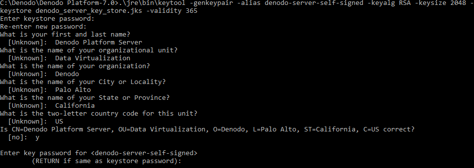
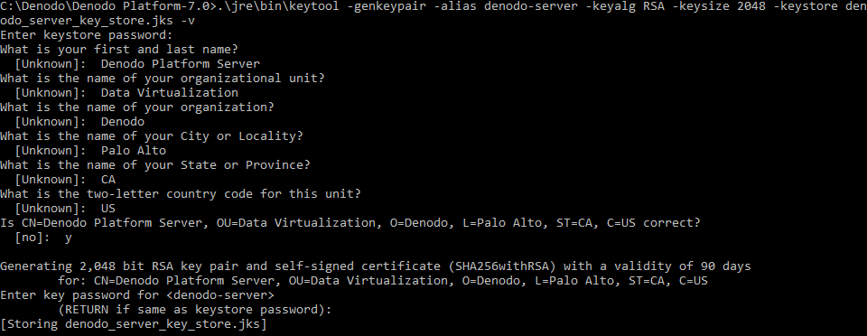

===============================================
Obtaining and Installing an SSL/TLS Certificate
===============================================

Before enabling SSL/TLS in the Denodo Platform servers and clients, you need to create a
*keystore* with a key pair (a public key and associated private key) and a certificate. To do this, follow one of these options:

a. If you do *not* have an SSL private key, you can :ref:`create a keystore with a self-signed private key<Create a Keystore with a Self-Signed Certificate>`.
#. If you do *not* have an SSL private key, you can :ref:`send a request to a certificate authority (CA) and create a keystore with the certificate reply<Send a Certificate Request to a Certificate Authority (CA) and Create a Keystore with the Reply>`.
#. If you have a PFX file with the private key, :ref:`create a keystore with its content<Create a Keystore from a PFX File (PKCS#12)>`.
#. If you already have a keystore file (usually, this file has the extension "jks"), jump to the :ref:`next<Enabling SSL/TLS in Denodo Platform Servers>` section.

To use the options one, two or three, we are going to use the tool keytool. The `keytool documentation for Windows <https://docs.oracle.com/javase/8/docs/technotes/tools/windows/keytool.html>`_
and `Linux <https://docs.oracle.com/javase/8/docs/technotes/tools/unix/keytool.html>`_ provides more details about the parameters of this tool.

Create a Keystore with a Self-Signed Certificate
================================================

This section explains how to generate a key pair (a public key and associated private key) and its self-signed certificate (an X.509 v3 self-signed certificate).

In the host where the Denodo servers will run, open a command line and run these commands.

.. rubric:: Step #1. Generate the key pair.

Execute this (on Linux, replace ``\`` with ``/``):

.. code-block:: batch

   cd <DENODO_HOME>
   .\jre\bin\keytool -genkeypair -alias denodo-server-self-signed -keyalg RSA -keysize 2048 -keystore denodo_server_key_store.jks -validity 365

Enter and re-enter the password of the new keystore. **Write down this password**, you will need it later in the configuration and if lost, it cannot be retrieved.

After entering the password, you have to provide the attributes of the certificate. If any of these attributes has an &, @, or any other symbol using the shift key, spell out the symbol or omit it to enroll. For example, if "Oil & Gas Corporation", enter "Oil and Gas Corporation".

When prompted for the password for the key (when in the command line you see ``(RETURN if same as keystore password)``), press **Enter** so the key has the same password as the keystore. The key and the keystore need to have the same password.

.. note::

   When running this command, you will see this warning:

   .. code-block:: none

      Warning:
      The JKS keystore uses a proprietary format. It is recommended to migrate to PKCS12 which is an industry standard format using "keytool -importkeystore -srckeystore denodo_server_key_store.jks -destkeystore denodo_server_key_store.jks -deststoretype pkcs12".

   Ignore it. If you use a keystore with the PKCS12 format, the Denodo web applications will not start.

.. rubric:: Step #2. Export the self-signed public key to a file.

Execute this (on Linux, replace ``\`` with ``/``):

.. code-block:: batch

   .\jre\bin\keytool -exportcert -alias denodo-server-self-signed -keystore denodo_server_key_store.jks -file denodo_server_public_key.cer

Enter the password you entered in "step #1".

This command exports the certificate to the file ``denodo_server_public_key.cer``.

.. rubric:: Step #3. Import the certificate into the truststore of the Denodo servers.

Execute this (on Linux, replace ``\`` with ``/``):

.. code-block:: batch

   .\jre\bin\keytool -importcert -alias denodo-server-self-signed -file denodo_server_public_key.cer -keystore jre\lib\security\cacerts -storepass "changeit" -noprompt

.. rubric:: Step #4. Copy the public key to the Virtual DataPort administration tools that will connect to this Denodo server.

Copy the file "cacerts" of this server (located in the directory "<DENODO_HOME>/jre/lib/security"), to *all* the computers that have a Virtual DataPort administration tool that will connect to this server. In these computers, replace the file <DENODO_HOME>/jre/lib/security/cacerts with the cacerts you just copied.

The cacerts file only contains public keys and not private ones so it can be shared freely and does not pose any security risk.

|

*Alternatively*, instead of copying the "cacerts" file, you can import just the public key. To do this, copy the file ``denodo_server_public_key.cer`` from the Denodo server to the directory <DENODO_HOME> *of the client*, open a command line in this client and execute this:

.. code-block:: batch

   cd <DENODO_HOME>
   .\jre\bin\keytool -importcert -alias denodo-server-self-signed -file denodo_server_public_key.cer -keystore jre\lib\security\cacerts -storepass "changeit" -noprompt

With the parameter ``-importcert`` you are importing the self-signed certificate into the truststore of the Java Runtime Environment included in the Denodo Platform. "changeit" is the default password of the cacerts file included in any Java Runtime Environment.

|

.. rubric:: Step #5. Import the public key into JDBC clients.

1. Copy the file ``denodo_server_public_key.cer`` from the Server to the computer of the client application.
2. Locate the Java Runtime Environment (JRE) the JDBC client uses.
3. Open a command line in this computer and execute this:

.. code-block:: batch

   keytool -importcert -alias denodo-server-self-signed -file denodo_server_public_key.cer -keystore <PATH TO THE cacerts FILE OF THE CLIENT> -storepass "changeit" -noprompt

|

You do not have to import the public key into clients that to connect to Denodo using ODBC.

|

You need to import the certificate into the truststore of the clients (the "cacerts" file) because this certificate is self-signed and not signed by a public certificate authority (CA). Therefore, by default, external clients do not trust this certificate and they will refuse to establish SSL connections to the Denodo servers.

|

Now that you have the certificate in place, go to the :ref:`next section <Enabling SSL/TLS in Denodo Platform Servers>` to enable SSL on the Denodo servers and its clients.

Send a Certificate Request to a Certificate Authority (CA) and Create a Keystore with the Reply
===============================================================================================

This section explains how to send a "Certificate Signing Request" (CSR) so you can use a certificate that is signed a public certification authority (CA); and how to create a keystore with the reply.

In the host where the Denodo servers will run, open a command line and run these commands.

.. rubric:: Step #1. Create a keystore and a private key.

Execute this (on Linux, replace ``\`` with ``/``):

.. code-block:: batch

   cd <DENODO_HOME>
   .\jre\bin\keytool -genkeypair -alias denodo-server -keyalg RSA -keysize 2048 -keystore denodo_server_key_store.jks -v

Enter and re-enter the password of the new keystore. **Write down this password**, you will need it later in the configuration and if lost, it cannot be retrieved.

After entering the password, provide the attributes of the certificate. If any of these attributes has an &, @, or any other symbol using the shift key, spell out the symbol or omit it to enroll. For example, if "Oil & Gas Corporation", enter "Oil and Gas Corporation".

When prompted for the password for the key (when in the command line you see ``(RETURN if same as keystore password)``), press **Enter** so the key has the same password as the keystore. The key and the keystore need to have the same password.

.. note::

   When running this command, you will see this warning:

   .. code-block:: none

      Warning:
      The JKS keystore uses a proprietary format. It is recommended to migrate to PKCS12 which is an industry standard format using "keytool -importkeystore -srckeystore denodo_server_key_store.jks -destkeystore denodo_server_key_store.jks -deststoretype pkcs12".

   Ignore it. If you use a keystore with the PKCS12 format, the Denodo web applications will not start.

.. rubric:: Step #2. Generate the Certificate Signing Request (CSR)

Execute this:

.. code-block:: batch

   .\jre\bin\keytool -certreq -alias denodo-server -file denodo_certificate_signing_request.csr -keystore denodo_server_key_store.jks -sigalg SHA1withRSA -v

You will have to enter the password of the keystore you entered on step #1.

The file ``denodo_certificate_signing_request.csr`` contains the certificate request; send it to your Certification Authority (CA).

.. rubric:: Step #3. Import the certificate response into the keystore.

Once you got the certificate response, import it into the keystore. The steps depend on if you have a PCKS#7 certificate or a X.509 one.

a. An **X.509 certificate** usually has the extension ``cer`` and it is a text file that starts with ``-----BEGIN CERTIFICATE-----``. If you have this type of certificate, you have to do two steps:

   1. Probably (depends on the CA), you need to obtain the intermediate certificate of the CA. After obtaining it, execute this:

   .. code-block:: batch

      .\jre\bin\keytool -import -trustcacerts -alias intermediate_ca -keystore denodo_server_key_store.jks -file <INTERMEDIATE CERTIFICATE FILENAME.cer>

   2. Import the certificate:

   .. code-block:: batch

      .\jre\bin\keytool -import -trustcacerts -alias denodo-server -keystore denodo_server_key_store.jks -file <YOUR CERTIFICATE FILENAME.cer>

   .. note:: The parameter ``alias`` has to match the alias you indicated in the previous step (when you executed ``keytool -certreq``).

b. A **PKCS#7 certificate** usually has the extension ``p7b``. Execute this to import it into the keystore:

   .. code-block:: batch

      .\jre\bin\keytool -import -trustcacerts -alias denodo-server -keystore denodo_server_key_store.jks -file <YOUR CERTIFICATE FILENAME.p7b>

   .. note:: The parameters ``alias`` and ``keystore`` have to match what you indicated in the previous step (when you executed ``keytool -certreq``).

.. rubric:: Step #4. Check the contents of the keystore.

Check that the keystore contains the appropriate certificate. To do it, execute
this from the command line:

.. code-block:: batch

   .\jre\bin\keytool -list -v -keystore denodo_server_key_store.jks

You should see something like the following:

.. code-block:: batch
   :emphasize-lines: 3

   Alias name: denodo-server...
   Creation date: Nov 15, 2017
   Entry type: PrivateKeyEntry
   Certificate chain length:
   ...
   ...

The value of “Entry Type” has to be ``PrivateKeyEntry`` or ``KeyEntry``.

Now that you have the certificate in place, go to the :ref:`next section <Enabling SSL/TLS in Denodo Platform Servers>` to enable SSL on the Denodo servers and its clients.

Create a Keystore from a PFX File (PKCS#12)
===========================================

A PKCS #12 bundle contains a private key and its X.509 certificate. These bundles usually have the file extension .pfx or .p12.

To create a keystore from a PKCS bundle, open a command line and follow these steps:

.. rubric:: Step #1. List the certificates in the PCKS #12 file.

.. code-block:: batch

   cd <DENODO_HOME>
   .\jre\bin\keytool -list -keystore <PFX file name> -storetype pkcs12 -v

This command lists the certificates included in this file. You will see something like this:

.. code-block:: none
   :emphasize-lines: 6

   Keystore type: PKCS12
   Keystore provider: SunJSSE

   Your keystore contains 1 entry

   Alias name: 91fd6b6a-5e7e-4e32-b963-6faf6439aaae
   ...
   ...
   ...

Copy the value of the attribute "Alias name".

.. rubric:: Step #2. Import the key into the keystore.

.. code-block:: batch

   .\jre\bin\keytool -importkeystore -trustcacerts --srckeystore <PFX certificate file name> -srcalias "<ALIAS OF THE KEY TO IMPORT>" -srcstoretype PKCS12 -destkeystore denodo_server_key_store.jks -destalias "denodo_server"

Replace ``<ALIAS OF THE KEY TO IMPORT>`` with the "Alias name" obtained in the previous step.

You will have to provide the password of the PFX bundle and the password of the new keystore.

.. rubric:: Step #3. Check the contents of the keystore.

Execute the command below to check that the keystore contains the appropriate certificate.

.. code-block:: batch

   .\jre\bin\keytool -list -v -keystore denodo_server_key_store.jks

You should see something like the following:

.. code-block:: none
   :emphasize-lines: 3

   Alias name: denodo-server...
   Creation date: Jul 1, 2016
   Entry type: PrivateKeyEntry
   Certificate chain length:
   ...
   ...

The value of “Entry Type” has to be ``PrivateKeyEntry`` or ``KeyEntry``.

.. rubric:: Step #4. Export the certificate to a file.

.. code-block:: batch

   .\jre\bin\keytool -exportcert -alias "denodo_server" -keystore denodo_server_key_store.jks -file denodo_server_public_key.cer

Enter the password you entered in "step #2" for the new keystore.

.. rubric:: Step #5. Import the certificate into the truststore of the Denodo servers.

Execute this (on Linux, replace ``\`` with ``/``):

.. code-block:: batch

   .\jre\bin\keytool -importcert -alias "denodo_server" -file denodo_server_public_key.cer -keystore .\jre\lib\security\cacerts -storepass "changeit" -noprompt

This command imports the certificate into the truststore of the Java Runtime Environment included in the Denodo Platform.

Now that you have the certificate in place, go to the :ref:`next section <Enabling SSL/TLS in Denodo Platform Servers>` to enable SSL on the Denodo servers and its clients.
