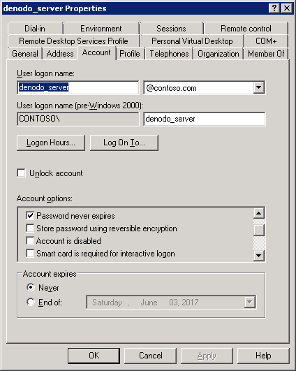
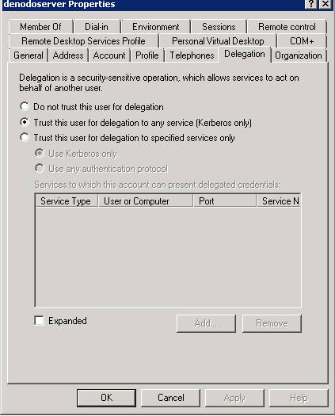

==================================
Setting-up Kerberos Authentication
==================================

Several modules of the Denodo Platform support Kerberos authentication:

-  The Virtual DataPort server
-  The Data Catalog
-  The Diagnostic and Monitoring Tool
-  The Scheduler server and administration tool

Before enabling this support, you have to perform these tasks:

#. :ref:`Configure the Kerberos authentication server <Configuring the Kerberos Authentication Server (e.g.
   Active Directory)>` to be able to authenticate the Virtual DataPort server and its users.

#. Optionally, :ref:`modify the Windows registry to use the native ticket cache <Modifying the Windows Registry to use the Native Ticket
   Cache>` so the user does not have to enter her credentials when opening the administration tool.

After performing these steps, you have to configure the Virtual DataPort
server and its clients to use Kerberos authentication. The section :doc:`../../../../vdp/administration/server_administration_-_configuring_the_server/kerberos_authentication/kerberos_authentication` of the Virtual DataPort Administration Guide
explains how to do this.

Configuring the Kerberos Authentication Server (e.g. Active Directory)
======================================================================

You need to perform the following tasks on Active Directory (or the Kerberos server your organization uses):

#. :ref:`Create a user in the Kerberos server of type “User” <Creating a User in the Active Directory>`.

#. :ref:`Declare a Service Principal Name (SPN) <Declaring a Service Principal
   Name (SPN)>` and associate it with the user of
   the Virtual DataPort server.

#. :ref:`Generate a keytab file <Generating a Keytab File>`.

In many organizations, only the administrators of the Active Directory can do this.

Creating a User in the Active Directory
---------------------------------------

Create a service account in the Active Directory, which the Virtual DataPort
server will use to authenticate itself. This service account has to meet these requirements:

-  Create a *User* account, not a *Machine* account nor a *Computer* account.
-  Clear the option *User must change password at next logon*.
-  We recommend selecting *Password never expires*.

To do this in Active Directory, follow these steps:

#. Launch the tool **Active Directory Users and Computers** (in the menu **Programs** > **Administrative Tools**).

#. Right-click the **Users** node and click **New** > **User** (*do not* select
   **Machine** nor **Computer**).

#. Enter ``denodo_server_prod`` in the **Logon name** field. You can enter a different name; the rest of the examples use "denodo_server_prod".

#. Click **Next** and enter a password.

#. Locate ``denodo_server_prod`` in the **Users** tree, in the left side pane and
   double-click it.

#. Click the tab **Account** of "denodo_server_prod" and in the panel **Account options**, do this:

   -  We recommend selecting **Password never expires**. Otherwise, you will have to reconfigure and restart the Virtual DataPort server every time the password expires.
   -  Regarding encryption mechanisms, we recommend clearing **Use Kerberos DES encryption types for this account** because is considered insecure.

   Active Directory User Configuration (Account tab)

Declaring a Service Principal Name (SPN)
----------------------------------------

A Service Principal Name (SPN) is a unique identifier for a service running on a server. SPNs are used by Kerberos authentication to associate a service instance with a service logon account.

To define the SPN for Denodo, follow these steps:

.. rubric:: Step #1

Open a command prompt as an administrator, either from the host where the Denodo server is going to run or from the "Windows Domain Controller".

.. rubric:: Step #2

With the utility ``setspn``, declare the SPN and associate it with the user account created in the previous step ("denodo_server_prod").

.. code-block:: batch
   :name: Syntax of the setspn utility
   :caption: Syntax of the setspn utility

   setspn -U -S HTTP/<Fully Qualified Domain Name of the Denodo server> <REALM>\<server account>

For example,

.. code-block:: batch

   setspn -U -S HTTP/denodo-dv-prod.contoso.com CONTOSO.COM\denodo_server_prod

The output should be like::

   Checking domain DC=contoso,DC=com

   Registering ServicePrincipalNames for CN=Denodo Production Server,CN=Users,DC=contoso,DC=com
          HTTP/denodo-dv-prod.contoso.com
   Updated object

If you are doing this for a Denodo server that will be part of a cluster of Denodo servers and the client applications will connect 
to it through a load balancer, use the host name defined in the load balancer, not the actual host name of the Denodo server.

.. rubric:: Step #3

Verify that the user account only has one SPN. To do this, execute ``setspn -L <user account>``. For example,

.. code-block:: batch

   setspn -L CONTOSO.COM\denodo_server_prod

The output should be like::

  Registered ServicePrincipalNames for CN=denodo_server_prod,CN=Users,DC=contoso,DC=com:
       HTTP/denodo-dv-prod.contoso.com

or::
    
   Registered ServicePrincipalNames for CN=denodo_server_prod,CN=Users,DC=contoso,DC=com:
       HTTP/denodo-dv-prod.contoso.com
       HTTP/denodo-dv-prod

Consider the following rules regarding SPNs:

-  In step #2, if ``setspn -U -s ...`` returns an error like "Duplicate SPN found, aborting operation!", it means this SPN is already registered, either on this account or another one. The SPN you use for Kerberos authentication of the Denodo servers cannot be associated with more than one user account. If it is, this authentication will not work.

-  The user account cannot be associated with two different SPNs either. If it is, the Kerberos authentication will fail for ODBC clients, web services, the Data Catalog, the Diagnostic and Monitoring Tool, and the Scheduler administration tool. The Denodo JDBC driver and the administration tool will be able to connect.

-  The SPN has to comply with the following rules:
   
   1. The host name (in this example "host1.subnet1.contoso.com") has to be the Fully Qualified Domain Name (FQDN) of the host where the Virtual DataPort server runs or in case of a cluster of Denodo servers, the FQDN defined in the load balancer for this cluster.

   #. The "service class" of the SPN has to be ``HTTP``, except for the Scheduler server (it could be any string, for instance, ``SCHED``).
   
      When web browsers request a Kerberos ticket, they do it for the service "HTTP/<host name of the URL you are accessing>" (the browser forms the SPN with "HTTP" even if you use the protocol "https"). The SPN of this ticket has to match the SPN that the Denodo servers will use; otherwise the authentication will fail.
   
   If the SPN does not meet these rules, the Kerberos authentication will fail for ODBC clients, web services, the Data Catalog, the Diagnostic and Monitoring Tool, and the Scheduler administration tool. The Denodo JDBC driver and the administration tool will be able to connect.

-  SPNs are case insensitive when used by Microsoft Windows-based computers. However, Linux/Unix is case-sensitive and requires the proper case to function properly. So, when you create the SPN and configure the Virtual DataPort server, *always enter the SPNs with the proper case*. That is, the host name in lower case (e.g. denodo-prod.subnet1.contoso.com) and the domain name in upper case (e.g. CONTOSO.COM).

-  If your organization uses Microsoft Active Directory 2003 or earlier, you cannot use the -S switch in setspn because it is not available for that version. In that case, replace -S with -a but make sure that the same SPN is not associated to two user accounts.

See the `documentation <https://social.technet.microsoft.com/wiki/contents/articles/717.service-principal-names-spns-setspn-syntax-setspn-exe.aspx>`_ of ``setspn``.

See what a Fully Qualified Domain Name is at
https://en.wikipedia.org/wiki/Fully\_qualified\_domain\_name.

.. _generating-a-keytab-file-for-virtual-dataport:

Generating a Keytab File
------------------------

After defining the SPN, you have to generate a *keytab* file for the Virtual DataPort server. A
*keytab* file contains pairs of Kerberos principals and encrypted keys
derived from the password of a user account. The Virtual DataPort server starts will use the keytab 
to authenticate itself with Active Directory. Once it authenticates itself, it can authenticate other users.

.. rubric:: Step #1

From the command line of the Windows Domain Controller, execute this (only domain administrators can run it):

.. code-block:: batch
   :name: Syntax of the ktpass utility
   :caption: Syntax of the ktpass utility

   ktpass /out denodo.keytab /princ <SPN with FQDN>@<REALM> /mapUser 
   <server Active Directory account> /crypto ALL /pass * 
   /ptype KRB5_NT_PRINCIPAL

For example:

.. code-block:: batch
   :name: Example of generating a keytab file
   :caption: Example of generating a keytab file

   ktpass /out denodo_server_prod.keytab /princ HTTP/denodo-dv-prod.contoso.com@CONTOSO.COM 
   /mapuser denodo_server_prod /pass * /crypto ALL /ptype KRB5_NT_PRINCIPAL

You will have to enter the password of the user account "denodo_server_prod".

.. important::
  
   Make sure the password entered is correct and the case of the principal is the right one. ktpass **does not validate** this. 
   It just generates the keytab based on the principal and the password you enter.

You should see something like::
  
   Successfully mapped HTTP/denodo-dv-prod.contoso.com to denodo_server_prod.
   Type the password for HTTP/denodo-dv-prod.contoso.com:
   Type the password again to confirm:
   Password succesfully set!
   Key created.
   Key created.
   Key created.
   Key created.
   Key created.
   Output keytab to denodo.keytab:
   Keytab version: 0x502
   keysize 70 HTTP/denodo-dv-prod.contoso.com@CONTOSO.COM ptype 1 (KRB5_NT_PRINCIPAL) vno 4 etype 0x1 (DES-CBC-CRC) keylength 8 (0xfbeaece643fef213)
   keysize 70 HTTP/denodo-dv-prod.contoso.com@CONTOSO.COM ptype 1 (KRB5_NT_PRINCIPAL) vno 4 etype 0x3 (DES-CBC-MD5) keylength 8 (0xfbeaece643fef213)
   keysize 78 HTTP/denodo-dv-prod.contoso.com@CONTOSO.COM ptype 1 (KRB5_NT_PRINCIPAL) vno 4 etype 0x17 (RC4-HMAC) keylength 16 (0x25e19011618301a73e20fda538e18a91)
   keysize 94 HTTP/denodo-dv-prod.contoso.com@CONTOSO.COM ptype 1 (KRB5_NT_PRINCIPAL) vno 4 etype 0x12 (AES256-SHA1) keylength 32 (0x0370175225b496a88a120973d70e28bb9e94f113a2b827926ad52d093471f35f)
   keysize 78 HTTP/denodo-dv-prod.contoso.com@CONTOSO.COM ptype 1 (KRB5_NT_PRINCIPAL) vno 4 etype 0x11 (AES128-SHA1) keylength 16 (0x60c3d8c6f43727deeaccc480f8101c41)

See more about "ktpass" in `its documentation <https://docs.microsoft.com/en-us/windows-server/administration/windows-commands/ktpass>`_.

.. rubric:: Step #2

Copy the file "denodo_server_prod.keytab" to the host where the Denodo server runs. If this server is part of a cluster of Denodo servers, copy it to all these servers. 

.. rubric:: Step #3 (Optional)

You need to do this step if:

-  You plan on enabling Kerberos authentication in the Data Catalog, Scheduler or the Web Panel.
-  Or you plan on creating JDBC data sources that use the option "pass-through session credentials" *and* Kerberos authentication.

If you are not going to do any of these things, skip this section. You can do the following changes later in the future.

|

After running ``setspn`` and ``ktpass``, two things change in the configuration of the user account in Active Directory:

-  In the **Account** tab, the field **User logon name** changes to the Service Principal Name (before, it was just the name user account).

-  There is a new tab: **Delegation**.

Follow these steps:

1. Open the new user account and go to the tab **Delegation**.

2. Select one of these options:

   -  **Trust this user for delegation to any service** (known as "open delegation"). With this option, Active Directory will allow Virtual DataPort to delegate to any service (database, web service...) the Kerberos credential that the user used to connect to Virtual DataPort. In addition, it will allow the Data Catalog, Scheduler and the Web Panel to connect to Virtual DataPort using Kerberos authentication.
   
   -  **Trust this user for delegation to specified services only** (known as "constrained delegation"). If you select this, you also have to do this:

      i. Select **Use any authentication protocol**. Otherwise, the pass-through session credentials of Kerberos will not work.
      #. In the list **Services to which this account can present delegated credentials**, add the following:
      
         -  The SPN (Service Principal Name) of this same user (e.g. ``HTTP/denodo-dv-prod.contoso.com@CONTOSO.COM``). That way, if you enable Kerberos authentication on the Data Catalog, the Web Panel or Scheduler, these components can delegate to Virtual DataPort the Kerberos credential of the user.
         
         -  The SPNs (Service Principal Names) of the databases and web services to which you want to allow Denodo to delegate the Kerberos credentials that the user used to connect to Virtual DataPort.
         
         With the option *Trust this user for delegation to specified services only*, Active Directory will allow Virtual DataPort - and any other Denodo components that use the same SPN - to delegate the Kerberos credentials of the users only to the services on this list.

.. important:: If you select **Trust this user for delegation to specified services only**, you are enabling "constrained delegation". That is, the queries sent to Virtual DataPort will fail if they involve 
   a JDBC data source with the authentication option “pass-through session credentials” and the driver does not support Kerberos authentication with constrained delegation.
   Read the section :ref:`Connecting to a JDBC Source with Kerberos Authentication`
   of the Administration Guide to check if in your scenario, you can enable this option.

   Active Directory User Configuration (Delegation tab)

Modifying the Windows Registry to Use the Native Ticket Cache
=============================================================

The Virtual DataPort administration tool and the Denodo JDBC driver provide "Single Sign-on" (SSO), which means that the users do not need to enter their password to log in.

If the administration tool runs on Windows with the Denodo update 20190312 or earlier, and you want to use this feature, you have to modify the Windows registry of the host where the tool runs. That way, the tool will be able to obtain the Kerberos ticket that the system acquired when you logged in to the system. The reason for having to modify the registry to use SSO is that Microsoft added a new feature in which they no longer export the session keys for Ticket-Granting Tickets (TGTs). As a result, the native TGT obtained on Windows has an "empty" session key and null EType. If the administration tool
has the update 20190903 or newer, you do not need to do this.

You do not have to do anything to use single sign-on on Linux or to connect to the Denodo server using the ODBC driver.

Jump to the :ref:`next task<Setting-up Kerberos Authentication in the Data Catalog>` if you are not going to use "single sign-on" or the administration tool runs on Linux.

Note that you can use Kerberos authentication without modifying the registry by providing the user and the password when you log in. This is what you do when selecting *Use user/password* of the Kerberos authentication options of the administration tool.

To modify the registry, follow these steps:

#. Run ``regedit.exe``
#. Look for the key
   ``HKEY_LOCAL_MACHINE\System\CurrentControlSet\Control\Lsa\Kerberos\Parameters``
#. Right-click the “Parameters” node and click **New** > **DWORD**.
#. Enter the name of the entry: ``allowtgtsessionkey``.
#. Double-click the new entry and set the value to ``1``
   (``0x00000001``)

.. important:: You have to do this in all these hosts:

   -  All the hosts where Virtual DataPort administration tools run and
      whose users want to use Kerberos authentication.
   -  All the hosts where JDBC clients run and want to use Kerberos
      authentication.

You have to do this when the client runs on Windows because, as
explained in the `Troubleshooting page <https://docs.oracle.com/javase/8/docs/technotes/guides/security/jgss/tutorials/Troubleshooting.html>`_ for Kerberos authentication of
the Java Runtime Environment, Windows does not give access to
the session key of a Ticket-Granting Ticket (TGT) by defaults. This change in the
registry will make the session key for TGT accessible, so Java can use
it to acquire additional service tickets.

Even if you modify the registry, if the user that starts the administration tool belongs to the group "local administrator" of that computer, the tool will not be able to retrieve the Kerberos ticket from the system. This will make the single sign-on to fail. If that is the case, use the options *Use user/password* or *Use ticket cache* of the Kerberos authentication options of the administration tool.

The information provided in this section also applies to the Denodo JDBC driver.
