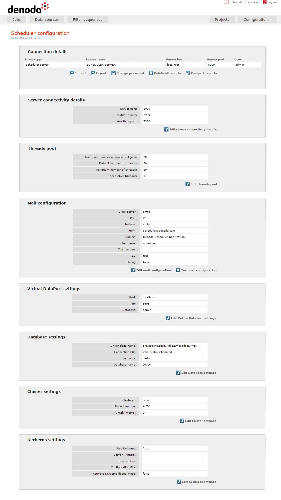

==============================
Scheduler Server Configuration
==============================

.. In Denodo 70, rename the file to match the name of the section

.. toctree::
   :hidden:
   
   server_configuration_sections.rst
   permissions.rst
   plugins_and_jdbc_adapters.rst

Once the Denodo Scheduler server has started up, it is possible to
change some parameters from any of the configuration sections of the
administration tool. It is important to note that only users with the
maximum privileges (administrator permissions) may access these
sections.

 

   Scheduler configuration screen
 

As shown in `Scheduler configuration screen`_, there are four
configuration areas: “Server configuration”, “Permissions”, “Plugins”
and “Drivers”. Each of them can be accessed from the drop-down menu
**Configuration**. Each of the configuration areas will be detailed in
the following sections.

