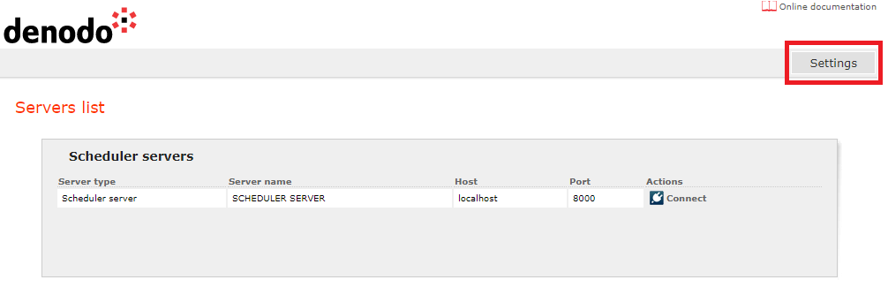
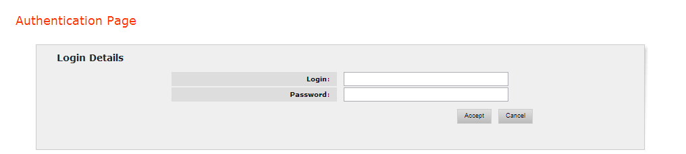
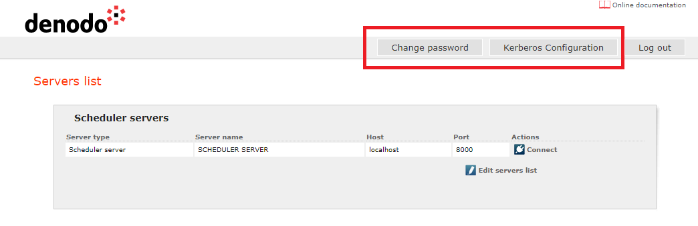

====================
Web Configuration
====================

.. toctree::
   :hidden:
   
   user_configuration/user_configuration.rst
   kerberos_configuration/kerberos_configuration.rst

Once the Denodo Scheduler administration tool has started up, it is possible to
configure some parameters that affect this tool by clicking on *Settings*. 
It is important to note that only users with the
maximum privileges (administrator permissions) may access these
sections.

   Denodo Scheduler Admin Tool Settings

To access the configuration of the Denodo Scheduler administration tool a screen
(`Denodo Scheduler login screen to administrate the web tool`_) is shown in which the user will
have to enter his/her credentials. There is one predefined user for this web
administration tool with login “admin” and password initially set
to “admin” (which can be changed after the user logs in by clicking **Change password**).

   Denodo Scheduler login screen to administrate the web tool

 

   Web configuration screen

Here, a link *Edit servers list* is shown. Following this link the
administrator can manage the list of Denodo Scheduler servers to which
the tool may connect (he/she can edit or remove the existing servers, or
add new ones).

As shown in `Web configuration screen`_, there are two
configuration areas: “Change password” and “Kerberos configuration”. 
Each of the configuration areas will be detailed in
the following sections.