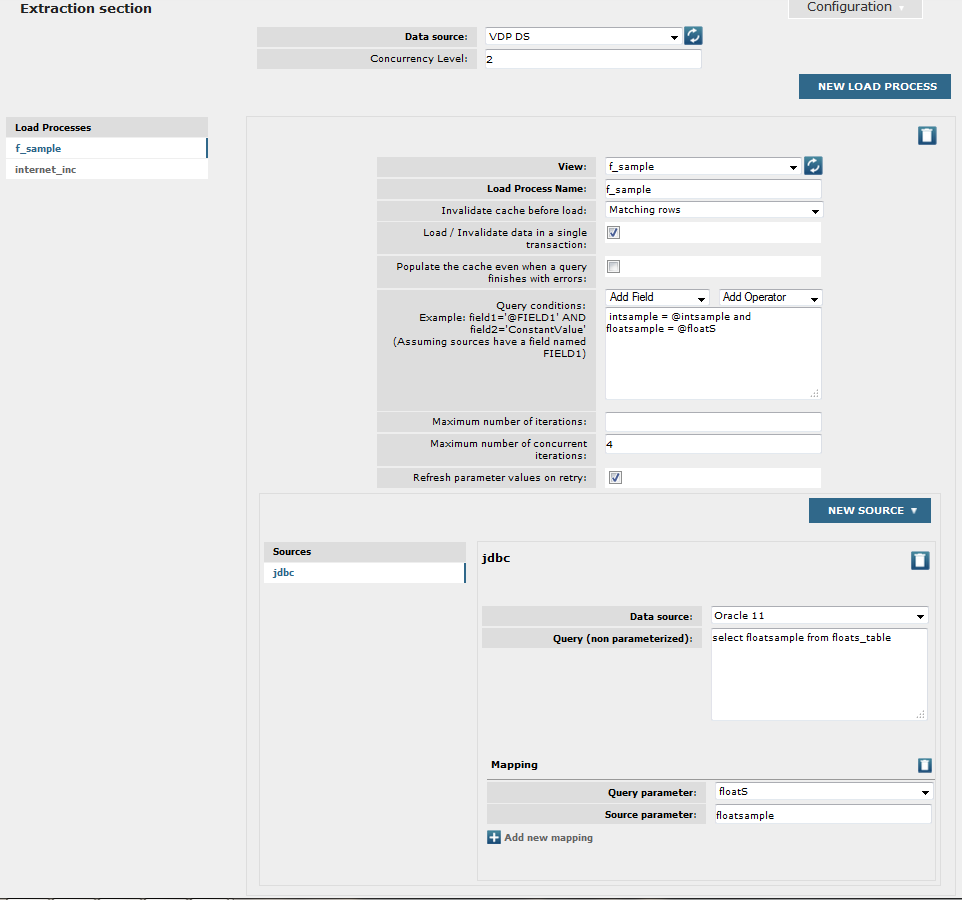
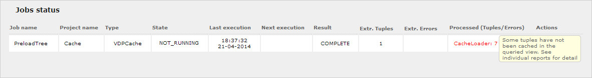

===========================
VDPCache Extraction Section
===========================

To configure the extraction section for VDPCache-type jobs a VDP-type
**data source** needs to be selected. Once selected, several load
processes to preload the cache of VDP views may be created, by clicking
on **New Load Process**.

Additionally, it is possible to configure the number of load processes
to run concurrently during the job execution (**Concurrency Level**).

When clicking on **New Load Process**, you can choose the type of the load process to create:

- :ref:`Non Incremental <Non Incremental Load Process>`: does a complete load of the cache.

- :ref:`Incremental <Incremental Load Process>`: uses the `Denodo Incremental Cache Load stored procedure <https://support.denodo.com/resources/denodo-connect/download/1763>`_, 
  that makes incremental additions with the new tuples and the updated ones to keep the cache view updated. 
  This option is only available if the Virtual DataPort server referenced by the selected data source
  has installed the extension and created the procedure ``INCREMENTAL_CACHE_LOAD`` (its name has to be exactly like this).
 

Non Incremental Load Process
-----------------------------

The configuration of each load process (`Example of the extraction
section of a VDPCache job`_) is quite similar to the extraction section
of a VDP-type job (we could think of this job like a conglomerate of
VDP-type jobs with the same data source). It consists of:

-  The VDP **view** to preload. All the fields from the selected view are
   projected. Views in this combo box are retrieved from the VDP data
   source configured for the job (all views from every database for which 
   the user has permissions are listed, not only the ones from the database specified 
   in the data source). Note that the corresponding VDP server
   must be running (there is a refresh button that allows reloading the
   views from the VDP data source at any moment).

-  The **query conditions**. It is the *where* part of the parameterized
   queries already seen for VDP-type jobs. Query conditions are optional
   and there are two combo boxes to help the user to create them:

   -  One to **add fields** of the selected view to the condition
      (mandatory fields are indicated). This combo is updated every time a
      new view is selected (if the VDP data source is accessible).
   -  Another one to **add operators** to the condition. This combo
      contains all the possible operators that can be used in a condition.

   Query conditions can have parameters, and the way to define their
   sources and their level of concurrency is identical to the one seen for
   VDP- and JDBC-type jobs.

   When saving the job configuration, the query conditions for every load
   process are validated against VDP. If there are errors, the names of the
   load processes with errors are shown in red, and the detailed
   information about each error is shown in the details of the
   corresponding load process.

-  The query **Context**. Allows to specify properties for the ``CONTEXT``
   clause of the query which is sent to VDP. For instance, you could
   specify ``'simplify' = 'off'`` in order to not apply simplifications to
   the query when executing it. Note that the options [#]_ applicable to
   the ``CONTEXT`` clause that are configured through the rest of
   parameters cannot be specified here.

-  An option to **invalidate the cache** before being loaded. This option
   can have one of these three values:

   1. **None**: do not invalidate the cache.
   #. **All rows**: when this option is selected the option
      ``'cache_invalidate' = 'all_rows'`` is added to the ``CONTEXT`` clause
      of the query which is sent to VDP. In this case, all tuples from the
      cache are invalidated, regardless of the query.
   #. **Matching rows**: when this option is selected the option
      ``'cache_invalidate' = 'matching_rows'`` is added to the ``CONTEXT``
      clause of the query which is sent to VDP. In this case, only the
      tuples that match the rows returned by the query are invalidated from
      the cache. This is the default option for new jobs.

-  An option to indicate if the processes of loading and invalidating the
   cache data (if configured, see previous point) are executed in the same
   transaction (**Load / Invalidate data in a single transaction**). If
   this option is checked, the option ``'cache_atomic_operation = 'true'`` is
   added to the ``CONTEXT`` clause of the query which is sent to VDP. When
   it is not checked, the option ``'cache_atomic_operation' = 'false'`` is
   added to the CONTEXT clause. By default, this option is checked.

-  An option to indicate if the cache should be populated even when a query
   finishes with errors (**Populate the cache even when a query finishes
   with errors**). If this option is checked, the option
   ``'cache_load_on_error' = 'true'`` is added to the ``CONTEXT`` clause of
   the query which is sent to VDP. When it is not checked, the option
   ``'cache_load_on_error' = 'false'`` is added to the CONTEXT clause. By
   default, this option is not checked.

Given the value of these five fields, the query sent to the VDP data
source will be as follows:

.. code-block:: bnf

   SELECT * 
   FROM view
   [ WHERE <query_conditions> ]
   CONTEXT(
   'cache_preload' = 'true',
   'cache_wait_for_load' = 'true',
   'cache_return_query_results' = 'false',
   [ 'cache_invalidate' = { 'all_rows' | 'matching_rows' },
   'cache_atomic_operation' = { 'true' | 'false' }, ]
   'cache_load_on_error' = { 'true' | 'false' } )

As can be seen:

-  The query always indicates an explicit cache load
   (``'cache_preload' = 'true'``).
-  The results of the query are not returned to Scheduler
   (``'cache_return_query_results' = 'false'``) and that is why this job type has
   no Exporters section.
-  It waits to return the control to Scheduler until all the results of
   the query have been cached (``'cache_wait_for_load' = 'true'``).
-  Optionally, the cache can be invalidated before being loaded
   (``'cache_invalidate' = '{all_rows | matching_rows}'``) and the
   processes of loading and invalidating the cache can be executed in a
   single transaction or not
   (``'cache_atomic_operation' = {'true' | 'false'}``).
-  The cache can be populated even when a query finishes with errors or
   not (``'cache_load_on_error' = {'true' | 'false'}``).

  

There is also a field **Load Process Name**, where the user may specify
a user-friendly name for each load process. This name will appear in the
list of load processes to better identify them. By default, it is filled
in with the name of the view to be preloaded (note that it is not
possible to assign the same name to several load processes).

 

   Example of the extraction section of a VDPCache job
   
   
Incremental Load Process
-----------------------------

As explained before, creating Incremental Load Processes is only available if 
the stored procedure ``INCREMENTAL_CACHE_LOAD`` is correctly installed in Virtual DataPort.
This procedure has a few restrictions (as you can see in its documentation):

- The view that is going to be cached, must have a primary key.
- The view that is going to be cached, must have full cache enabled.
- It works well with base views, but it has some limitations for derived views.

The configuration of each load process is quite similar as the one shown when configuring a :ref:`non-incremental one <Non Incremental Load Process>`, but with fewer options. It consists of:

-  The VDP **View** to preload. In this case, only views with primary keys (PKs) are shown. This fullfills the parameters ``DATABASE_NAME`` and ``VIEW_NAME`` of the stored procedure.

-  **Load Process Name**. The user-friendly name for each load process

-  **Block Size**. Chunk size of the IN operator in the queries that are going to update de cache (``NUM_ELEMENTS_IN_CLAUSE``).

The condition (``LAST_UPDATE_CONDITION``) that retrieves data from the source that do not exist yet in the cache and that will be loaded in
the cache by the stored procedure can be configured with the following parameters (at least one of them is required):

- **Field Name**. If you select a field from the view, then the condition ``fieldName > @LASTCACHEREFRESH`` will be added to the query.

- **Custom conditions**. You can use this field to specify a custom condition to be added to the query (you can use the variable
  ``\@LASTCACHEREFRESH`` to reference the time of the last execution).

Given the value of these fields, the query sent to the VDP data
source will be as follows:

.. code-block:: bnf

   SELECT * 
   FROM <database_with_the_sp>.INCREMENTAL_CACHE_LOAD
   ('<DATABASE_NAME>',
    '<VIEW_NAME>',
    '<LAST_UPDATE_CONDITION>',
    <NUM_ELEMENTS_IN_CLAUSE>);
    
where

.. code-block:: bnf

    <LAST_UPDATE_CONDITION> ::= <fieldName> > @LASTCACHEREFRESH 
                                | <custom conditions>
                                | <fieldName> > @LASTCACHEREFRESH AND <custom conditions>

General Considerations
-----------------------

Since this type of job is a little bit different from the other
extraction jobs (remember that the tuples returned by the queried views
are not sent to Scheduler, so it has not Exporters section), the meaning
of the values of the “Extracted” and “Processed” columns of the table of
jobs is explained below:

-  The “Extracted” column shows the number of tuples extracted from the
   queried VDP views although they are not sent to Scheduler.

-  The “Processed” column shows the name of a *virtual* exporter called
   “CacheLoader”, and the number of tuples inserted in the cache of the
   queried VDP views.

   .. note::  A special case is when one or several load processes are
      configured to query a view that has the cache disabled, but some
      intermediate views have the cache enabled and configured as partial
      mode. For that load processes, the “Processed” column will contain
      the sum of the number of tuples inserted in the cache of the
      intermediate views (note that the number of tuples cached in the
      queried views will be 0). In this case, the total number of cached
      tuples is shown in red, and an explanatory tooltip is displayed when
      clicking on the value, to indicate that some tuples has not been
      cached in the queried views (note that this value could be greater
      than the number of extracted tuples, because the number of extracted
      tuples always refers to the tuples returned by the queried views).
      This is shown in `Example of information about extracted and cached
      tuples`_.

 

Both columns show the aggregation of the values of each individual load
process. To see the exact number of tuples cached in a load process, you
will have to see the individual report for that load process. Besides,
if the load process has been configured with a parameterized query which
is executed several times, you will have to see the report for each
parameter to see the number of tuples cached in each query execution.
Both columns, “Extracted” and “Processed”, also show the number of
errors produced during each process, i.e., the number of extraction
errors and the number of cache insertion errors, respectively (as in the
rest of job types, if there are no errors, then the number of errors is
not shown).

 

.. note:: When the connection to VDP is lost, the user can save the job
   as draft in order to not lose the work.

 

   Example of information about extracted and cached tuples

.. [#] These properties are ``cache_preload``, ``cache_wait_for_load``,
   ``cache_return_query_results``, ``cache_invalidate``, ``cache_atomic_operation`` and
   ``cache_load_on_error``.
